Metabolomics Analysis of HILIC and RPLC Data
================
Fredrik A.F Markussen
2024-09-23

- [1. Introduction](#1-introduction)
  - [Workflow Overview](#workflow-overview)
  - [RPLC Data Wrangling](#rplc-data-wrangling)
- [3. RPLC and HILIC vulcano plots](#3-rplc-and-hilic-vulcano-plots)
- [4. HILIC Data Analysis](#4-hilic-data-analysis)
- [5. RPLC Data Analysis](#5-rplc-data-analysis)
  - [Grouping A1 and A2 -\> EAR](#grouping-a1-and-a2---ear)
  - [sPLS-DA euthermic groups](#spls-da-euthermic-groups-1)
- [6. Enrichment plots](#6-enrichment-plots)

# 1. Introduction

Untargeted metabolomics is an analytical approach aimed at profiling a
broad spectrum of metabolites within biological systems, typically
plasma serum or homogenized tissue or substance. The ultimate aim of
untargeted metabolomics is to capture the global metabolome and assess
how metabolic profiles are altered under various physiological,
pathological, or experimental conditions. Thus, the methodology is used
for discovery of correlation between certain biomarkers, pathway
mechanics, or other metabolic phenomena and a biological relevant state.
Untargeted metabolomics is therefore a hypothesis generating method.

One of the significant challenges in untargeted metabolomics is the
management of high-dimensional data, which can include thousands of
features from each biological sample. Each feature corresponds to a
molecular ion, but many of these features can be redundant due to
isotopes, adducts, and in-source fragments, complicating the analysis
(Chong et al., 2018; Beirnaert et al., 2019). Furthermore,
distinguishing meaningful biological signals from noise and instrument
artifacts is a complex task that requires sophisticated data processing
techniques. Accurate identification of metabolites is also a challenge,
as current databases are often incomplete, leading to many detected
features remaining unidentified (Puccio et al., 2021; Chen et al.,
2022). Therefore, effective data processing, feature filtering, and
identification are critical for ensuring the reliability of metabolomic
analyses (Rao et al., 2021; Deng et al., 2023).

In this study, we employed two complementary chromatographic methods:
Hydrophilic Interaction Liquid Chromatography (HILIC) and reverse-phase
liquid chromatography (RPLC). HILIC biases towards the separation of
polar compounds such as amino acids and organic acids, while RPLC biases
towords non-polar metabolites like lipids and steroids (Xie et al.,
2021; Marco-Ramell et al., 2018). This dual chromatography strategy was
chosen for metabolite coverage, allowing for a more comprehensive
analysis of both hydrophilic and hydrophobic species within the
metabolome. Each method produces distinct datasets that require
independent processing and analysis before integration for biological
interpretation (Wieder et al., 2021; Chong et al., 2018).

Here, we conduct an anlysis of two datasets generated from HILIC and
RPLC chromatography. The datasets are first preprocessed to remove
low-quality features and identify metabolites with high confidence. They
are then sculpted in to dataframes suitable for work in R, and analyzed
separately. The analysis includes exploratory data analysis,
visualization, and statistical testing to identify differentially
abundant metabolites between experimental groups.

We use sPLS-DA, a supervised machine learning method, to identify the
most important features that discriminate between groups. This method is
particularly useful for high-dimensional data, as it can identify the
most relevant features for classification or regression tasks.

After we have seleced the most important fretures for group
classification in each data set, a joint pathway enrichment analysis is
done to associate differentially regulated metabolites with known
metabolic pathways. To do this we use MetaboAnalyst toolkits to map
metabolites to biochemical pathways. This integration of metabolite
identification with pathway analysis enables a systems-level
understanding of how metabolic changes correspond to physiological or
pathological states, thereby offering a robust approach for hypothesis
generation and mechanistic insights to the changes in the hibernating
metabolome.

## Workflow Overview

The data were initially processed by the UiT Metabolomics and
Bioinformatics Core Facility. In this step, initial peak filtering and
rating were performed. Most compounds were manually inspected and
assigned an MSI (Metabolomics Standards Initiative) rating from A to F,
where:

- **A**: Match against an in-house MS/MS library.
- **B**: Match ≥60% to mzCloud (Thermo Scientific in-house library) and
  a full match to the molecular formula.
- **C**: mzCloud match between 0% and 60%.
- **D**: ChemSpider match.
- **E**: mzCloud similarity match.
- **F**: No match.

A key decision in untargeted metabolomics analysis is determining which
data to include in the final analysis. Retaining too many features can
introduce issues related to fitting models to compounds that are not
well-identified, reducing the interpretability of the model. Conversely,
removing too many features can lead to a loss of valuable information.
In this analysis, we decided to work with MSI classes A to D, excluding
compounds at the D level that could not be identified by any identifier
database (HMDB, KEGG, PubChem, mzCloud, etc).

After applying this filtering criterion, the HILIC compounds were
reduced from 991 to 249, and the RPLC compounds were similarly reduced
from 1209 to 230.

An analysis of the non-identifieable data was also performed, but is not
included in this report. To summarize, similar founding were made as
with the identified metabolites. However, interpreting the feature
selection could not be made due to the lack of identification and
association with pathways. What one can conclude, however, is that a
massive widespread shift in the metabolome is observed in the
hibernating state, with a very large number of features changing in
abundance.

The analysis follows these steps:

1.  **HILIC and RPLC dataset wrangling**, including formatting and
    filtering.
2.  **Generation and exploration of pairwise vulcano plots**.
3.  **HILIC data set exploration and analysis**.
4.  **RPLC data set exploration and analysis**.
5.  **Enrichment analysis and plotting**.
6.  **Compound-specific plotting**.
7.  **Interpretation of results**.

\#2. Data wrangling \## HILIC Data Wrangling

Clean script FM

``` r
library(tidyverse)
library(dplyr)
library(arrow, warn.conflicts = T)
library(stringr)
```

Read dataframe:

``` r
hilic.df<-read.csv("./data/230314.CD_compounds_HILIC_Fredrik_csv.csv", sep="", check.names =TRUE)
str(hilic.df)
```

Make in-hous library matches are give A rating:

``` r
hilic.df <-hilic.df %>%
  mutate(Tags = ifelse(Annot..Source..mzVault.Search == "Full match", "A", Tags))
```

clear out columns that are invalid delta mass:

``` r
hilic.df <- hilic.df %>%
  filter(Annot..DeltaMass..ppm. > -5 & Annot..DeltaMass..ppm. < 5)
```

Select name, CalcMW, RT, norm_area and peak rating, Select out group
area and group CV:

``` r
df_sel<- hilic.df %>% 
  dplyr::select(species=Name, tags=Tags, CalcMW=Calc..MW, RTmin=RT..min., contains(c("Norm", "Peak")), -contains("Gr"))
```

Function for name cleaning:

``` r
clean.names <- function(name) {
  if (is.na(name)) {
    return(NA)
  }
  if (name == "" || str_detect(name, "Similar to")) {
    return(NA)  # Return NA for empty rows or rows containing "similar to..."
  } else {
    name <- iconv(name, to = "UTF-8")  # Convert to UTF-8 using iconv
    name <- str_trim(name)  # Trim whitespace
    name <- str_replace_all(name, "[\\{\\}\\[\\]?�]", "")
    name <- str_replace_all(name, "-�", "")
    name <- str_to_title(name)  # Capitalize each word
    return(name)
  }
}
```

Apply the function to ensure consistent formatting of species (compunds)
names:

``` r
df_sel$species <- sapply(df_sel$species, clean.names)
```

add column that have CalcMW/RT, as unique identifier of nameless compund
and reorder so CalcMWRT is first:

``` r
df_sel$CalcMWRT<-paste(df_sel$CalcMW ,df_sel$RTmin ,sep="/")

df_sel<- df_sel %>% 
  relocate(tags, CalcMWRT)
```

Fill in Species based on CalcMWRT if species is missing and futher
formatting:

``` r
df_sel$species[is.na(df_sel$species)] <- "" #convert NA to empty string
sum(df_sel$species == "") #how many unidentified metabolites are there

df_sel$species <- ifelse(df_sel$species == "",  df_sel$CalcMWRT, df_sel$species ) #if else statement filling in MW/RT if metabolite ID is missing

df_sel$tags[is.na(df_sel$tags)] <- "" #convert NA to empty string
sum(df_sel$tags == "") #how many tag classes
```

assign level 4 class (un-IDable) as “F”

``` r
df_sel$tags <- ifelse(df_sel$tags == "",  'F', df_sel$tags ) #if else statement filling in MW/RT if metabolite ID is missing
```

check to see distribution of confidence categories are. To keep in mind
for later filtering.

``` r
MSI_dist <- barplot(table(df_sel$tags), xlab='conf level category', ylab='count')
```

<!-- -->

``` r
print(MSI_dist)
```

Rename variables to see which sample is which individual

``` r
library(stringr)
```

Replacing odd character strings

``` r
df_sel<- df_sel %>% 
  rename_all(~str_replace_all(.,"\\.", "_"))%>%
  rename_all(~str_replace_all(.,"raw__F\\d+\\_", "")) %>%
  rename_all(~str_replace_all(.,".Area__sample_", ""))
```

``` r
names(df_sel
          )
```

AND renaming sample location in 96-well plate to match Animal Individual
ID

``` r
df_sel<- df_sel %>% 
  rename(P15=Norm__Area__230201_SG_Fredrik_HILIC_biological_sample_1_,
         P19=Norm__Area__230201_SG_Fredrik_HILIC_biological_sample_2_,
         P26=Norm__Area__230201_SG_Fredrik_HILIC_biological_sample_3_,
         P28=Norm__Area__230201_SG_Fredrik_HILIC_biological_sample_4_,
         P6=Norm__Area__230201_SG_Fredrik_HILIC_biological_sample_5_,
         P5=Norm__Area__230201_SG_Fredrik_HILIC_biological_sample_6_,         
         P9=Norm__Area__230201_SG_Fredrik_HILIC_biological_sample_7_,
         P22=Norm__Area__230201_SG_Fredrik_HILIC_biological_sample_8_,
         P21=Norm__Area__230201_SG_Fredrik_HILIC_biological_sample_9_,  
         P23=Norm__Area__230201_SG_Fredrik_HILIC_biological_sample_10_, 
         P4=Norm__Area__230201_SG_Fredrik_HILIC_biological_sample_11_ ,
         P14=Norm__Area__230201_SG_Fredrik_HILIC_biological_sample_12_ ,
         P3=Norm__Area__230201_SG_Fredrik_HILIC_biological_sample_13_ ,
         P18=Norm__Area__230201_SG_Fredrik_HILIC_biological_sample_14_ ,
         P16=Norm__Area__230201_SG_Fredrik_HILIC_biological_sample_15_ ,
         P20=Norm__Area__230201_SG_Fredrik_HILIC_biological_sample_16_ ,
         P17=Norm__Area__230201_SG_Fredrik_HILIC_biological_sample_17_ ,
         P24=Norm__Area__230201_SG_Fredrik_HILIC_biological_sample_18_ ,
         P11=Norm__Area__230201_SG_Fredrik_HILIC_biological_sample_19_ ,
         P27=Norm__Area__230201_SG_Fredrik_HILIC_biological_sample_20_,
         P8=Norm__Area__230201_SG_Fredrik_HILIC_biological_sample_21_ ,
         P10=Norm__Area__230201_SG_Fredrik_HILIC_biological_sample_22_,
         P7=Norm__Area__230201_SG_Fredrik_HILIC_biological_sample_23_,
         P2=Norm__Area__230201_SG_Fredrik_HILIC_biological_sample_24_ ,
         P1=Norm__Area__230201_SG_Fredrik_HILIC_biological_sample_25_ ,
         P13=Norm__Area__230201_SG_Fredrik_HILIC_biological_sample_26_ ,
         P12=Norm__Area__230201_SG_Fredrik_HILIC_biological_sample_27_ ,
         P25=Norm__Area__230201_SG_Fredrik_HILIC_biological_sample_28_,
         blank=Norm__Area__230201_SG_Fredrik_HILIC_extractionblank_2_,
         QC1=Norm__Area__230201_SG_Fredrik_HILIC_QCPool_1_             ,
         QC2=Norm__Area__230201_SG_Fredrik_HILIC_QCPool_2_            ,
         QC3=Norm__Area__230201_SG_Fredrik_HILIC_QCPool_3_            ,
         QC4=Norm__Area__230201_SG_Fredrik_HILIC_QCPool_4_            ,
         QC5=Norm__Area__230201_SG_Fredrik_HILIC_QCPool_5_             ,
         QC6=Norm__Area__230201_SG_Fredrik_HILIC_QCPool_6_            ,
         PR_P15=Peak_Rating__230201_SG_Fredrik_HILIC_biological_sample_1_ ,
         PR_P19=Peak_Rating__230201_SG_Fredrik_HILIC_biological_sample_2_ ,
         PR_P26=Peak_Rating__230201_SG_Fredrik_HILIC_biological_sample_3_ ,
         PR_P28=Peak_Rating__230201_SG_Fredrik_HILIC_biological_sample_4_,
         PR_P6=Peak_Rating__230201_SG_Fredrik_HILIC_biological_sample_5_ ,
         PR_P5=Peak_Rating__230201_SG_Fredrik_HILIC_biological_sample_6_,
         PR_P9=Peak_Rating__230201_SG_Fredrik_HILIC_biological_sample_7_ ,
         PR_P22=Peak_Rating__230201_SG_Fredrik_HILIC_biological_sample_8_ ,
         PR_P21=Peak_Rating__230201_SG_Fredrik_HILIC_biological_sample_9_ ,
         PR_P23=Peak_Rating__230201_SG_Fredrik_HILIC_biological_sample_10_,
         PR_P4=Peak_Rating__230201_SG_Fredrik_HILIC_biological_sample_11_,
         PR_P14=Peak_Rating__230201_SG_Fredrik_HILIC_biological_sample_12_,
         PR_P3=Peak_Rating__230201_SG_Fredrik_HILIC_biological_sample_13_,
         PR_P18=Peak_Rating__230201_SG_Fredrik_HILIC_biological_sample_14_,
         PR_P16=Peak_Rating__230201_SG_Fredrik_HILIC_biological_sample_15_,
         PR_P20=Peak_Rating__230201_SG_Fredrik_HILIC_biological_sample_16_,
         PR_P17 =Peak_Rating__230201_SG_Fredrik_HILIC_biological_sample_17_,
         PR_P24 =Peak_Rating__230201_SG_Fredrik_HILIC_biological_sample_18_,
         PR_P11 =Peak_Rating__230201_SG_Fredrik_HILIC_biological_sample_19_,
         PR_P27=Peak_Rating__230201_SG_Fredrik_HILIC_biological_sample_20_,
         PR_P8=Peak_Rating__230201_SG_Fredrik_HILIC_biological_sample_21_,
         PR_P10=Peak_Rating__230201_SG_Fredrik_HILIC_biological_sample_22_,
         PR_P7=Peak_Rating__230201_SG_Fredrik_HILIC_biological_sample_23_,
         PR_P2=Peak_Rating__230201_SG_Fredrik_HILIC_biological_sample_24_,
         PR_P1=Peak_Rating__230201_SG_Fredrik_HILIC_biological_sample_25_,
         PR_P13=Peak_Rating__230201_SG_Fredrik_HILIC_biological_sample_26_,
         PR_P12=Peak_Rating__230201_SG_Fredrik_HILIC_biological_sample_27_,
         PR_P25=Peak_Rating__230201_SG_Fredrik_HILIC_biological_sample_28_,
         PR_blank=Peak_Rating__230201_SG_Fredrik_HILIC_extractionblank_2_   ,
         PR_QC1=Peak_Rating__230201_SG_Fredrik_HILIC_QCPool_1_           ,
         PR_QC2=Peak_Rating__230201_SG_Fredrik_HILIC_QCPool_2_            ,
         PR_QC3=Peak_Rating__230201_SG_Fredrik_HILIC_QCPool_3_            ,
         PR_QC4=Peak_Rating__230201_SG_Fredrik_HILIC_QCPool_4_           ,
         PR_QC5=Peak_Rating__230201_SG_Fredrik_HILIC_QCPool_5_            ,
         PR_QC6=Peak_Rating__230201_SG_Fredrik_HILIC_QCPool_6_          
  )
```

``` r
str(df_sel)
```

find index range to perform peak filtering on

``` r
str_which(names(df_sel), "PR")
```

filter out only metabolites that have at least 4 samples with \> 5 in
peakrating (Already filtered by SG in CD, shuld return unchanged)

``` r
df_PR <- df_sel%>%
 filter(rowSums(.[,41:ncol(.)] >=5, na.rm = T) >=4) #rowsums switches to counts if we put a condition behind the selection (>=5). Then we filter on the basis if that count is >=4
```

inspect structure:

``` r
str(df_PR)
```

Write file to have it.

readr::write_delim(df_PR,
“./data/df_HILIC_neg_peakrated_20231218_FM.txt”)

Consider filtering on tags at this point.

Filering to keep MSI level 1-3 (A-D).

``` r
df_PR <- df_PR %>%
  dplyr::filter(tags %in% c("A", "B", "C", "D"))
```

``` r
df_PR_A <- df_PR %>%
  dplyr::filter(tags %in% c("A"))
df_PR_B <- df_PR %>%
  dplyr::filter(tags %in% c("B"))
df_PR_C <- df_PR %>%
  dplyr::filter(tags %in% c("C"))
df_PR_D <- df_PR %>%
  dplyr::filter(tags %in% c("D"))
```

Write the files to have them: write.csv(unique(df_PR_A\$species),
“./data/MSI-A-HILIC_list.csv”, row.names = FALSE)
write.csv(unique(df_PR_B\$species), “./data/MSI-B-HILIC_list.csv”,
row.names = FALSE) write.csv(unique(df_PR_C\$species),
“./data/MSI-C-HILIC_list.csv”, row.names = FALSE)
write.csv(unique(df_PR_D\$species), “./data/MSI-D-HILIC_list.csv”,
row.names = FALSE)

``` r
barplot(table(df_PR$tags), xlab='conf level category', ylab='count')
```

<!-- -->

Convert frame to long format

``` r
df_long <- df_PR %>%
  dplyr::select(species, contains("P"), contains("qc"), -contains("PR"), blank) %>%
  tidyr::pivot_longer(cols = -species, names_to = "sample", values_to = "norm_area")
```

Assign group IDs

``` r
group_assignments <- c(
  "P15" = "A2", 
  "P19" = "IBE2", 
  "P26" = "IBE1", 
  "P28" = "ENT", 
  "P6" = "ENT", 
  "P5" = "ENT", 
  "P9" = "A1", 
  "P22" = "IBE1", 
  "P21" = "IBE2", 
  "P23" = "IBE1", 
  "P4" = "ENT", 
  "P14" = "A2", 
  "P3" = "ENT", 
  "P18" = "IBE2", 
  "P16" = "A2", 
  "P20" = "IBE2", 
  "P17" = "IBE2", 
  "P24" = "IBE1", 
  "P11" = "A1", 
  "P27" = "ENT", 
  "P8" = "A1", 
  "P10" = "A1", 
  "P7" = "A1", 
  "P2" = "ENT", 
  "P1" = "Test", 
  "P13" = "A2", 
  "P12" = "A2", 
  "P25" = "IBE1",
  "QC1" = "qc", 
  "QC2" = "qc", 
  "QC3" = "qc", 
  "QC4" = "qc", 
  "QC5" = "qc", 
  "QC6" = "qc", 
  "QC7" = "qc", 
  "blank" = "blank"
)

df_long <- df_long %>%
  mutate(group = group_assignments[sample])
```

Rename columns, ensure fomatting

``` r
names(df_long) <- c("species", "sample", "norm_area", "group")

df_long$species <-iconv(df_long$species, "UTF-8", "ASCII", sub = "")
```

Cast df to wide format using pivot_wider

``` r
HILIC.final <- df_long %>%
  tidyr::pivot_wider(names_from = species, values_from = norm_area, values_fill = list(norm_area = 0), values_fn = mean)
```

``` r
HILIC.metabolites.list.all <- as.data.frame(colnames(HILIC.final)[3:ncol(HILIC.final)] , check.names = F)
```

Write to file to have it. write.csv(HILIC.final,
“./data/MSI-ABCD-HILIC_neg_final_FM.csv”)

We retain identifiable class D compounds and ran separate analyses for
those without database matches. This focuses the analysis on compounds
we can likely follow up on, avoiding those with unclear biological
relevance.

Using MetaboAnalyst’s compound identifier tool
(<https://www.metaboanalyst.ca/faces/upload/MSI_Match.jsp>), we matched
compounds to key databases.

Match lists are available in the data folder.

This yielded the following:

``` r
A.DB.match <- readr::read_delim("./data/MSI-A-HILIC_feature_DB_match.txt", delim = ",")
B.DB.match <- readr::read_delim("./data/MSI-B-HILIC_feature_DB_match.txt", delim = ",")
C.DB.match <- readr::read_delim("./data/MSI-C-HILIC_feature_DB_match.txt", delim = ",")
D.DB.match <- readr::read_delim("./data/MSI-D-HILIC_feature_DB_match.txt", delim = ",")
```

merge all DB.match datasets and assign tag value to each dataset
according to the original:

``` r
DB.match <- rbind(A.DB.match, B.DB.match, C.DB.match, D.DB.match)
DB.match$tag <- c(rep("A", nrow(A.DB.match)), rep("B", nrow(B.DB.match)), rep("C", nrow(C.DB.match)), rep("D", nrow(D.DB.match)))
```

we start Manual search for the Querys that belong to A B or C tag class
and were not matched to any DB

``` r
H.bar.before <- DB.match%>%
  group_by(tag)%>%
  summarise(HMDB_matches = length(na.omit(unique(HMDB))), total_Querys = length(unique(Query )))%>%
  mutate(percentage = HMDB_matches/total_Querys*100)%>%
  ggplot(aes(x = tag, y = percentage, fill = tag))+
  geom_bar(stat = "identity")+
  theme_minimal()+
  theme(legend.position = "none")+
  labs(title = "Percentage of HMDB matches per tag class", x = "Tag class", y = "Percentage of HMDB matches")

H.bar.before
```

<!-- -->

manual work:

10(E),12(Z)-Conjugated Linoleic Acid, found C14766 kegg and PubChem CID
5282800, HMDB0005048

``` r
DB.match$KEGG[which(DB.match$Query == "10(E),12(Z)-Conjugated Linoleic Acid")] <- "C14766"
DB.match$PubChem[which(DB.match$Query == "10(E),12(Z)-Conjugated Linoleic Acid")] <- "5282800"
DB.match$HMDB[which(DB.match$Query == "10(E),12(Z)-Conjugated Linoleic Acid")] <- "HMDB0005048"
```

4-Phenolsulfonic Acid, peak and match ok. found kegg ID C12849 and
PubChem CID 4765, HMDB0304953

``` r
DB.match$KEGG[which(DB.match$Query == "4-Phenolsulfonic Acid")] <- "C12849"
DB.match$PubChem[which(DB.match$Query == "4-Phenolsulfonic Acid")] <- "4765"
DB.match$HMDB[which(DB.match$Query == "4-Phenolsulfonic Acid")] <- "HMDB0304953"
```

Ethyl Myristate, peak and match ok. found PubChem CID 31283, KEGG:
C06424 HMDB:HMDB0034153

``` r
DB.match$KEGG[which(DB.match$Query == "Ethyl Myristate")] <- "C06424"
DB.match$PubChem[which(DB.match$Query == "Ethyl Myristate")] <- "31283"
DB.match$HMDB[which(DB.match$Query == "Ethyl Myristate")] <- "HMDB0034153"
```

3-Methyl-2-Oxovalerate, found kegg COMPOUND: C03465 and PubChem CID
4298878, HMDB0000491

``` r
DB.match$KEGG[which(DB.match$Query == "3-Methyl-2-Oxovalerate")] <- "C03465"
DB.match$PubChem[which(DB.match$Query == "3-Methyl-2-Oxovalerate")] <- "4298878"
DB.match$HMDB[which(DB.match$Query == "3-Methyl-2-Oxovalerate")] <- "HMDB0000491"
```

L-Ascorbic Acid 2-Sulfate, PubChem CID 54676864 and KEGG COMPOUND:
C02812 HMDB: HMDB0060649

``` r
DB.match$KEGG[which(DB.match$Query == "L-Ascorbic Acid 2-Sulfate")] <- "C02812"
DB.match$PubChem[which(DB.match$Query == "L-Ascorbic Acid 2-Sulfate")] <- "54676864"
DB.match$HMDB[which(DB.match$Query == "L-Ascorbic Acid 2-Sulfate")] <- "HMDB0060649"
```

2-Hydroxyvaleric Acid, good, peak and match ok. found PubChem CID 98009
and kegg COMPOUND: C02804 HMDB: HMDB0001863

``` r
DB.match$KEGG[which(DB.match$Query == "2-Hydroxyvaleric Acid")] <- "C02804"
DB.match$PubChem[which(DB.match$Query == "2-Hydroxyvaleric Acid")] <- "98009"
DB.match$HMDB[which(DB.match$Query == "2-Hydroxyvaleric Acid")] <- "HMDB0001863"
```

-Linolenic Acid KEGG COMPOUND: C06427. possibly food related,
essential-fatty acid. filling for alpha- lin hmdb: HMDB0001388, PubChem
CID 5280934

``` r
DB.match$KEGG[which(DB.match$Query == "-Linolenic Acid")] <- "C06427"
DB.match$HMDB[which(DB.match$Query == "-Linolenic Acid")] <- "HMDB0001388"
DB.match$PubChem[which(DB.match$Query == "-Linolenic Acid")] <- "5280934"
```

Myristic Acid Alkyne - good peak and match found kegg Myristic Acid
C06424 and PubChem CID 11005, HMDB0000806

``` r
DB.match$KEGG[which(DB.match$Query == "Myristic Acid Alkyne")] <- "C06424"
DB.match$PubChem[which(DB.match$Query == "Myristic Acid Alkyne")] <- "11005"
DB.match$HMDB[which(DB.match$Query == "Myristic Acid Alkyne")] <- "HMDB0000806"
```

4-Chloro-1h-Indazol-3-Amine - good peak and match. found PubChem CID
313444. no good info (pubchem: acute toxic), clise hmdb HMDB0244882

``` r
DB.match$PubChem[which(DB.match$Query == "4-Chloro-1h-Indazol-3-Amine")] <- "313444"
DB.match$HMDB[which(DB.match$Query == "4-Chloro-1h-Indazol-3-Amine")] <- "HMDB0244882"
```

3,4-Dimethylbenzoic Acid - good peak and match. Food preservative.
filter out of the table.

``` r
DB.match <- DB.match%>%
  dplyr::filter(Query != "3,4-Dimethylbenzoic Acid")
```

4-Indolecarbaldehyde. not the best pak and match, but ok. found. food
related, filter out of the table.

``` r
DB.match <- DB.match%>%
  dplyr::filter(Query != "4-Indolecarbaldehyde")
```

DRUG: Methyl salicylate. good peak and match. found PubChem CID 4133 and
KEGG D01087, likely food related: wintergreen oil

filter out:

``` r
DB.match <- DB.match%>%
  dplyr::filter(Query != "Methyl salicylate")
```

“(R)-3-Hydroxy Myristic Acid” - good peak and match. found PubChem CID
5288266 and KEGG COMPOUND: C22001 (omega-9), HMDB0000806

``` r
DB.match$KEGG[which(DB.match$Query == "(R)-3-Hydroxy Myristic Acid")] <- "C22001"
DB.match$PubChem[which(DB.match$Query == "(R)-3-Hydroxy Myristic Acid")] <- "5288266"
DB.match$HMDB[which(DB.match$Query == "(R)-3-Hydroxy Myristic Acid")] <- "HMDB0000806"
```

L-Glutathione Oxidized (intracellular antii-oxidant) ok peaks and match.
KEGG COMPOUND: C00127 PubChem CID 975, HMDB0003337

``` r
DB.match$KEGG[which(DB.match$Query == "L-Glutathione Oxidized")] <- "C00127"
DB.match$PubChem[which(DB.match$Query == "L-Glutathione Oxidized")] <- "975"
DB.match$HMDB[which(DB.match$Query == "L-Glutathione Oxidized")] <- "HMDB0003337"
```

Lauric Acid Ethyl Ester - good peak and match. found kegg C02679 for
dodecanoic acid (very similar) HMDB HMDB0033788. PubChem CID 7800

likley food related, but may also be fermentation product bu gut
microbiome

``` r
DB.match$KEGG[which(DB.match$Query == "Lauric Acid Ethyl Ester")] <- "C02679"
DB.match$HMDB[which(DB.match$Query == "Lauric Acid Ethyl Ester")] <- "HMDB0033788"
DB.match$PubChem[which(DB.match$Query == "Lauric Acid Ethyl Ester")] <- "7800"
```

N-Isobutyrylglycine, not the best paek and match, no kegg but good info:

HMDB: Isobutyrylglycine is an acyl glycine. Acyl glycines are normally
minor metabolites of fatty acids.

hmdb HMDB0000730, PubChem CID 10855600

fill in the table with these

``` r
DB.match$HMDB[which(DB.match$Query == "N-Isobutyrylglycine")] <- "HMDB0000730"
DB.match$PubChem[which(DB.match$Query == "N-Isobutyrylglycine")] <- "10855600"
```

6-Aminonicotinic Acid - good peak and match. found PubChem CID 18496 and
HMDB0247034. no exact kegg but functially relate to C00253: Nicotinic
acid. (wo. amino group)

``` r
DB.match$PubChem[which(DB.match$Query == "6-Aminonicotinic Acid")] <- "18496"
DB.match$HMDB[which(DB.match$Query == "6-Aminonicotinic Acid")] <- "HMDB0247034"
DB.match$KEGG[which(DB.match$Query == "6-Aminonicotinic Acid")] <- "C00253"
```

N-Acetylasparagine - good peak and match. found PubChem CID no kegg id
but intersting info. HMDB: HMDB0006028 PubChem CID 99715

HMDB:Many N-acetylamino acids are classified as uremic toxins if present
in high abundance in the serum or plasma (PMID: 26317986 ; PMID:
20613759 ).

Uremic toxins are a diverse group of endogenously produced molecules
that, if not properly cleared or eliminated by the kidneys, can cause
kidney damage,

cardiovascular disease and neurological deficits (PMID: 18287557 ).

``` r
DB.match$HMDB[which(DB.match$Query == "N-Acetylasparagine")] <- "HMDB0006028"
DB.match$PubChem[which(DB.match$Query == "N-Acetylasparagine")] <- "99715"
```

L-Cysteine-S-Sulfate - good peak and match. found PubChem CID 115015 and
KEGG COMPOUND: C05824, HMDB0000731 (NMDA-receptor agonist)

``` r
DB.match$PubChem[which(DB.match$Query == "L-Cysteine-S-Sulfate")] <- "115015"
DB.match$HMDB[which(DB.match$Query == "L-Cysteine-S-Sulfate")] <- "HMDB0000731"
```

Trans-10-Heptadecenoic Acid no kegg but hmdb:HMDB0244268, PubChem CID
5312434. exposome. pubchem: metaboilte from mold Monascus purpureus. Up
in arousals….

also: Alves, S.P., Marcelino, C., Portugal, P.V., et al. Short
communication: The nature of heptadecenoic acid in ruminant fat

``` r
DB.match$HMDB[which(DB.match$Query == "Trans-10-Heptadecenoic Acid" )] <- "HMDB0244268"
DB.match$PubChem[which(DB.match$Query == "Trans-10-Heptadecenoic Acid" )] <- "5312434"
```

2-Hydroxymyristic Acid - good peak and match.

HMDB:HMDB0002261 . -Hydroxymyristic acid is an analog of myristic acid
that becomes metabolically activated in cells to form
2-hydroxymyristoyl-CoA,

a potent inhibitor of myristoyl-CoA:protein N-myristoyltransferase, the
enzyme that catalyzes protein N-myristoylation.

Treatment of T cells with 2-hydroxymyristic acid inhibits the
myristoylation and alters the stability of p56lck. (PMID 8103677 ).

KEgg COMPOUND: C22001, PubChem CID 1563

``` r
DB.match$KEGG[which(DB.match$Query == "2-Hydroxymyristic Acid")] <- "C22001"
DB.match$HMDB[which(DB.match$Query == "2-Hydroxymyristic Acid")] <- "HMDB0002261"
DB.match$PubChem[which(DB.match$Query == "2-Hydroxymyristic Acid")] <- "1563"
```

2,5-Di-Tert-Butylhydroquinone - not the best peak. industrial chemical?
no kegg, but hmdb exposome. possible antioxidant? separates A1 and A2

Found:
<https://www.bindingdb.org/bind/chemsearch/marvin/MolStructure.jsp?monomerid=176764>

apperently inhibiting serca1B, 2B, 3a

HMDB HMDB0245492, PubChem CID 2374

``` r
DB.match$HMDB[which(DB.match$Query == "2,5-Di-Tert-Butylhydroquinone")] <- "HMDB0245492"
DB.match$PubChem[which(DB.match$Query == "2,5-Di-Tert-Butylhydroquinone")] <- "2374"
```

D-(-)-Glutamine: HMDB0003423, PubChem CID 5961

``` r
DB.match$HMDB[which(DB.match$Query == "D-(-)-Glutamine")] <- "HMDB0003423"
DB.match$PubChem[which(DB.match$Query == "D-(-)-Glutamine")] <- "5961"
```

Dl-Lactic Acid, wite as L-(+)-Lactic Acid HMDB0000190, PubChem CID 612

``` r
DB.match$HMDB[which(DB.match$Query == "Dl-Lactic Acid")] <- "HMDB0000190"
DB.match$PubChem[which(DB.match$Query == "Dl-Lactic Acid")] <- "612"
```

11(E)-Eicosenoic Acid (PubChem CID 5282769) and
11(Z),14(Z)-Eicosadienoic Acid (PubChem CID 5282805) use same
HMDB0002231

``` r
DB.match$HMDB[which(DB.match$Query == "11(E)-Eicosenoic Acid")] <- "HMDB0002231"
DB.match$HMDB[which(DB.match$Query == "11(Z),14(Z)-Eicosadienoic Acid")] <- "HMDB0002231"
DB.match$PubChem[which(DB.match$Query == "11(E)-Eicosenoic Acid")] <- "5282769"
DB.match$PubChem[which(DB.match$Query == "11(Z),14(Z)-Eicosadienoic Acid")] <- "5282805"
```

13(S)-Hotre HMDB0010203, PubChem CID 16061072

``` r
DB.match$HMDB[which(DB.match$Query == "13(S)-Hotre")] <- "HMDB0010203"
DB.match$PubChem[which(DB.match$Query == "13(S)-Hotre")] <- "16061072"
```

1-(Carboxymethyl)Cyclohexanecarboxylic Acid HMDB0031342 (related)
PubChem CID 260003

``` r
DB.match$HMDB[which(DB.match$Query == "1-(Carboxymethyl)Cyclohexanecarboxylic Acid")] <- "HMDB0031342"
DB.match$PubChem[which(DB.match$Query == "1-(Carboxymethyl)Cyclohexanecarboxylic Acid")] <- "260003"
```

Glycerophospho-N-Palmitoyl Ethanolamine related to HMDB0002100, PubChem
CID 53393933

``` r
DB.match$HMDB[which(DB.match$Query == "Glycerophospho-N-Palmitoyl Ethanolamine")] <- "HMDB0002100"
DB.match$PubChem[which(DB.match$Query == "Glycerophospho-N-Palmitoyl Ethanolamine")] <- "53393933"
```

5-Aminonicotinic Acid. related: HMDB0061680 (2-Aminonicotinic Acid)
PubChem CID 354316

``` r
DB.match$HMDB[which(DB.match$Query == "5-Aminonicotinic Acid")] <- "HMDB0061680"
DB.match$PubChem[which(DB.match$Query == "5-Aminonicotinic Acid")] <- "354316"
```

Edgeworoside A Food related. Filter ou from dataset:

``` r
DB.match <- DB.match[DB.match$Query != "Edgeworoside A",]
```

N-Acetyl-Dl-Glutamic Acid: HMDB0006029 (related), PubChem CID 185

``` r
DB.match$HMDB[which(DB.match$Query == "N-Acetyl-Dl-Glutamic Acid")] <- "HMDB0006029"
DB.match$PubChem[which(DB.match$Query == "N-Acetyl-Dl-Glutamic Acid")] <- "185"
```

(15z)-9,12,13-Trihydroxy-15-Octadecenoic Acid, PubChem CID 24066906,
related hmdb HMDB0038555

``` r
DB.match$HMDB[which(DB.match$Query == "(15z)-9,12,13-Trihydroxy-15-Octadecenoic Acid")] <- "HMDB0038555"
DB.match$PubChem[which(DB.match$Query == "(15z)-9,12,13-Trihydroxy-15-Octadecenoic Acid")] <- "24066906"
```

4-(Octyloxy)Benzoic Acid, PubChem CID 17231, no hmdb

``` r
DB.match$PubChem[which(DB.match$Query == "4-(Octyloxy)Benzoic Acid")] <- "17231"
```

3-Hydroxy-3-(Methoxycarbonyl)Pentanedioic Acid, PubChem CID 12566215,
HMDB0000379

``` r
DB.match$HMDB[which(DB.match$Query == "3-Hydroxy-3-(Methoxycarbonyl)Pentanedioic Acid")] <- "HMDB0000379"
DB.match$PubChem[which(DB.match$Query == "3-Hydroxy-3-(Methoxycarbonyl)Pentanedioic Acid")] <- "12566215"
```

(2z)-2-Octyl-2-Pentenedioic Acid, (likely yeast derived compound)
PubChem CID 6436344, 2-Pentenoic acid (HMDB0032459)

``` r
DB.match$HMDB[which(DB.match$Query == "(2z)-2-Octyl-2-Pentenedioic Acid")] <- "HMDB0032459"
DB.match$PubChem[which(DB.match$Query == "(2z)-2-Octyl-2-Pentenedioic Acid")] <- "6436344"
```

5-(5-Nitro-2-Furyl)-1,3,4-Thiadiazol-2-Amine, likley PubChem CID
5374030, no hmdb

``` r
DB.match$PubChem[which(DB.match$Query == "5-(5-Nitro-2-Furyl)-1,3,4-Thiadiazol-2-Amine")] <- "5374030"
```

5-(4-Nitrophenyl)-1h-1,2,4-Triazole, PubChem CID 677492, no hmdb

``` r
DB.match$PubChem[which(DB.match$Query == "5-(4-Nitrophenyl)-1h-1,2,4-Triazole")] <- "677492"
```

Endothal is herbicide, filter out from dataset

``` r
DB.match <- DB.match[DB.match$Query != "Endothal",]
```

Myristyl Sulfate PubChem CID 5248, no hmdb

``` r
DB.match$PubChem[which(DB.match$Query == "Myristyl Sulfate")] <- "5248"
```

(15z)-9,12,13-Trihydroxy-15-Octadecenoic Acid, PubChem CID 24066906, no
hmdb

``` r
DB.match$PubChem[which(DB.match$Query == "(15z)-9,12,13-Trihydroxy-15-Octadecenoic Acid")] <- "24066906"
```

1,2,4-Benzenetricarboxylic Acid, PubChem CID 22491882

``` r
DB.match$PubChem[which(DB.match$Query == "1,2,4-Benzenetricarboxylic Acid")] <- "22491882"
```

N1,N5-Bis(3-Pyridinyl)Pentanediamide PubChem CID 728924, no hmdb

``` r
DB.match$PubChem[which(DB.match$Query == "N1,N5-Bis(3-Pyridinyl)Pentanediamide")] <- "728924"
```

(15z)-9,12,13-Trihydroxy-15-Octadecenoic Acid PubChem CID 24066906, no
hmdb

``` r
DB.match$PubChem[which(DB.match$Query == "(15z)-9,12,13-Trihydroxy-15-Octadecenoic Acid")] <- "24066906"
```

Ethyl 3-(4-Chlorophenethyl)Amino-2-Cyanoacrylate, PubChem CID 641312

``` r
DB.match$PubChem[which(DB.match$Query == "Ethyl 3-(4-Chlorophenethyl)Amino-2-Cyanoacrylate")] <- "641312"
```

for each tag class, calculate the percentage of HMDB matches compared to
the total number of unique Querys and plot in bargraph

``` r
H.bar.after <- DB.match%>%
  group_by(tag)%>%
  summarise(HMDB_matches = length(na.omit(unique(HMDB))), total_Querys = length(unique(Query )))%>%
  mutate(percentage = HMDB_matches/total_Querys*100)%>%
  ggplot(aes(x = tag, y = percentage, fill = tag))+
  geom_bar(stat = "identity")+
  theme_minimal()+
  theme(legend.position = "none")+
  labs(title = "Percentage of HMDB matches per tag class After manual work", x = "Tag class", y = "Percentage of HMDB matches")

H.bar.after
```

<!-- -->

``` r
head(DB.match)
```

``` r
head(HILIC.final[,1:6])
```

filter HILIC.final colums to keep only the ones that have a match in
HMDB or PubChem or KEGG columns of DB.match

Filter out rows in DB.match that have NA in HMDB, PubChem, and KEGG to
store in a new tibble called DB.no.match

``` r
DB.no.match <- DB.match %>%
  dplyr::filter(is.na(HMDB) & is.na(PubChem) & is.na(KEGG) & is.na(ChEBI) & is.na(METLIN))
```

remove all rows in DB.match with tag D that have NA in HMDB, PubChem,
and KEGG (keep unmatched Tag A B C )

``` r
DB.match.1 <- DB.match %>%
  dplyr::filter(!(tag == "D" & is.na(HMDB) & is.na(PubChem) & is.na(KEGG)))
```

``` r
ids <- DB.match.1$Query
```

``` r
hilic.colnames <- names(HILIC.final[,3:ncol(HILIC.final)])
df.hilic.conames <- as.data.frame(hilic.colnames)
```

``` r
matching.colnames <- hilic.colnames[hilic.colnames %in% ids]
```

some mismatch in lengths here. Need check:

``` r
n.mia <- length(ids) - length(matching.colnames)
n.mia
```

which of the ids are missing in the matching.colnames

``` r
mia <- setdiff(ids, hilic.colnames)
mia
```

mysterious… duplicatess?

Check for duplicates in ‘ids’

``` r
print(length(ids))
print(length(unique(ids)))
```

``` r
length(names(HILIC.final))
length(unique(names(HILIC.final)))
```

Check for duplicates in ‘matching.colnames’

``` r
print(length(matching.colnames))
print(length(unique(matching.colnames)))
```

Check for duplicates in hilic.colnames

``` r
print(length(hilic.colnames))
print(length(unique(hilic.colnames)))
```

which of the ids are duplicated

``` r
duplicated.ids <- ids[duplicated(ids)]
duplicated.ids
```

filter DB.match to show only the duplicated ids

``` r
DB.match.duplicated <- DB.match %>%
  dplyr::filter(Query %in% duplicated.ids)%>%
  arrange(Query)
```

``` r
DB.match.duplicated
```

inspection of hmdb seems that its ok. we can keep the first one and
remove the rest thus keep HILIC.final as is. What about the unmatched
metabolites

``` r
no.ids <- DB.no.match$Query 
matching.colnames.nomatch <- hilic.colnames[hilic.colnames %in% no.ids]
```

some mismatch in lengths here. Need check:

``` r
n.mia <- length(no.ids) - length(matching.colnames.nomatch)
n.mia
```

which of the ids are missing in the matching.colnames

``` r
mia <- setdiff(no.ids,matching.colnames.nomatch)
mia
```

seems there is some spelling issues.the missing of the mia of the no
mach compund dont have a “-” in the end of the name. fix this

add “-” to the end of the no.ids that are in the mia list

``` r
DB.no.match$Query <- ifelse(DB.no.match$Query %in% mia, paste0(DB.no.match$Query, "-"), DB.no.match$Query)
```

check it worked

``` r
no.ids <- DB.no.match$Query 
matching.colnames.nomatch <- hilic.colnames[hilic.colnames %in% no.ids]
mia <- setdiff(no.ids,matching.colnames.nomatch)
mia
```

filter HILIC.final to keep only the columns that DO NOT have a match in
any DB

``` r
HILIC.nomatch.final <- HILIC.final %>%
  dplyr::select(sample, group, all_of(no.ids))
```

filter HILIC.final to keep only the columns that DO have a match in
DB.match and all unmatched MSI A, B, C

``` r
HILIC.final <- HILIC.final %>%
  dplyr::select(sample, group, all_of(ids))
```

View the first few rows of the filtered tibble

``` r
head(HILIC.final)
head(HILIC.nomatch.final)
```

write to disk:

write.csv(HILIC.final, “./data/HILIC_neg_final_FM.csv”)

write.csv(HILIC.nomatch.final, “./data/HILIC_neg_NO-DB-MATCH_FM.csv”)

clean env to only keep HILIC.final and DB.no.match

``` r
HILIC.DB.match <- DB.match.1
rm(list=setdiff(ls(), c("HILIC.final", "HILIC.DB.match")))
```

## RPLC Data Wrangling

Clean script FM

``` r
library(dplyr)
library(arrow, warn.conflicts = T)
library(stringr)
```

Read dataframe:

``` r
df<-read.csv("./data/230314.CD_compounds_RPLC_Fredrik.csv", sep="", check.names = T)
str(df)
```

``` r
df <-df %>%
  mutate(Tags = ifelse(Annot..Source..mzVault.Search == "Full match", "A", Tags))
```

``` r
df <-df %>%
  filter(Annot..DeltaMass..ppm. > -5 & Annot..DeltaMass..ppm. < 5)
```

Select name, CalcMW, RT, norm_area and peak rating, Select out group
area and group CV:

``` r
df_sel<- df %>% 
  dplyr::select(species=Name, tags=Tags, CalcMW=Calc..MW, RTmin=RT..min., contains(c("Norm", "Peak")), -contains("Gr"))
```

Clean up names

``` r
clean.names <- function(name) {
  if (is.na(name)) {
    return(NA)
  }
  if (name == "" || str_detect(name, "Similar to")) {
    return(NA)  # Return NA for empty rows or rows containing "similar to..."
  } else {
    name <- str_trim(name)  # Trim whitespace
    name <- str_replace_all(name, "[\\{\\}\\[\\]?�]", "")
    name <- str_replace_all(name, "-�", "")
    name <- str_to_title(name)  # Capitalize each word
    return(name)
  }
}
```

``` r
df_sel$species<- sapply(df_sel$species, clean.names)
```

add column that have CalcMW/RT, is unique

``` r
df_sel$CalcMWRT<-paste(df_sel$CalcMW ,df_sel$RTmin ,sep="/")
```

reorder so CalcMWRT is first:

``` r
df_sel<- df_sel %>% 
  relocate(tags, CalcMWRT)
```

Fill in Species based on CalcMWRT

``` r
df_sel$species[is.na(df_sel$species)] <- "" #convert NA to empty string
sum(df_sel$species == "") #how many unidentified metabolites are there
```

``` r
df_sel$species <- ifelse(df_sel$species == "",  df_sel$CalcMWRT, df_sel$species ) #if else statement filling in MW/RT if metabolite ID is missing
```

``` r
df_sel$tags[is.na(df_sel$tags)] <- "" #convert NA to empty string
sum(df_sel$tags == "") #how many tag classes
```

assing level 4 class (un-IDable) as “F”

``` r
df_sel$tags <- ifelse(df_sel$tags == "",  'F', df_sel$tags ) #if else statement filling in MW/RT if metabolite ID is missing
```

check to see distribution of confidence categories are. To keep in mind
for later filtering.

``` r
barplot(table(df_sel$tags), xlab='conf level category', ylab='count')
```

<!-- -->

``` r
str(df_sel)
```

Rename variables to see which sample is which individual

``` r
library(stringr)
```

Replacing odd character strings

``` r
df_sel<- df_sel %>% 
  rename_all(~str_replace_all(.,"\\.", "_"))%>%
  rename_all(~str_replace_all(.,"raw__F\\d+\\_", "")) %>%
  rename_all(~str_replace_all(.,".Area__sample_", ""))
```

AND renaming sample location in 96-well plate to match Animal Individual
ID

``` r
df_sel<- df_sel %>% 
  rename(P15=Norm__Area__220923_SG_Fredrik_RP_biological_sample_1_,
         P19=Norm__Area__220923_SG_Fredrik_RP_biological_sample_2_,
         P26=Norm__Area__220923_SG_Fredrik_RP_biological_sample_3_,
         P28=Norm__Area__220923_SG_Fredrik_RP_biological_sample_4_,
         P6=Norm__Area__220923_SG_Fredrik_RP_biological_sample_5_,
         P5=Norm__Area__220923_SG_Fredrik_RP_biological_sample_6_,         
         P9=Norm__Area__220923_SG_Fredrik_RP_biological_sample_7_,
         P22=Norm__Area__220923_SG_Fredrik_RP_biological_sample_8_,
         P21=Norm__Area__220923_SG_Fredrik_RP_biological_sample_9_,  
         P23=Norm__Area__220923_SG_Fredrik_RP_biological_sample_10_, 
         P4=Norm__Area__220923_SG_Fredrik_RP_biological_sample_11_ ,
         P14=Norm__Area__220923_SG_Fredrik_RP_biological_sample_12_ ,
         P3=Norm__Area__220923_SG_Fredrik_RP_biological_sample_13_ ,
         P18=Norm__Area__220923_SG_Fredrik_RP_biological_sample_14_ ,
         P16=Norm__Area__220923_SG_Fredrik_RP_biological_sample_15_ ,
         P20=Norm__Area__220923_SG_Fredrik_RP_biological_sample_16_ ,
         P17=Norm__Area__220923_SG_Fredrik_RP_biological_sample_17_ ,
         P24=Norm__Area__220923_SG_Fredrik_RP_biological_sample_18_ ,
         P11=Norm__Area__220923_SG_Fredrik_RP_biological_sample_19_ ,
         P27=Norm__Area__220923_SG_Fredrik_RP_biological_sample_20_,
         P8=Norm__Area__220923_SG_Fredrik_RP_biological_sample_21_ ,
         P10=Norm__Area__220923_SG_Fredrik_RP_biological_sample_22_,
         P7=Norm__Area__220923_SG_Fredrik_RP_biological_sample_23_,
         P2=Norm__Area__220923_SG_Fredrik_RP_biological_sample_24_ ,
         P1=Norm__Area__220923_SG_Fredrik_RP_biological_sample_25_ ,
         P13=Norm__Area__220923_SG_Fredrik_RP_biological_sample_26_ ,
         P12=Norm__Area__220923_SG_Fredrik_RP_biological_sample_27_ ,
         P25=Norm__Area__220923_SG_Fredrik_RP_biological_sample_28_,
         blank=Norm__Area__220923_SG_Fredrik_RP_extractionblank_2_,
         QC1=Norm__Area__220923_SG_Fredrik_RP_QCPool_1_             ,
         QC2=Norm__Area__220923_SG_Fredrik_RP_QCPool_2_            ,
         QC3=Norm__Area__220923_SG_Fredrik_RP_QCPool_3_            ,
         QC4=Norm__Area__220923_SG_Fredrik_RP_QCPool_4_            ,
         QC5=Norm__Area__220923_SG_Fredrik_RP_QCPool_5_             ,
         QC6=Norm__Area__220923_SG_Fredrik_RP_QCPool_6_            ,
         QC7=Norm__Area__220923_SG_Fredrik_RP_QCPool_7_             ,
         PR_P15=Peak_Rating__220923_SG_Fredrik_RP_biological_sample_1_ ,
         PR_P19=Peak_Rating__220923_SG_Fredrik_RP_biological_sample_2_ ,
         PR_P26=Peak_Rating__220923_SG_Fredrik_RP_biological_sample_3_ ,
         PR_P28=Peak_Rating__220923_SG_Fredrik_RP_biological_sample_4_,
         PR_P6=Peak_Rating__220923_SG_Fredrik_RP_biological_sample_5_ ,
         PR_P5=Peak_Rating__220923_SG_Fredrik_RP_biological_sample_6_,
         PR_P9=Peak_Rating__220923_SG_Fredrik_RP_biological_sample_7_ ,
         PR_P22=Peak_Rating__220923_SG_Fredrik_RP_biological_sample_8_ ,
         PR_P21=Peak_Rating__220923_SG_Fredrik_RP_biological_sample_9_ ,
         PR_P23=Peak_Rating__220923_SG_Fredrik_RP_biological_sample_10_,
         PR_P4=Peak_Rating__220923_SG_Fredrik_RP_biological_sample_11_,
         PR_P14=Peak_Rating__220923_SG_Fredrik_RP_biological_sample_12_,
         PR_P3=Peak_Rating__220923_SG_Fredrik_RP_biological_sample_13_,
         PR_P18=Peak_Rating__220923_SG_Fredrik_RP_biological_sample_14_,
         PR_P16=Peak_Rating__220923_SG_Fredrik_RP_biological_sample_15_,
         PR_P20=Peak_Rating__220923_SG_Fredrik_RP_biological_sample_16_,
         PR_P17 =Peak_Rating__220923_SG_Fredrik_RP_biological_sample_17_,
         PR_P24 =Peak_Rating__220923_SG_Fredrik_RP_biological_sample_18_,
         PR_P11 =Peak_Rating__220923_SG_Fredrik_RP_biological_sample_19_,
         PR_P27=Peak_Rating__220923_SG_Fredrik_RP_biological_sample_20_,
         PR_P8=Peak_Rating__220923_SG_Fredrik_RP_biological_sample_21_,
         PR_P10=Peak_Rating__220923_SG_Fredrik_RP_biological_sample_22_,
         PR_P7=Peak_Rating__220923_SG_Fredrik_RP_biological_sample_23_,
         PR_P2=Peak_Rating__220923_SG_Fredrik_RP_biological_sample_24_,
         PR_P1=Peak_Rating__220923_SG_Fredrik_RP_biological_sample_25_,
         PR_P13=Peak_Rating__220923_SG_Fredrik_RP_biological_sample_26_,
         PR_P12=Peak_Rating__220923_SG_Fredrik_RP_biological_sample_27_,
         PR_P25=Peak_Rating__220923_SG_Fredrik_RP_biological_sample_28_,
         PR_blank=Peak_Rating__220923_SG_Fredrik_RP_extractionblank_2_   ,
         PR_QC1=Peak_Rating__220923_SG_Fredrik_RP_QCPool_1_           ,
         PR_QC2=Peak_Rating__220923_SG_Fredrik_RP_QCPool_2_            ,
         PR_QC3=Peak_Rating__220923_SG_Fredrik_RP_QCPool_3_            ,
         PR_QC4=Peak_Rating__220923_SG_Fredrik_RP_QCPool_4_           ,
         PR_QC5=Peak_Rating__220923_SG_Fredrik_RP_QCPool_5_            ,
         PR_QC6=Peak_Rating__220923_SG_Fredrik_RP_QCPool_6_           ,
         PR_QC7=Peak_Rating__220923_SG_Fredrik_RP_QCPool_7_
  )
```

``` r
str(df_sel)
```

find index range to perform peak filtering on

``` r
str_which(names(df_sel), "PR")
```

filter out only metabolites that have at least 4 samples with \> 5 in
peakrating (Already filtered by SG in CD, shuld return unchanged)

``` r
df_PR <- df_sel%>%
  filter(rowSums(.[,42:ncol(.)] >=5, na.rm = T) >=4) #rowsums switches to counts if we put a condition behind the selection (>=5). Then we filter on the basis if that count is >=4
```

inspect structure:

``` r
str(df_PR)
```

Write file to have it.

write_delim(df_PR, “./data/df_RPLC_peakrated_20221006_FM.txt”)

Consider filtering on tags at this point.

Filering to keep MSI level 1-3 (A-E).

``` r
df_PR <- df_PR %>%
  dplyr::filter(tags %in% c("A", "B", "C", "D"))
```

``` r
df_PR_A <- df_PR %>%
  dplyr::filter(tags %in% c("A"))
df_PR_B <- df_PR %>%
  dplyr::filter(tags %in% c("B"))
df_PR_C <- df_PR %>%
  dplyr::filter(tags %in% c("C"))
df_PR_D <- df_PR %>%
  dplyr::filter(tags %in% c("D"))
```

write.csv(unique(df_PR_A\$species), “./data/MSI-A-RPLC_list.csv”,
row.names = FALSE)

write.csv(unique(df_PR_B\$species), “./data/MSI-B-RPLC_list.csv”,
row.names = FALSE)

write.csv(unique(df_PR_C\$species), “./data/MSI-C-RPLC_list.csv”,
row.names = FALSE)

write.csv(unique(df_PR_D\$species), “./data/MSI-D-RPLC_list.csv”,
row.names = FALSE)

``` r
barplot(table(df_PR$tags), xlab='conf level category', ylab='count')
```

<!-- -->

Convert to long format

``` r
df_long <- df_PR %>%
  dplyr::select(species, contains("P"), contains("qc"), -contains("PR"), blank) %>%
  tidyr::pivot_longer(cols = -species, names_to = "sample", values_to = "norm_area")
```

Assign group IDs

``` r
group_assignments <- c(
  "P15" = "A2", 
  "P19" = "IBE2", 
  "P26" = "IBE1", 
  "P28" = "ENT", 
  "P6" = "ENT", 
  "P5" = "ENT", 
  "P9" = "A1", 
  "P22" = "IBE1", 
  "P21" = "IBE2", 
  "P23" = "IBE1", 
  "P4" = "ENT", 
  "P14" = "A2", 
  "P3" = "ENT", 
  "P18" = "IBE2", 
  "P16" = "A2", 
  "P20" = "IBE2", 
  "P17" = "IBE2", 
  "P24" = "IBE1", 
  "P11" = "A1", 
  "P27" = "ENT", 
  "P8" = "A1", 
  "P10" = "A1", 
  "P7" = "A1", 
  "P2" = "ENT", 
  "P1" = "Test", 
  "P13" = "A2", 
  "P12" = "A2", 
  "P25" = "IBE1",
  "QC1" = "qc", 
  "QC2" = "qc", 
  "QC3" = "qc", 
  "QC4" = "qc", 
  "QC5" = "qc", 
  "QC6" = "qc", 
  "QC7" = "qc", 
  "blank" = "blank"
)
```

``` r
df_long <- df_long %>%
  mutate(group = group_assignments[sample])
```

Rename columns

``` r
names(df_long) <- c("species", "sample", "norm_area", "group")
```

``` r
df_long$species <-iconv(df_long$species, "UTF-8", "ASCII", sub = "")
```

Cast df to wide format using pivot_wider

``` r
RPLC.final <- df_long %>%
  tidyr::pivot_wider(names_from = species, values_from = norm_area, values_fill = list(norm_area = 0), values_fn = mean)
```

``` r
metabolites <- as.data.frame(colnames(RPLC.final)[3:ncol(RPLC.final)] , check.names = F)
```

Write to file to have it.

write.csv(RPLC.final, “./data/MSI-ABCD-RPLC_pos_final_FM.csv”)

We retain identifiable class D compounds and ran separate analyses for
those without database matches. This focuses the analysis on compounds
we can likely follow up on, avoiding those with unclear biological
relevance.

Using MetaboAnalyst’s compound identifier tool
(<https://www.metaboanalyst.ca/faces/upload/MSI_Match.jsp>), we matched
compounds to key databases.

Match lists are available in the data folder.

This yielded the following:

``` r
A.DB.match <- readr::read_delim("./data/MSI-A-RPLC_feature_DB_match.txt", delim = ",")
B.DB.match <- readr::read_delim("./data/MSI-B-RPLC_feature_DB_match.txt", delim = ",")
C.DB.match <- readr::read_delim("./data/MSI-C-RPLC_feature_DB_match.txt", delim = ",")
D.DB.match <- readr::read_delim("./data/MSI-D-RPLC_feature_DB_match.txt", delim = ",")
```

merge all DB.match datasets and assign tag value to each dataset
according to the original

``` r
DB.match <- rbind(A.DB.match, B.DB.match, C.DB.match, D.DB.match)
DB.match$tag <- c(rep("A", nrow(A.DB.match)), rep("B", nrow(B.DB.match)), rep("C", nrow(C.DB.match)), rep("D", nrow(D.DB.match)))
```

for each tag class, calculate the percentage of HMDB matches compared to
the total number of unique Querys and plot in bargraph

``` r
Before.manual <- DB.match%>%
  group_by(tag)%>%
  summarise(HMDB_matches = length(na.omit(unique(HMDB))), total_Querys = length(unique(Query )))%>%
  mutate(percentage = HMDB_matches/total_Querys*100)%>%
  ggplot(aes(x = tag, y = percentage, fill = tag))+
  geom_bar(stat = "identity")+
  theme_minimal()+
  theme(legend.position = "none")+
  labs(title = "Percentage of HMDB matches per tag class", x = "Tag class", y = "Percentage of HMDB matches")

Before.manual 
```

<!-- -->

Manualwork: Matching to DBs using metaboanalys tool
(<https://www.metaboanalyst.ca/faces/upload/MSI_Match.jsp>)

import .txt file from the matching query

2-Amino-4-Methylpyrimidine Good peak, good match in CD. no good
info…possible food. List in Food metaibolite set

``` r
Food <- c("2-Amino-4-Methylpyrimidine")
```

5-Nitro-O-Toluidine, goog pseak , good match in CD3. KEGG match: C16398,
filling in other hits Query Hit HMDB KEGG PubChem ChEBI C16398
2-Amino-4-nitrotolueneHMDB0041965 C16398 47205696 66891

``` r
Toluidine_row <- DB.match$Query == "5-Nitro-O-Toluidine"
```

Update HMDB, KEGG, PubChem, ChEBI, MetLin identifiers for
‘5-Nitro-O-Toluidine’

``` r
DB.match$KEGG[Toluidine_row] <- "C16398"
DB.match$PubChem[Toluidine_row] <- "47205696"
DB.match$ChEBI[Toluidine_row] <- "66891"
DB.match$HMDB[Toluidine_row] <- "HMDB0041965"
```

Methyl 2-(Benzoylamino)Acetate, good peak, good match in CD3 to
2-Methylhippuric acid Query Hit HMDB KEGG PubChem ChEBI 91637
2-Methylhippurc acid HMDB0011723 C01586 91637 68455 which row is Methyl
2-(Benzoylamino)Acetate

``` r
Methyl_row <- DB.match$Query == "Methyl 2-(Benzoylamino)Acetate"
```

update HMDB, KEGG, PubChem, ChEBI, MetLin identifiers for ‘Methyl
2-(Benzoylamino)Acetate’

``` r
DB.match$HMDB[Methyl_row] <- "HMDB0011723"
DB.match$KEGG[Methyl_row] <- "C01586"
DB.match$PubChem[Methyl_row] <- "91637"
DB.match$ChEBI[Methyl_row] <- "68455"
```

N-acetylproline is wierd, MSI lv A, but no hit in KEGG. We use proline
KEGG instead KEGG: C00148, PubChem CID 66141, (HMDB0094701) which row is
N-acetylproline

``` r
Nacetylproline_row <- DB.match$Query == "N-Acetylproline"
```

updat

``` r
DB.match$KEGG[Nacetylproline_row] <- "C00148"
DB.match$PubChem[Nacetylproline_row] <- "66141"
DB.match$HMDB[Nacetylproline_row] <- "HMDB0094701"  
```

3-Isopropoxy-4-Morpholinocyclobut-3-Ene-1,2-Dione, peak + match ok. no
good info found.
3-{\[(6-methoxy-2-morpholinopyridin-3-yl)amino\]carbonyl}pyrazine-2-carboxylic
acid, peak + match not the best. no good info found.
N-(2,3-Dihydro-1,4-Benzodioxin-6-Yl)-2-4-Methyl-5-(3-Thienylmethyl)-4h-1,2,4-Triazol-3-Ylsulfanylacetamide,
peak good, match not the best. no good info found. Np-020454 peak +
match not the best. no good info found.
8-Hydroxy-2,7,7,11,15-Pentamethyl-5,12,14-Trioxapentacyclo9.8.0.02,8.04,6.013,18nonadec-13(18)-Ene-3,17-Dione,
peak good, match not the best. no good info found. Myriocin, peak and
match ok. sphingolipid. KEGG: C19914 Query Hit HMDB KEGG PubChem ChEBI
C19914 6438394 582124 which row is Myriocin

``` r
Myriocin_row <- DB.match$Query == "Myriocin"
```

update HMDB, KEGG, PubChem, ChEBI, MetLin identifiers for ‘Myriocin’

``` r
DB.match$KEGG[Myriocin_row] <- "C19914"
DB.match$PubChem[Myriocin_row] <- "6438394"
DB.match$ChEBI[Myriocin_row] <- "582124"
```

Picoline kegg: C14447 which row is 4-Picoline

``` r
Picoline_row <- DB.match$Query == "4-Picoline"
```

update HMDB, KEGG, PubChem, ChEBI, MetLin identifiers for ‘Picoline’

``` r
DB.match$KEGG[Picoline_row] <- "C14447"
```

4-Cyano-4-(Dodecylsulfanylthiocarbonyl)Sulfanylpentanoic Acid, peak and
match ok. pentatonic acid related compund. likley food related since its
high in IBE1 and IBE2 but not the others. add to
4-Cyano-4-(Dodecylsulfanylthiocarbonyl)Sulfanylpentanoic Acid Food list

``` r
Food <- c(Food, "4-Cyano-4-(Dodecylsulfanylthiocarbonyl)Sulfanylpentanoic Acid")
```

(3ar,4r,11ar)-4-Hydroxy-10-(Hydroxymethyl)-3-Methylidene-2-Oxo-2h,3h,3ah,4h,5h,8h,9h,11ah-Cyclodecabfuran-6-Carbaldehyde,
BAD MATCH, NO INFO FOUND, remove: add to Food list

``` r
Food <- c(Food, "(3ar,4r,11ar)-4-Hydroxy-10-(Hydroxymethyl)-3-Methylidene-2-Oxo-2h,3h,3ah,4h,5h,8h,9h,11ah-Cyclodecabfuran-6-Carbaldehyde")
```

Np-022068, peak and match ok. no good info found. Np-011199, peak and
match ok. no good info found. Indole-3-Acrylic Acid, peak and match
ok.hmdh (HMDB0000734). PubChem SID 348274765. according to pub chem
functionally similart to acryllic acid. using this KEGG C00511 (acryllic
acid) which row is Indole-3-Acrylic Acid

``` r
Indole_row <- DB.match$Query == "Indole-3-Acrylic Acid"
```

update HMDB, KEGG, PubChem, ChEBI, MetLin identifiers for
‘Indole-3-Acrylic Acid’

``` r
DB.match$KEGG[Indole_row] <- "C00511"
DB.match$PubChem[Indole_row] <- "348274765"
DB.match$HMDB[Indole_row] <- "HMDB0000734"
```

3-(4-Benzylpiperazino)Pyrazine-2-Carbonitrile Benzylpiperazine (BZP) is
a substance often used as a recreational drug and is known to have
euphoriant and stimulant properties. Several studies conducted between
2000 and 2011 found that the effects of BZP are similar to amphetamine

Pyrazine is a heterocyclic aromatic organic compound with the chemical
formula C4H4N2. It is a symmetrical molecule with point group D2h.
Pyrazine is less basic than pyridine, pyridazine and pyrimidine. It is a
“deliquescent crystal or wax-like solid with a pungent, sweet,
corn-like, nutty odour”.\[3\] it is uniqely high in IBE1 only. But no
kegg ID or other info is availble. The compound
3-(4-benzylpiperazino)pyrazine-2-carbonitrile is of interest due to its
potential pharmacological properties. Benzylpiperazine (BZP) is known
for its stimulant effects, which are similar to those of amphetamine, as
it triggers the release of dopamine and norepinephrine while inhibiting
their uptake (Smith et al., 2015). This compound is often used as a
recreational drug due to its euphoriant properties (Monteiro et al.,
2013). Additionally, 1-benzylpiperazine (BZP) has become popular among
recreational drug users as the major active ingredient of “party pills”
due to its stimulant and euphoric properties (Monteiro et al., 2013).
Furthermore, BZP is a sympathomimetic agent with weak amphetamine-like
effects (Musselman & Hampton, 2014). The compound
3-(4-benzylpiperazino)pyrazine-2-carbonitrile is a piperazine
derivative, and it is important to note that piperazine derivatives have
been increasingly abused and are known for their central nervous system
stimulant and hallucinogenic properties (Gish et al., 2022). Pyrazine,
the parent compound, is a heterocyclic aromatic organic compound with a
symmetrical structure and is less basic than pyridine, pyridazine, and
pyrimidine (Alasalvar et al., 2003). It is characterized as a
deliquescent crystal or wax-like solid with a pungent, sweet, corn-like,
nutty odor (Alasalvar et al., 2003). Pyrazine compounds have been
identified as major bioactive components in certain food products, such
as Zhenjiang aromatic vinegar, and have been associated with specific
aroma characteristics (Lü et al., 2011; Migita et al., 2017).
Additionally, pyrazines have been found to contribute to the aroma of
alcoholic beverages, such as Moutai-flavour liquor, through the
production of volatile organic compounds (Zhang et al., 2013; Huang et
al., 2014).In conclusion, the compound
3-(4-benzylpiperazino)pyrazine-2-carbonitrile is a piperazine derivative
with potential stimulant and euphoric properties, similar to those of
amphetamine. Pyrazine, the parent compound, is a heterocyclic aromatic
organic compound known for its specific aroma characteristics and has
been identified as a major bioactiv component in various food products
and alcoholic beverages.

Another pyrazine- related, but is high in Arousals
3-(6-Methoxy-2-Morpholinopyridin-3-Yl)Aminocarbonylpyrazine-2-Carboxylic
Acid, good peak but bad match and no info.

3-(1-Hydroxyethyl)-2,3,6,7,8,8a-Hexahydropyrrolo1,2-Apyrazine-1,4-Dione,
peak and match ok.

CORRECT SPELLING:
3-(1-Hydroxyethyl)-2,3,6,7,8,8a-hexahydropyrrolo\[1,2-a\]pyrazine-1,4-dione.
Pubchem ID: 73146465,, hmdb HMDB0341303, Cyclo(-Pro-Thr) is an
organonitrogen compound and an organooxygen compound.

It is functionally related to an alpha-amino acid. PubChem CID 73146465
which rw is
3-(1-Hydroxyethyl)-2,3,6,7,8,8a-Hexahydropyrrolo1,2-Apyrazine-1,4-Dione

``` r
Hydroxyethyl_row <- DB.match$Query == "3-(1-Hydroxyethyl)-2,3,6,7,8,8a-Hexahydropyrrolo1,2-Apyrazine-1,4-Dione"
```

update HMDB, KEGG, PubChem, ChEBI, MetLin identifiers for
‘3-(1-Hydroxyethyl)-2,3,6,7,8,8a-Hexahydropyrrolo1,2-Apyrazine-1,4-Dione’

``` r
DB.match$PubChem[Hydroxyethyl_row] <- "73146465"
DB.match$HMDB[Hydroxyethyl_row] <- "HMDB0341303"
```

No kegg id or related compund can be found
<https://www.biosynth.com/p/FC108331/227777-31-3-cyclo-pro-thr>:

Cyclo(-Pro-Thr) is a cyclic peptide that is derived from the amino acid
sequence of serotonin. Cyclo(-Pro-Thr) has been detected in human urine,
and it is possible that this compound may be formed by the hydrolysis of
serotonin by enzymes such as pipecolate oxidase. The presence of
cyclo(-Pro-Thr) in human urine has been correlated with the occurrence
of stomach ulcers, which are caused by substances such as famotidine and
other proton pump inhibitors. Cyclo(-Pro-Thr) has also been found to
inhibit the production of gamma-aminobutyric acid (GABA), which is an
important neurotransmitter for controlling muscle tone, blood pressure,
and anxiety. Cyclo(-Pro-Thr): Biological Significance and Potential
Therapeutic Applications Cyclo(-Pro-Thr) is a cyclic dipeptide derived
from the amino acid sequence of serotonin, commonly detected in human
urine (Stark & Hofmann, 2005). It is hypothesized to be a product of
serotonin hydrolysis, potentially mediated by enzymes like pipecolate
oxidase. Notably, the presence of Cyclo(-Pro-Thr) in urine correlates
with stomach ulcers, with implicational ties to substances such as
famotidine and proton pump inhibitors (Cai et al., 1986). The cyclic
dipeptide class, or 2,5-diketopiperazines, to which Cyclo(-Pro-Thr)
belongs, exhibits diverse biological activities. These include
antiviral, antibacterial, antifungal, and antitumor properties (Yan et
al., 2004). Notably, the inclusion of d-amino acids in such structures
is linked to inhibition of Vibrio anguillarum (Fdhila et al., 2003),
suggesting potential antibacterial efficacy. Cyclo(-Pro-Thr) has also
been found to inhibit gamma-aminobutyric acid (GABA) production (Park &
Park, 2000). GABA, a critical neurotransmitter, regulates various
physiological functions, including muscle tone, blood pressure, and
anxiety. This inhibition underscores the potential neurological impact
of Cyclo(-Pro-Thr). Further, the synthesis and conformational analysis
of linear and cyclic peptides have been subject to extensive research
(Roedern et al., 1996). Such studies have shed light on the bioactive
conformations of cyclic peptides, providing insights into their
potential physiologica effects (Freidinger et al., 1984). The
exploration of cyclic peptide ligands, particularly their antagonistic
effects, reveals the significance of these compounds in modulating
biological processes (Tselios et al., 2001; Boer et al., 2001). In
summary, Cyclo(-Pro-Thr) represents a biologically significant cyclic
dipeptide with potential implications in human health and disease. Its
correlation with stomach ulcers, inhibitory effect on GABA production,
and the broader spectrum of biological activities associated with cyclic
dipeptides warrant further investigation into its physiological roles
and therapeutic applications.May be related to diketopiperazines: adding
KEGG ID C02777 to this
“3-(1-Hydroxyethyl)-2,3,6,7,8,8a-Hexahydropyrrolo1,2-Apyrazine-1,4-Dione”

``` r
DB.match$KEGG[Hydroxyethyl_row] <- "C02777"
```

4-Indolecarbaldehyde, match ok and peak ok,
<https://pubchem.ncbi.nlm.nih.gov/compound/Indole-4-carboxaldehyde>,
likely food related filter out.

add 4-Indolecarbaldehyde to Food list

``` r
Food <- c(Food, "4-Indolecarbaldehyde")
```

Propionylcarnitine, good peack and match. add KEGG ID C03017 to this
“Propionylcarnitine” Query Hit HMDB KEGG PubChem ChEBI MetLin C03017
Propionylcarnitine HMDB0000824 C03017 188824 53210 5787

``` r
propionylcarnitine_row <- DB.match$Query == "Propionylcarnitine"
DB.match$KEGG[propionylcarnitine_row] <- "C03017"
DB.match$PubChem[propionylcarnitine_row] <- "188824"
DB.match$ChEBI[propionylcarnitine_row] <- "53210"
DB.match$HMDB[propionylcarnitine_row] <- "HMDB0000824"  
```

N-(2,3-Dihydro-1,4-Benzodioxin-6-Yl)-2-4-Methyl-5-(3-Thienylmethyl)-4h-1,2,4-Triazol-3-Ylsulfanylacetamide,
good peaks, basically no info.

6-Methylquinoline: belongs to the class of organic compounds known as
quinolines and derivatives. Quinolines nd derivatives are compounds
containing a quinoline moiety, which consists of a benzene ring fused to
a pyrimidine ring to form benzo\[b\]azabenzene. 6-Methylquinoline is a
castoreum, civet, and fecal tasting compound. 6-Methylquinoline has been
detected, but not quantified in, several different foods, such as black
tea, green tea, herbal tea, red tea, and teas (Camellia sinensis). This
could make 6-methylquinoline a potential biomarker for the consumption
of these foods. Based on a literature review very few articles have been
published on 6-Methylquinoline.likely food related, add to food list,

``` r
Food <- c(Food, "6-Methylquinoline")
```

4,4’-Bipyridine is an intermediate in the production of paraquat, a
widely-used herbicide. Likely food related (low in A1 A2 ENT, Highi in
IBE1 IBE2)

add to food list

``` r
Food <- c(Food, "4,4'-Bipyridine")
```

8-hydroxy-2,7,7,11,15-pentamethyl-5,12,14-trioxapentacyclo\[9.8.0.02,8.04,6.013,18\]nonadec-13(18)-ene-3,17-dione,
peaks ok, match ok, (MSI C) High in Arousals and low in the others. No
info. more unknown metabolites that are high in Arousals and low in the
others: Np-011199 Endogenous Metabolites; Natural Products/Medicines
NP-022068 Endogenous Metabolites; Natural Products/Medicines NP-020454
Endogenous Metabolites; Natural Products/Medicines

Demethylalangiside, foun kegg COMPOUND: C11813, Alkaloids derived from
tyrosine, no hmdb fill in KEGG ID

``` r
DB.match$KEGG[DB.match$Query == "Demethylalangiside"] <- "C11813"
```

Bispyribac, herbicide, likely food related, add to food list, high in
Arousalas and low in the others

``` r
Food <- c(Food, "Bispyribac")
```

Isohomovanillic acid, found kegg COMPOUND: C05582, add fill in KEGG ID

``` r
DB.match$KEGG[DB.match$Query == "Isohomovanillic acid"] <- "C05582"
```

Aspartame, food related, add to food list

``` r
Food <- c(Food, "Aspartame")
```

cassadine, plant derivate possibly, but High in Arousal. Apparently also
cardiotonic drug 13,14-Dihydro-15-Keto-Tetranor Prostaglandin F1beta,
peak and match ok. Prostanoid related molecule. which is in
prostaglandin-like compounds. vaso dialator.assigning prostaglandin
f2beta kegg id Query Hit HMDB KEGG PubChem ChEBI HMDB0001483 C02314
5280506 26347 which row is 13,14-Dihydro-15-Keto-Tetranor Prostaglandin
Fbeta

``` r
Dihydro_row <- DB.match$Query == "13,14-Dihydro-15-Keto-Tetranor Prostaglandin F1"
```

update HMDB, KEGG, PubChem, ChEBI, MetLin identifiers for
‘13,14-Dihydro-15-Keto-Tetranor Prostaglandin F1beta’

``` r
DB.match$HMDB[Dihydro_row] <- "HMDB0001483"
DB.match$KEGG[Dihydro_row] <- "C02314"
DB.match$PubChem[Dihydro_row] <- "5280506"
DB.match$ChEBI[Dihydro_row] <- "26347"
```

(+/-)12(13)-Dihome, PubChem CID 10236635, (HMDB0004705), no kegg, brown
fat activation marker fill in PubChem ID

``` r
DB.match$PubChem[DB.match$Query == "(+/-)12(13)-Dihome"] <- 10236635
```

1h-Indene-3-Carboxamide likely food related, add to food list

``` r
Food <- c(Food, "1h-Indene-3-Carboxamide")
```

2-(1s)-1-Hydroxyethyl-4(1h)-Quinazolinone, likely food related, add to
food list

``` r
Food <- c(Food, "2-(1s)-1-Hydroxyethyl-4(1h)-Quinazolinone")
```

(S)-(+)-2-Amino-1-Propanol likely food related, add to food list

``` r
Food <- c(Food, "(S)-(+)-2-Amino-1-Propanol", "Feature")
```

Food list is taken and applied at top as filter so we run the analysis
again this is done until VIP top hits are of satisfactory quality.
Remove all the features that are in the Food list from the DB.match

``` r
DB.match <- DB.match%>%
    dplyr::filter(!Query %in% Food)

head(DB.match)
```

which of the Food list is in the DB.match

``` r
DB.match$Query %in% Food
```

``` r
head(DB.match)
```

``` r
head(RPLC.final[,1:6])
```

filter RPLC.final colums to keep only the ones that have a match in HMDB
or PubChem or KEGG columns of DB.match

Filter out rows in DB.match that have NA in HMDB, PubChem, and KEGG to
store in a new tibble called DB.no.match

``` r
DB.no.match <- DB.match %>%
  dplyr::filter(is.na(HMDB) & is.na(PubChem) & is.na(KEGG) & is.na(ChEBI) & is.na(METLIN))
```

remove all rows in DB.match with tag D that have NA in HMDB, PubChem,
and KEGG (keep unmatched Tag A B C )

``` r
DB.match.1 <- DB.match %>%
  dplyr::filter(!(tag == "D" & is.na(HMDB) & is.na(PubChem) & is.na(KEGG)))
```

``` r
ids <- DB.match.1$Query
```

``` r
rplc.colnames <- names(RPLC.final[,3:ncol(RPLC.final)])
df.RPLC.colnames <- as.data.frame(rplc.colnames)
```

``` r
matching.colnames <- rplc.colnames[rplc.colnames %in% ids]
```

some mismatch in lengths here. Need check:

``` r
n.mia <- length(ids) - length(matching.colnames)
n.mia
```

which of the ids are missing in the matching.colnames

``` r
mia <- setdiff(ids, rplc.colnames)
mia
```

mysterious… duplicatess?

Check for duplicates in ‘ids’

``` r
print(length(ids))
print(length(unique(ids)))
```

``` r
length(names(RPLC.final))
length(unique(names(RPLC.final)))
```

Check for duplicates in ‘matching.colnames’

``` r
print(length(matching.colnames))
print(length(unique(matching.colnames)))
```

Check for duplicates

``` r
print(length(rplc.colnames))
print(length(unique(rplc.colnames)))
```

which of the ids are duplicated

``` r
duplicated.ids <- ids[duplicated(ids)]
duplicated.ids
```

filter DB.match to show only the duplicated ids

``` r
DB.match.duplicated <- DB.match %>%
  dplyr::filter(Query %in% duplicated.ids)%>%
  arrange(Query)
```

``` r
DB.match.duplicated
```

inspection of hmdb seems that its ok. we can keep the first one and
remove the rest thus keep .final as is.

What about the unmatched metabolites

``` r
no.ids <- DB.no.match$Query 
matching.colnames.nomatch <- rplc.colnames[rplc.colnames %in% no.ids]
```

some mismatch in lengths here. Need check:

``` r
n.mia <- length(no.ids) - length(matching.colnames.nomatch)
n.mia
```

which of the ids are missing in the matching.colnames

``` r
mia <- setdiff(no.ids,matching.colnames.nomatch)
mia
```

seems there is some spelling issues.the missing of the mia of the no
mach compund dont have a “-” in the end of the name. fix this

found 3 wrong spellings:

“6-Thio-5′-Xanthylic Acid-”

“Glycine,
N-(3α,5β,7α,12α)-3,12-Dihydroxy-24-Oxo-7-(Sulfooxy)Cholan-24-Yl-”

“6,6-Bis(Ethylsulfanyl)-5-Methoxy-1,2,3,4-Hexanetetro-”

correct Spelling:

6-Thio-5-Xanthylic Acid

Glycine, N-(3,5,7,12)-3,12-Dihydroxy-24-Oxo-7-(Sulfooxy)Cholan-24-Yl-

6,6-Bis(Ethylsulfanyl)-5-Methoxy-1,2,3,4-Hexanetetrol

``` r
DB.no.match$Query <- ifelse(DB.no.match$Query == "6-Thio-5â�\u0082�²-Xanthylic Acid-", "6-Thio-5-Xanthylic Acid", DB.no.match$Query)

DB.no.match$Query <- ifelse(DB.no.match$Query ==  "Glycine, N-(3�\u008e±,5�\u008e²,7�\u008e±,12�\u008e±)-3,12-Dihydroxy-24-Oxo-7-(Sulfooxy)Cholan-24-Yl-", "Glycine, N-(3,5,7,12)-3,12-Dihydroxy-24-Oxo-7-(Sulfooxy)Cholan-24-Yl-", DB.no.match$Query)

DB.no.match$Query <- ifelse(DB.no.match$Query == "6,6-Bis(Ethylsulfanyl)-5-Methoxy-1,2,3,4-Hexanetetro-", "6,6-Bis(Ethylsulfanyl)-5-Methoxy-1,2,3,4-Hexanetetrol", DB.no.match$Query)
```

check it worked

``` r
no.ids <- DB.no.match$Query 
matching.colnames.nomatch <- rplc.colnames[rplc.colnames %in% no.ids]
mia <- setdiff(no.ids,matching.colnames.nomatch)
mia
```

they are all unidentifiealble remove mia from DB.no.match:

``` r
DB.no.match <- DB.no.match %>%
  dplyr::filter(Query %in% matching.colnames.nomatch)
```

filter RPLC.final to keep only the columns that DO have a match in
DB.match and all unmatched MSI A, B, C

``` r
RPLC.final <- RPLC.final %>%
  dplyr::select(sample, group, all_of(ids))
```

View the first few rows of the filtered tibble

``` r
head(RPLC.final)
```

write to disk: write.csv(RPLC.final, “./data/RPLC_pos_final_FM.csv”)
write.csv(RPLC.nomatch.final, “./data/RPLC_pos_NO-DB-MATCH_FM.csv”)

clean env to only keep RPLC.final and DB.no.match

``` r
RPLC.DB.match <- DB.match.1 
rm(list=setdiff(ls(), c("RPLC.final", "RPLC.DB.match", "HILIC.final", "HILIC.DB.match")))
```

# 3. RPLC and HILIC vulcano plots

These plots are done as an initial step to see if there are any
significantly differentially regulated compunds betwee any pair of
group. These compounds are then stored so that they can be used in
subsequent filtering steps. That is, further down in the analysis
pipeline, compounds are filtered out if they are not significantly
differentially regulated between any pair of groups.

### HILIC Volcano Plot

install if neccescary:

install.packages(c(‘ggalt’,‘tidyverse’, ‘reshape2’, ‘circlize’, ‘ca’,
‘gridExtra’ ))

install complex heatmap if required . follow instructions in console
(remove ““)

if (!require(“BiocManager”, quietly = TRUE))

install.packages(“BiocManager”)

BiocManager::install(“ComplexHeatmap”)

load libraries

``` r
library(dplyr)
library(gridExtra)
library(reshape2)
library(ca)
library(vegan)
library(circlize)
library(RColorBrewer)
library(ggalt)
library(ComplexHeatmap) 
library(PCAtools)
```

This script identifies any significant differences between the groups
and stores them in vulcano.sign.all, which in important is subsequent
filtering steps.

Import data

``` r
df.t <- read.csv( "./data/MSI-ABCD-HILIC_neg_final_FM.csv", header = TRUE, check.names = F)
```

``` r
ncol(df.t)
```

Normalization process:

normalization against the QC samples using the raw values.

aims to correct for batch effects, instrumental drift, systematic
variations -\> systemic variations are minimized

transformation to QC-normalized data.

transformation stabilizes the variance across the range of data, making
the data more suitable for subsequent analysis.

It also helps to make the data more normally distributed, which is an
assumption of many statistical techniques.

Here I choose sqrt() transform because it allows me to normalize the
data after nomalizing againts QC samples.

(log transform does not work on negative values which appear after
normalizing against QC)

to start normalize against QC samples first makes sense beacuseit
directly addresses the technical variability introduced during the
sample processing and acquisition.

thus I have ensured that any subsequent transformations or scaling are
applied to data that have already been adjusted for technical artifacts,

which increases reliabillity and interpretabillity of the results.

Scale and center the data:

Helps issues where some variables dominate solely due to their scale.

Centering (subtracting the mean) can be particularly useful for
techniques like PCA, where the variation around the mean is of interest.

``` r
qc <- df.t[df.t$group == "qc", 4:ncol(df.t)] #extracts qc grpup
```

``` r
norm <- apply(qc, 2, median, na.rm = TRUE) #calculates the median for each compound
```

Apply QC normalization factor to each compound

``` r
met.sc <- df.t
met.sc[,4:ncol(met.sc)] <- sweep(df.t[, 4:ncol(met.sc)], 2, norm, FUN = "/") #sweep across all columns, 2 indicates columns
```

Apply sqrt transformation and scaling

``` r
met.sc <- scale(sqrt(met.sc[,4:ncol(met.sc)]), center = F, scale = T) #no centering in vulcanoplots because we cannot have negative values for the Log fold change calc. 
```

Making 4 plots showing effects of normalization

``` r
m.sc.plot <- cbind(df.t[2], met.sc)%>%
  melt(., id= "sample")%>%
  mutate(value =as.numeric(unlist(value)))%>%
  ggplot(aes(value, sample))+
  geom_boxplot()
```

``` r
m.sc.dens <- cbind(df.t[2], met.sc)%>%
  melt(., id= "sample")%>%
  mutate(value =as.numeric(unlist(value)))%>%
  ggplot(aes(value))+
  geom_density()+geom_vline(xintercept = 1, linetype= "dashed", color="gray50")
```

``` r
df.t.unnorm.box <-cbind(df.t[2], df.t[4:ncol(df.t)])%>%
  melt(., id= "sample")%>%
  mutate(value =as.numeric(unlist(value)))%>%
  ggplot(aes(value, sample))+
  geom_boxplot()
```

``` r
df.t.unnorm.dens <-cbind(df.t[2], df.t[4:ncol(df.t)])%>%
  melt(., id= "sample")%>%
  mutate(value =as.numeric(unlist(value)))%>%
  ggplot(aes(value))+
  geom_density()
```

Drawing the 4 plots together

``` r
grid.arrange(df.t.unnorm.dens,m.sc.dens, df.t.unnorm.box, m.sc.plot, ncol=2)
```

<!-- -->

``` r
df.2 <- cbind(df.t[,2:3], met.sc)
```

ENT VS A1

Vulcanoplot between grups:

``` r
df.ent<-df.2 %>% filter(group == 'ENT')
df.a1 <- df.2 %>% filter(group == 'A1')
```

species means

``` r
df.ent_means <- as.data.frame(colMeans(df.ent[, -c(1:2)], na.rm = TRUE))
names(df.ent_means)[1] <- "mean"
df.a1_means <- as.data.frame(colMeans(df.a1[, -c(1:2)], na.rm = TRUE))
names(df.a1_means)[1] <- "mean"
```

``` r
summary(df.ent_means)
sum(df.ent_means$mean==0)
summary(df.a1_means)
sum(df.ent_means$mean==0)
```

log2 fold change

``` r
log2fc <- log2(df.a1_means$mean / df.ent_means$mean)
```

calc the p vals

``` r
p.val <- sapply(colnames(df.2)[-c(1:2)], function(compound) {
  t.test(df.ent[[compound]], df.a1[[compound]], alternative = "two.sided", var.equal = TRUE)$p.value
})
```

``` r
p.val.adj <- p.adjust(p.val, method = "BH")
```

``` r
volcano<- data.frame(
  Compound = colnames(df.2)[-c(1:2)],
  log2FC = log2fc,
  negLog10P = -log10(p.val.adj)
)
library(ggrepel)
```

Create the volcano plot

``` r
ENT.A1 <-ggplot(volcano, aes(x = log2FC, y = negLog10P)) +
  geom_point(aes(color = negLog10P)) +
  scale_y_continuous(limits= c(0,  max(volcano$negLog10P*1.2, na.rm = TRUE))) +
  scale_x_continuous(limits= c(-4,  4)) +
  labs(x = "Log2FC", y = "-Log10 P-value (Adjusted)",title = expression(atop("HILIC-Neg Log2FC", "ENT vs A1")))  +
  scale_color_gradient(low = "steelblue4", high = "firebrick1")+
  geom_hline(yintercept = 5, linetype = "dashed", color = "darkred") +
  geom_hline(yintercept = -log10(0.05), linetype = "dashed", color = "darkred") +
  geom_vline(xintercept = 0, linetype= "dashed", color="gray50")+
geom_vline(xintercept = -2, linetype= "dashed", color="gray50")+
geom_vline(xintercept = 2, linetype= "dashed", color="gray50")+
  theme_classic() +
  theme(
    text = element_text(family = "arial",size = 16, color = 'gray20'),
    legend.position = "none",
    legend.title = element_blank(),
    plot.title = element_text(hjust = 0.5, vjust = 2.5),
    plot.margin = margin(1, 1, 1, 1, "cm"),
    panel.grid.major.x = element_blank(),
    panel.grid.major.y = element_blank(),
    panel.grid.minor.x = element_blank(),
    panel.grid.minor.y = element_blank(),
    axis.line = element_line(color = "black"))

ENT.A1
```

<!-- -->

``` r
library(ggrepel)
volcano %>%
  filter(negLog10P > 1.3, (log2FC < -0.5| log2FC > 0.5)) %>%
  ggplot(aes(x = 1, y = negLog10P, label = Compound)) +
  geom_point() +
  geom_text_repel(
    force        = 0.5,
    nudge_x      = 0.01,
    direction    = "y",
    hjust        = 0.5,
    segment.size = 0.2
  )  +
  theme_classic() +
  labs(x = "", y = "-Log10 P-value (Adjusted)") +
  theme(
    plot.margin = margin(1, 1, 1, 1, "cm"),
    axis.title.x = element_blank(),
    axis.text.x = element_blank(),
    axis.ticks.x = element_blank()
  )
```

<!-- -->

``` r
Sing.comp.A1_Ent <- volcano %>%
  filter(negLog10P > 1.3, (log2FC < -0.5| log2FC > 0.5))%>%
  mutate(v.comp = 'A1_Ent')
```

IBE1 VS ENT

Vulcanoplot between grups:

``` r
df.ent<-df.2 %>% filter(group == 'ENT')
df.IBE1 <- df.2 %>% filter(group == 'IBE1')
```

species means

``` r
df.ent_means <- as.data.frame(colMeans(df.ent[, -c(1:2)], na.rm = TRUE))
names(df.ent_means)[1] <- "mean"
```

``` r
df.IBE1_means <- as.data.frame(colMeans(df.IBE1[, -c(1:2)], na.rm = TRUE))
names(df.IBE1_means)[1] <- "mean"
```

``` r
summary(df.ent_means)
sum(df.ent_means$mean==0)
summary(df.IBE1_means)
sum(df.ent_means$mean==0)
```

log2 fold change

``` r
log2fc <- log2(df.IBE1_means$mean / df.ent_means$mean)
```

calc the p vals

``` r
p.val <- sapply(colnames(df.2)[-c(1:2)], function(compound) {
  t.test(df.ent[[compound]], df.a1[[compound]], alternative = "two.sided", var.equal = TRUE)$p.value
})
```

``` r
p.val.adj <- p.adjust(p.val, method = "BH")
```

``` r
volcano<- data.frame(
  Compound = colnames(df.2)[-c(1:2)],
  log2FC = log2fc,
  negLog10P = -log10(p.val.adj)
)
```

Create the volcano plot

``` r
ggplot(volcano, aes(x = log2FC, y = negLog10P)) +
  geom_point(aes(color = negLog10P)) +
  scale_y_continuous(limits= c(0,  max(volcano$negLog10P*1.2, na.rm = TRUE))) +
  scale_x_continuous(limits= c(-3,  3)) +
  labs(x = "Log2FC", y = "-Log10 P-value (Adjusted)",title = expression(atop("HILIC-Neg Log2FC", "ENT vs IBE1")))  +
  scale_color_gradient(low = "steelblue4", high = "firebrick1") +
  geom_hline(yintercept = -log10(0.05), linetype = "dashed", color = "darkred") +
  geom_vline(xintercept = 0, linetype= "dashed", color="gray50")+
  theme_classic() +
  theme(
    text = element_text(family = "arial",size = 16, color = 'gray20'),
    legend.position = "none",
    legend.title = element_blank(),
    plot.title = element_text(hjust = 0.5, vjust = 2.5),
    plot.margin = margin(1, 1, 1, 1, "cm"),
    panel.grid.major.x = element_blank(),
    panel.grid.major.y = element_blank(),
    panel.grid.minor.x = element_blank(),
    panel.grid.minor.y = element_blank(),
    axis.line = element_line(color = "black"))
```

<!-- -->

``` r
volcano %>%
  filter(negLog10P > 1.3, (log2FC < -0.5 | log2FC > 0.5)) %>%
  ggplot(aes(x = 1, y = negLog10P, label = Compound)) +
  geom_point() +
  geom_text_repel(
    force        = 0.5,
    nudge_x      = 0.01,
    direction    = "y",
    hjust        = 0.5,
    segment.size = 0.2
  )  +
  theme_classic() +
  labs(x = "", y = "-Log10 P-value (Adjusted)") +
  theme(
    plot.margin = margin(1, 1, 1, 1, "cm"),
    axis.title.x = element_blank(),
    axis.text.x = element_blank(),
    axis.ticks.x = element_blank()
  )
```

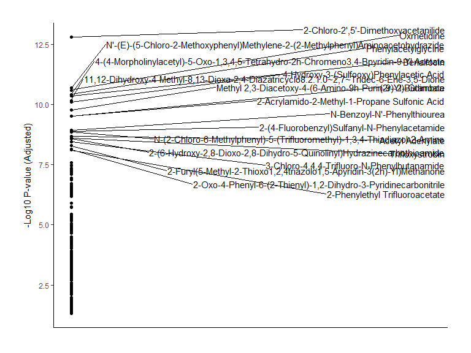<!-- -->

``` r
Sing.comp.ENT_IBE1 <- volcano %>%
  filter(negLog10P > 1.3, (log2FC < -0.5| log2FC > 0.5))%>%
  mutate(v.comp = 'A1_IBE1')
```

IBE1 VS A1

Vulcanoplot between grups:

``` r
df.IBE1<-df.2 %>% filter(group == 'IBE1')
df.a1 <- df.2 %>% filter(group == 'A1')
```

species means

``` r
df.IBE1_means <- as.data.frame(colMeans(df.IBE1[, -c(1:2)], na.rm = TRUE))
names(df.IBE1_means)[1] <- "mean"
df.a1_means <- as.data.frame(colMeans(df.a1[, -c(1:2)], na.rm = TRUE))
names(df.a1_means)[1] <- "mean"
```

``` r
summary(df.IBE1_means)
sum(df.IBE1_means$mean==0)
summary(df.a1_means)
sum(df.IBE1_means$mean==0)
```

log2 fold change

``` r
log2fc <- log2(df.a1_means$mean / df.IBE1_means$mean)
```

calc the p vals

``` r
p.val <- sapply(colnames(df.2)[-c(1:2)], function(compound) {
  t.test(df.IBE1[[compound]], df.a1[[compound]], alternative = "two.sided", var.equal = TRUE)$p.value
})
```

``` r
p.val.adj <- p.adjust(p.val, method = "BH")
```

``` r
volcano<- data.frame(
  Compound = colnames(df.2)[-c(1:2)],
  log2FC = log2fc,
  negLog10P = -log10(p.val.adj)
)
library(ggrepel)
```

Create the volcano plot

``` r
ggplot(volcano, aes(x = log2FC, y = negLog10P)) +
  geom_point(aes(color = negLog10P)) +
  scale_y_continuous(limits= c(0,  max(volcano$negLog10P*1.2, na.rm = TRUE))) +
  scale_x_continuous(limits= c(-4,  4)) +
  labs(x = "Log2FC", y = "-Log10 P-value (Adjusted)",title = expression(atop("HILIC-Neg Log2FC", "IBE1 vs A1")))  +
  scale_color_gradient(low = "steelblue4", high = "firebrick1") +
  geom_hline(yintercept = -log10(0.05), linetype = "dashed", color = "darkred") +
  geom_vline(xintercept = 0, linetype= "dashed", color="gray50")+
  theme_classic() +
  theme(
    text = element_text(family = "arial",size = 16, color = 'gray20'),
    legend.position = "none",
    legend.title = element_blank(),
    plot.title = element_text(hjust = 0.5, vjust = 2.5),
    plot.margin = margin(1, 1, 1, 1, "cm"),
    panel.grid.major.x = element_blank(),
    panel.grid.major.y = element_blank(),
    panel.grid.minor.x = element_blank(),
    panel.grid.minor.y = element_blank(),
    axis.line = element_line(color = "black"))
```

<!-- -->

``` r
volcano %>%
  filter(negLog10P > 1.3, (log2FC < -0.5 | log2FC > 0.5)) %>%
  ggplot(aes(x = 1, y = negLog10P, label = Compound)) +
  geom_point() +
  geom_text_repel(
    force        = 0.5,
    nudge_x      = 0.01,
    direction    = "y",
    hjust        = 0.5,
    segment.size = 0.2
  )  +
  theme_classic() +
  labs(x = "", y = "-Log10 P-value (Adjusted)") +
  theme(
    plot.margin = margin(1, 1, 1, 1, "cm"),
    axis.title.x = element_blank(),
    axis.text.x = element_blank(),
    axis.ticks.x = element_blank()
  )
```

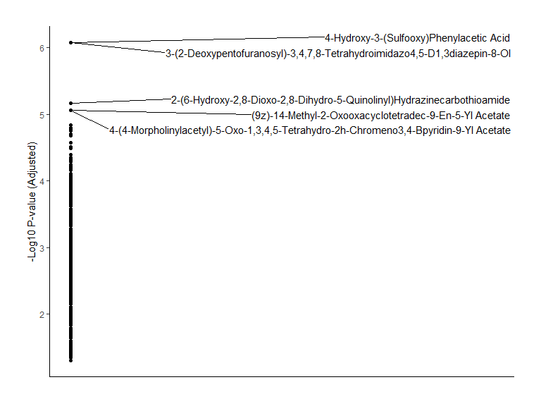<!-- -->

``` r
Sing.comp.IBE1_A1 <- volcano %>%
  filter(negLog10P > 1.3, (log2FC < -0.5| log2FC > 0.5))%>%
  mutate(v.comp = 'IBE1_A1')
```

IBE2 VS ENT

Vulcanoplot between grups:

``` r
df.ent<-df.2 %>% filter(group == 'ENT')
df.IBE2 <- df.2 %>% filter(group == 'IBE2')
```

species means

``` r
df.ent_means <- as.data.frame(colMeans(df.ent[, -c(1:2)], na.rm = TRUE))
names(df.ent_means)[1] <- "mean"
```

``` r
df.IBE2_means <- as.data.frame(colMeans(df.IBE2[, -c(1:2)], na.rm = TRUE))
names(df.IBE2_means)[1] <- "mean"
```

``` r
summary(df.ent_means)
sum(df.ent_means$mean==0)
summary(df.IBE2_means)
sum(df.ent_means$mean==0)
```

log2 fold change

``` r
log2fc <- log2(df.IBE2_means$mean / df.ent_means$mean)
```

calc the p vals

``` r
p.val <- sapply(colnames(df.2)[-c(1:2)], function(compound) {
  t.test(df.ent[[compound]], df.a1[[compound]], alternative = "two.sided", var.equal = TRUE)$p.value
})
```

``` r
p.val.adj <- p.adjust(p.val, method = "BH")
```

``` r
volcano<- data.frame(
  Compound = colnames(df.2)[-c(1:2)],
  log2FC = log2fc,
  negLog10P = -log10(p.val.adj)
)
```

Create the volcano plot

``` r
ggplot(volcano, aes(x = log2FC, y = negLog10P)) +
  geom_point(aes(color = negLog10P)) +
  scale_y_continuous(limits= c(0,  max(volcano$negLog10P*1.2, na.rm = TRUE))) +
  scale_x_continuous(limits= c(-3,  3)) +
  labs(x = "Log2FC", y = "-Log10 P-value (Adjusted)",title = expression(atop("HILIC-Neg Log2FC", "ENT vs IBE2")))  +
  scale_color_gradient(low = "steelblue4", high = "firebrick1") +
  geom_hline(yintercept = -log10(0.05), linetype = "dashed", color = "darkred") +
  geom_vline(xintercept = 0, linetype= "dashed", color="gray50")+
  theme_classic() +
  theme(
    text = element_text(family = "arial",size = 16, color = 'gray20'),
    legend.position = "none",
    legend.title = element_blank(),
    plot.title = element_text(hjust = 0.5, vjust = 2.5),
    plot.margin = margin(1, 1, 1, 1, "cm"),
    panel.grid.major.x = element_blank(),
    panel.grid.major.y = element_blank(),
    panel.grid.minor.x = element_blank(),
    panel.grid.minor.y = element_blank(),
    axis.line = element_line(color = "black"))
```

<!-- -->

``` r
library(ggrepel)
volcano %>%
  filter(negLog10P > 1.3, (log2FC < -0.5 | log2FC > 0.5)) %>%
  ggplot(aes(x = 1, y = negLog10P, label = Compound)) +
  geom_point() +
  geom_text_repel(
    force        = 0.5,
    nudge_x      = 0.01,
    direction    = "y",
    hjust        = 0.5,
    segment.size = 0.2
  )  +
  theme_classic() +
  labs(x = "", y = "-Log10 P-value (Adjusted)") +
  theme(
    plot.margin = margin(1, 1, 1, 1, "cm"),
    axis.title.x = element_blank(),
    axis.text.x = element_blank(),
    axis.ticks.x = element_blank()
  )
```

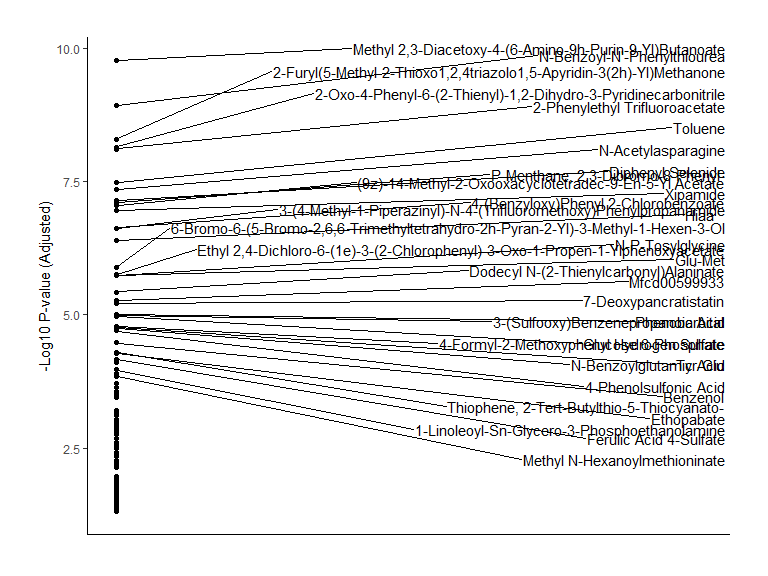<!-- -->

``` r
Sing.comp.ENT_IBE2 <- volcano %>%
  filter(negLog10P > 1.3, (log2FC < -0.5| log2FC > 0.5))%>%
  mutate(v.comp = 'ENT_IBE2')
```

IBE2 VS IBE1

Vulcanoplot between grups:

``` r
df.IBE1<-df.2 %>% filter(group == 'IBE1')
df.IBE2 <- df.2 %>% filter(group == 'IBE2')
```

species means

``` r
df.IBE1_means <- as.data.frame(colMeans(df.IBE1[, -c(1:2)], na.rm = TRUE))
names(df.IBE1_means)[1] <- "mean"
```

``` r
df.IBE2_means <- as.data.frame(colMeans(df.IBE2[, -c(1:2)], na.rm = TRUE))
names(df.IBE2_means)[1] <- "mean"
```

``` r
summary(df.IBE1_means)
sum(df.IBE1_means$mean==0)
summary(df.IBE2_means)
sum(df.IBE1_means$mean==0)
```

log2 fold change

``` r
log2fc <- log2(df.IBE1_means$mean / df.IBE2_means$mean)
```

calc the p vals

``` r
p.val <- sapply(colnames(df.2)[-c(1:2)], function(compound) {
  t.test(df.IBE1[[compound]], df.a1[[compound]], alternative = "two.sided", var.equal = TRUE)$p.value
})
```

``` r
p.val.adj <- p.adjust(p.val, method = "BH")
```

``` r
volcano<- data.frame(
  Compound = colnames(df.2)[-c(1:2)],
  log2FC = log2fc,
  negLog10P = -log10(p.val.adj)
)
```

Create the volcano plot

``` r
ggplot(volcano, aes(x = log2FC, y = negLog10P)) +
  geom_point(aes(color = negLog10P)) +
  scale_y_continuous(limits= c(0,  max(volcano$negLog10P*1.2, na.rm = TRUE))) +
  scale_x_continuous(limits= c(-3,  3)) +
  labs(x = "Log2FC", y = "-Log10 P-value (Adjusted)",title = expression(atop("HILIC-Neg Log2FC", "IBE2 vs IBE1")))  +
  scale_color_gradient(low = "steelblue4", high = "firebrick1") +
  geom_hline(yintercept = -log10(0.05), linetype = "dashed", color = "darkred") +
  geom_vline(xintercept = 0, linetype= "dashed", color="gray50")+
  theme_classic() +
  theme(
    text = element_text(family = "arial",size = 16, color = 'gray20'),
    legend.position = "none",
    legend.title = element_blank(),
    plot.title = element_text(hjust = 0.5, vjust = 2.5),
    plot.margin = margin(1, 1, 1, 1, "cm"),
    panel.grid.major.x = element_blank(),
    panel.grid.major.y = element_blank(),
    panel.grid.minor.x = element_blank(),
    panel.grid.minor.y = element_blank(),
    axis.line = element_line(color = "black"))
```

<!-- -->

``` r
library(ggrepel)
volcano %>%
  filter(negLog10P>1.3, (log2FC < -0.5 | log2FC > 0.5)) %>%
  ggplot(aes(x = 1, y = negLog10P, label = Compound)) +
  geom_point() +
  geom_text_repel(
    force        = 0.5,
    nudge_x      = 0.01,
    direction    = "y",
    hjust        = 0.5,
    segment.size = 0.2
  )  +
  theme_classic() +
  labs(x = "", y = "-Log10 P-value (Adjusted)") +
  theme(
    plot.margin = margin(1, 1, 1, 1, "cm"),
    axis.title.x = element_blank(),
    axis.text.x = element_blank(),
    axis.ticks.x = element_blank()
  )
```

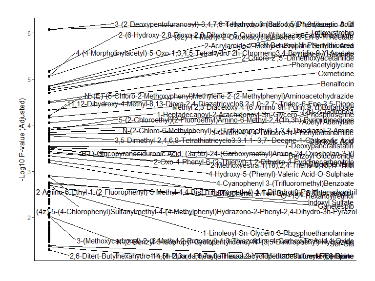<!-- -->

``` r
Sing.comp.IBE2_IBE1 <- volcano %>%
  filter(negLog10P > 1.3, (log2FC < -0.5| log2FC > 0.5))%>%
  mutate(v.comp = 'IBE2_IBE1')
```

A2 VS A1

Vulcanoplot between grups:

``` r
df.A2<-df.2 %>% filter(group == 'A2')
df.a1 <- df.2 %>% filter(group == 'A1')
```

species means

``` r
df.A2_means <- as.data.frame(colMeans(df.A2[, -c(1:2)], na.rm = TRUE))
names(df.A2_means)[1] <- "mean"
df.a1_means <- as.data.frame(colMeans(df.a1[, -c(1:2)], na.rm = TRUE))
names(df.a1_means)[1] <- "mean"
```

``` r
summary(df.A2_means)
sum(df.A2_means$mean==0)
summary(df.a1_means)
sum(df.A2_means$mean==0)
```

log2 fold change

``` r
log2fc <- log2(df.A2_means$mean / df.a1_means$mean)
```

calc the p vals

``` r
p.val <- sapply(colnames(df.2)[-c(1:2)], function(compound) {
  t.test(df.A2[[compound]], df.a1[[compound]], alternative = "two.sided", var.equal = TRUE)$p.value
})
```

``` r
p.val.adj <- p.adjust(p.val, method = "BH")
```

``` r
volcano<- data.frame(
  Compound = colnames(df.2)[-c(1:2)],
  log2FC = log2fc,
  negLog10P = -log10(p.val.adj)
)
```

Create the volcano plot

``` r
ggplot(volcano, aes(x = log2FC, y = negLog10P)) +
  geom_point(aes(color = negLog10P)) +
  scale_y_continuous(limits= c(0,  max(volcano$negLog10P*1.2, na.rm = TRUE))) +
  scale_x_continuous(limits= c(-4,  4)) +
  labs(x = "Log2FC", y = "-Log10 P-value (Adjusted)",title = expression(atop("HILIC-Neg Log2FC", "A1 vs A2")))  +
  scale_color_gradient(low = "steelblue4", high = "firebrick1") +
  geom_hline(yintercept = -log10(0.05), linetype = "dashed", color = "darkred") +
  geom_vline(xintercept = 0, linetype= "dashed", color="gray50")+
  theme_classic() +
  theme(
    text = element_text(family = "arial",size = 16, color = 'gray20'),
    legend.position = "none",
    legend.title = element_blank(),
    plot.title = element_text(hjust = 0.5, vjust = 2.5),
    plot.margin = margin(1, 1, 1, 1, "cm"),
    panel.grid.major.x = element_blank(),
    panel.grid.major.y = element_blank(),
    panel.grid.minor.x = element_blank(),
    panel.grid.minor.y = element_blank(),
    axis.line = element_line(color = "black"))
```

<!-- -->

``` r
volcano %>%
  filter(negLog10P > 1.3, (log2FC < -0.5 | log2FC > 0.5)) %>%
  ggplot(aes(x = 1, y = negLog10P, label = Compound)) +
  geom_point() +
  geom_text_repel(
    force        = 0.5,
    nudge_x      = 0.01,
    direction    = "y",
    hjust        = 0.5,
    segment.size = 0.2
  )  +
  theme_classic() +
  labs(x = "", y = "-Log10 P-value (Adjusted)") +
  theme(
    plot.margin = margin(1, 1, 1, 1, "cm"),
    axis.title.x = element_blank(),
    axis.text.x = element_blank(),
    axis.ticks.x = element_blank()
  )
```

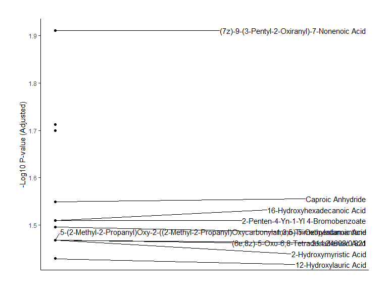<!-- -->

``` r
Sing.comp.A1_A2 <- volcano %>%
  filter(negLog10P > 1.3, (log2FC < -0.5| log2FC > 0.5))%>%
  mutate(v.comp = 'A1_A2')
```

``` r
vulcano.sign.all <- full_join(Sing.comp.A1_A2, Sing.comp.A1_Ent)
vulcano.sign.all <- full_join(vulcano.sign.all, Sing.comp.ENT_IBE1)
vulcano.sign.all <- full_join(vulcano.sign.all, Sing.comp.ENT_IBE2)
vulcano.sign.all <- full_join(vulcano.sign.all, Sing.comp.IBE1_A1)
vulcano.sign.all <- full_join(vulcano.sign.all, Sing.comp.IBE2_IBE1)

HILIC.vulcano.sign.all <- vulcano.sign.all
```

adjust correctly for each run:

MSI-ABC

readr::write_csv(vulcano.sign.all, file =
“./data/HILIC_ng_MSI-ABCD_vulcano.sign.all.csv”)

MSI-D:

readr::write_csv(vulcano.sign.all, file =
“./data/HILIC_ng_MSI-D_vulcano.sign.all.csv”)

### RPLC Volcano Plot

Import data

``` r
df.t <- read.csv("./data/MSI-ABCD-RPLC_pos_final_FM.csv", header = TRUE, check.names = FALSE)
```

``` r
ncol(df.t)
```

Normalization process: same as for HILIC

``` r
qc <- df.t[df.t$group == "qc", 4:ncol(df.t)] #extracts qc grpup
```

``` r
norm <- apply(qc, 2, median, na.rm = TRUE) #calculates the median for each compound
```

Apply QC normalization factor to each compound

``` r
met.sc <- df.t
met.sc[,4:ncol(met.sc)] <- sweep(df.t[, 4:ncol(met.sc)], 2, norm, FUN = "/") #sweep across all columns, 2 indicates columns
```

Apply sqrt transformation and scaling

``` r
met.sc <- scale(sqrt(met.sc[,4:ncol(met.sc)]), center = F, scale = T) #no centering in vulcanoplots because we cannot have negative values for the Log fold change calc. 
```

Making 4 plots showing effects of normalization

``` r
m.sc.plot <- cbind(df.t[2], met.sc)%>%
  melt(., id= "sample")%>%
  mutate(value =as.numeric(unlist(value)))%>%
  ggplot(aes(value, sample))+
  geom_boxplot()
```

``` r
m.sc.dens <- cbind(df.t[2], met.sc)%>%
  melt(., id= "sample")%>%
  mutate(value =as.numeric(unlist(value)))%>%
  ggplot(aes(value))+
  geom_density()+geom_vline(xintercept = 1, linetype= "dashed", color="gray50")
```

``` r
df.t.unnorm.box <-cbind(df.t[2], df.t[4:ncol(df.t)])%>%
  melt(., id= "sample")%>%
  mutate(value =as.numeric(unlist(value)))%>%
  ggplot(aes(value, sample))+
  geom_boxplot()
```

``` r
df.t.unnorm.dens <-cbind(df.t[2], df.t[4:ncol(df.t)])%>%
  melt(., id= "sample")%>%
  mutate(value =as.numeric(unlist(value)))%>%
  ggplot(aes(value))+
  geom_density()
```

Drawing the 4 plots together

``` r
grid.arrange(df.t.unnorm.dens,m.sc.dens, df.t.unnorm.box, m.sc.plot, ncol=2)
```

<!-- -->

``` r
df.2 <- cbind(df.t[,2:3], met.sc)
```

ENT VS A1

Vulcanoplot between grups:

``` r
df.ent<-df.2 %>% filter(group == 'ENT')
df.a1 <- df.2 %>% filter(group == 'A1')
```

species means

``` r
df.ent_means <- as.data.frame(colMeans(df.ent[, -c(1:2)], na.rm = TRUE))
names(df.ent_means)[1] <- "mean"
df.a1_means <- as.data.frame(colMeans(df.a1[, -c(1:2)], na.rm = TRUE))
names(df.a1_means)[1] <- "mean"
```

``` r
summary(df.ent_means)
sum(df.ent_means$mean==0)
summary(df.a1_means)
sum(df.ent_means$mean==0)
```

log2 fold change

``` r
log2fc <- log2(df.a1_means$mean / df.ent_means$mean)
```

calc the p vals

``` r
p.val <- sapply(colnames(df.2)[-c(1:2)], function(compound) {
  t.test(df.ent[[compound]], df.a1[[compound]], alternative = "two.sided", var.equal = TRUE)$p.value
})
```

``` r
p.val.adj <- p.adjust(p.val, method = "BH")
```

``` r
volcano<- data.frame(
  Compound = colnames(df.2)[-c(1:2)],
  log2FC = log2fc,
  negLog10P = -log10(p.val.adj)
)
library(ggrepel)
```

Create the volcano plot

``` r
ggplot(volcano, aes(x = log2FC, y = negLog10P)) +
  geom_point(aes(color = negLog10P)) +
  scale_y_continuous(limits= c(0,  max(volcano$negLog10P*1.2, na.rm = TRUE))) +
  scale_x_continuous(limits= c(-4,  4)) +
  labs(x = "Log2FC", y = "-Log10 P-value (Adjusted)",title = expression(atop("RPLC-Pos Log2FC", "ENT vs A1")))  +
  scale_color_gradient(low = "steelblue4", high = "firebrick1") +
  geom_hline(yintercept = 5, linetype = "dashed", color = "darkred") +
  geom_hline(yintercept = -log10(0.05), linetype = "dashed", color = "darkred") +
  geom_vline(xintercept = 0, linetype= "dashed", color="gray50")+
  geom_vline(xintercept = -2, linetype= "dashed", color="gray50")+
  geom_vline(xintercept = 2, linetype= "dashed", color="gray50")+
  theme_classic() +
  theme(
    text = element_text(family = "arial",size = 16, color = 'gray20'),
    legend.position = "none",
    legend.title = element_blank(),
    plot.title = element_text(hjust = 0.5, vjust = 2.5),
    plot.margin = margin(1, 1, 1, 1, "cm"),
    panel.grid.major.x = element_blank(),
    panel.grid.major.y = element_blank(),
    panel.grid.minor.x = element_blank(),
    panel.grid.minor.y = element_blank(),
    axis.line = element_line(color = "black"))
```

<!-- -->

``` r
volcano %>%
  filter(negLog10P > 1.3, (log2FC < -0.5| log2FC > 0.5)) %>%
  ggplot(aes(x = 1, y = negLog10P, label = Compound)) +
  geom_point() +
  geom_text_repel(
    force        = 0.5,
    nudge_x      = 0.01,
    direction    = "y",
    hjust        = 0.5,
    segment.size = 0.2
  )  +
  theme_classic() +
  labs(x = "", y = "-Log10 P-value (Adjusted)") +
  theme(
    plot.margin = margin(1, 1, 1, 1, "cm"),
    axis.title.x = element_blank(),
    axis.text.x = element_blank(),
    axis.ticks.x = element_blank()
  )
```

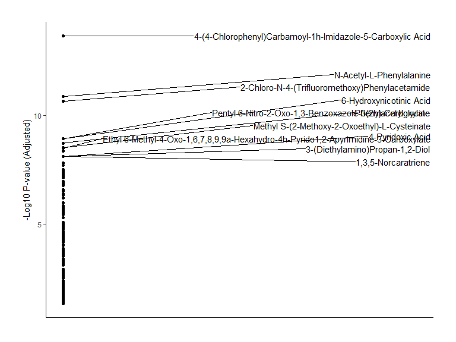<!-- -->

``` r
Sing.comp.A1_Ent <- volcano %>%
  filter(negLog10P > 1.3, (log2FC < -0.5| log2FC > 0.5))
```

IBE1 VS ENT

Vulcanoplot between grups:

``` r
df.ent<-df.2 %>% filter(group == 'ENT')
df.IBE1 <- df.2 %>% filter(group == 'IBE1')
```

species means

``` r
df.ent_means <- as.data.frame(colMeans(df.ent[, -c(1:2)], na.rm = TRUE))
names(df.ent_means)[1] <- "mean"
```

``` r
df.IBE1_means <- as.data.frame(colMeans(df.IBE1[, -c(1:2)], na.rm = TRUE))
names(df.IBE1_means)[1] <- "mean"
```

``` r
summary(df.ent_means)
sum(df.ent_means$mean==0)
summary(df.IBE1_means)
sum(df.ent_means$mean==0)
```

log2 fold change

``` r
log2fc <- log2(df.IBE1_means$mean / df.ent_means$mean)
```

calc the p vals

``` r
p.val <- sapply(colnames(df.2)[-c(1:2)], function(compound) {
  t.test(df.ent[[compound]], df.a1[[compound]], alternative = "two.sided", var.equal = TRUE)$p.value
})
```

``` r
p.val.adj <- p.adjust(p.val, method = "BH")
```

``` r
volcano<- data.frame(
  Compound = colnames(df.2)[-c(1:2)],
  log2FC = log2fc,
  negLog10P = -log10(p.val.adj)
)
```

Create the volcano plot

``` r
ggplot(volcano, aes(x = log2FC, y = negLog10P)) +
  geom_point(aes(color = negLog10P)) +
  scale_y_continuous(limits= c(0,  max(volcano$negLog10P*1.2, na.rm = TRUE))) +
  scale_x_continuous(limits= c(-3,  3)) +
  labs(x = "Log2FC", y = "-Log10 P-value (Adjusted)",title = expression(atop("RPLC-Pos Log2FC", "ENT vs IBE1")))  +
  scale_color_gradient(low = "steelblue4", high = "firebrick1") +
  geom_hline(yintercept = -log10(0.05), linetype = "dashed", color = "darkred") +
  geom_vline(xintercept = 0, linetype= "dashed", color="gray50")+
  theme_classic() +
  theme(
    text = element_text(family = "arial",size = 16, color = 'gray20'),
    legend.position = "none",
    legend.title = element_blank(),
    plot.title = element_text(hjust = 0.5, vjust = 2.5),
    plot.margin = margin(1, 1, 1, 1, "cm"),
    panel.grid.major.x = element_blank(),
    panel.grid.major.y = element_blank(),
    panel.grid.minor.x = element_blank(),
    panel.grid.minor.y = element_blank(),
    axis.line = element_line(color = "black"))
```

<!-- -->

``` r
library(ggrepel)
volcano %>%
  filter(negLog10P > 1.3, (log2FC < -0.5 | log2FC > 0.5)) %>%
  ggplot(aes(x = 1, y = negLog10P, label = Compound)) +
  geom_point() +
  geom_text_repel(
    force        = 0.5,
    nudge_x      = 0.01,
    direction    = "y",
    hjust        = 0.5,
    segment.size = 0.2
  )  +
  theme_classic() +
  labs(x = "", y = "-Log10 P-value (Adjusted)") +
  theme(
    plot.margin = margin(1, 1, 1, 1, "cm"),
    axis.title.x = element_blank(),
    axis.text.x = element_blank(),
    axis.ticks.x = element_blank()
  )
```

<!-- -->

``` r
Sing.comp.ENT_IBE1 <- volcano %>%
  filter(negLog10P > 1.3, (log2FC < -0.5| log2FC > 0.5))
```

IBE1 VS A1

Vulcanoplot between grups:

``` r
df.IBE1<-df.2 %>% filter(group == 'IBE1')
df.a1 <- df.2 %>% filter(group == 'A1')
```

species means

``` r
df.IBE1_means <- as.data.frame(colMeans(df.IBE1[, -c(1:2)], na.rm = TRUE))
names(df.IBE1_means)[1] <- "mean"
df.a1_means <- as.data.frame(colMeans(df.a1[, -c(1:2)], na.rm = TRUE))
names(df.a1_means)[1] <- "mean"
```

``` r
summary(df.IBE1_means)
sum(df.IBE1_means$mean==0)
summary(df.a1_means)
sum(df.IBE1_means$mean==0)
```

log2 fold change

``` r
log2fc <- log2(df.a1_means$mean / df.IBE1_means$mean)
```

calc the p vals

``` r
p.val <- sapply(colnames(df.2)[-c(1:2)], function(compound) {
  t.test(df.IBE1[[compound]], df.a1[[compound]], alternative = "two.sided", var.equal = TRUE)$p.value
})
```

``` r
p.val.adj <- p.adjust(p.val, method = "BH")
```

``` r
volcano<- data.frame(
  Compound = colnames(df.2)[-c(1:2)],
  log2FC = log2fc,
  negLog10P = -log10(p.val.adj)
)
library(ggrepel)
```

Create the volcano plot

``` r
ggplot(volcano, aes(x = log2FC, y = negLog10P)) +
  geom_point(aes(color = negLog10P)) +
  scale_y_continuous(limits= c(0,  max(volcano$negLog10P*1.2, na.rm = TRUE))) +
  scale_x_continuous(limits= c(-4,  4)) +
  labs(x = "Log2FC", y = "-Log10 P-value (Adjusted)",title = expression(atop("RPLC-Pos Log2FC", "IBE1 vs A1")))  +
  scale_color_gradient(low = "steelblue4", high = "firebrick1") +
  geom_hline(yintercept = -log10(0.05), linetype = "dashed", color = "darkred") +
  geom_vline(xintercept = 0, linetype= "dashed", color="gray50")+
  theme_classic() +
  theme(
    text = element_text(family = "arial",size = 16, color = 'gray20'),
    legend.position = "none",
    legend.title = element_blank(),
    plot.title = element_text(hjust = 0.5, vjust = 2.5),
    plot.margin = margin(1, 1, 1, 1, "cm"),
    panel.grid.major.x = element_blank(),
    panel.grid.major.y = element_blank(),
    panel.grid.minor.x = element_blank(),
    panel.grid.minor.y = element_blank(),
    axis.line = element_line(color = "black"))
```

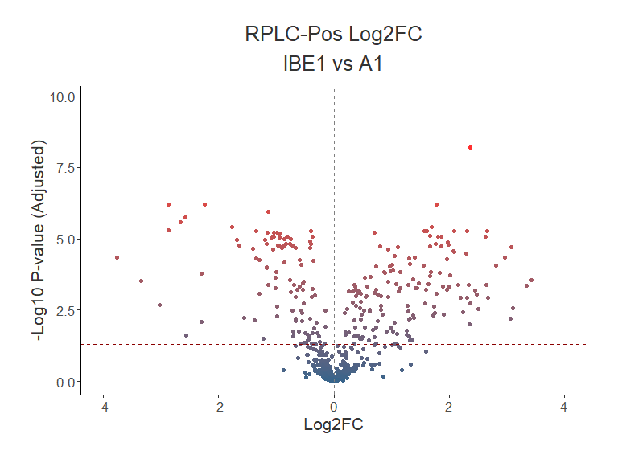<!-- -->

``` r
volcano %>%
  filter(negLog10P > 1.3, (log2FC < -0.5 | log2FC > 0.5)) %>%
  ggplot(aes(x = 1, y = negLog10P, label = Compound)) +
  geom_point() +
  geom_text_repel(
    force        = 0.5,
    nudge_x      = 0.01,
    direction    = "y",
    hjust        = 0.5,
    segment.size = 0.2
  )  +
  theme_classic() +
  labs(x = "", y = "-Log10 P-value (Adjusted)") +
  theme(
    plot.margin = margin(1, 1, 1, 1, "cm"),
    axis.title.x = element_blank(),
    axis.text.x = element_blank(),
    axis.ticks.x = element_blank()
  )
```

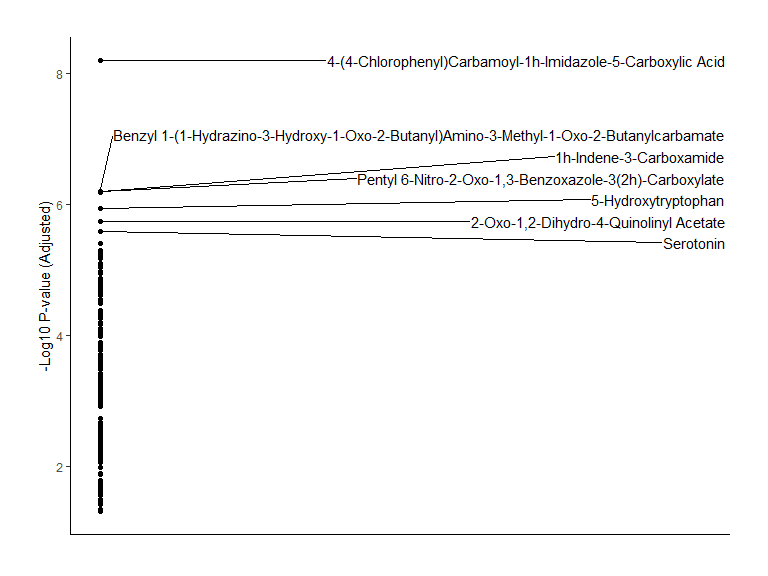<!-- -->

``` r
Sing.comp.IBE1_A1 <- volcano %>%
  filter(negLog10P > 1.3, (log2FC < -0.5| log2FC > 0.5))
```

IBE2 VS ENT

Vulcanoplot between grups:

``` r
df.ent<-df.2 %>% filter(group == 'ENT')
df.IBE2 <- df.2 %>% filter(group == 'IBE2')
```

species means

``` r
df.ent_means <- as.data.frame(colMeans(df.ent[, -c(1:2)], na.rm = TRUE))
names(df.ent_means)[1] <- "mean"
```

``` r
df.IBE2_means <- as.data.frame(colMeans(df.IBE2[, -c(1:2)], na.rm = TRUE))
names(df.IBE2_means)[1] <- "mean"
```

``` r
summary(df.ent_means)
sum(df.ent_means$mean==0)
summary(df.IBE2_means)
sum(df.ent_means$mean==0)
```

log2 fold change

``` r
log2fc <- log2(df.IBE2_means$mean / df.ent_means$mean)
```

calc the p vals

``` r
p.val <- sapply(colnames(df.2)[-c(1:2)], function(compound) {
  t.test(df.ent[[compound]], df.a1[[compound]], alternative = "two.sided", var.equal = TRUE)$p.value
})
```

``` r
p.val.adj <- p.adjust(p.val, method = "BH")
```

``` r
volcano<- data.frame(
  Compound = colnames(df.2)[-c(1:2)],
  log2FC = log2fc,
  negLog10P = -log10(p.val.adj)
)
```

Create the volcano plot

``` r
ggplot(volcano, aes(x = log2FC, y = negLog10P)) +
  geom_point(aes(color = negLog10P)) +
  scale_y_continuous(limits= c(0,  max(volcano$negLog10P*1.2, na.rm = TRUE))) +
  scale_x_continuous(limits= c(-3,  3)) +
  labs(x = "Log2FC", y = "-Log10 P-value (Adjusted)",title = expression(atop("RPLC-Pos Log2FC", "ENT vs IBE2")))  +
  scale_color_gradient(low = "steelblue4", high = "firebrick1") +
  geom_hline(yintercept = -log10(0.05), linetype = "dashed", color = "darkred") +
  geom_vline(xintercept = 0, linetype= "dashed", color="gray50")+
  theme_classic() +
  theme(
    text = element_text(family = "arial",size = 16, color = 'gray20'),
    legend.position = "none",
    legend.title = element_blank(),
    plot.title = element_text(hjust = 0.5, vjust = 2.5),
    plot.margin = margin(1, 1, 1, 1, "cm"),
    panel.grid.major.x = element_blank(),
    panel.grid.major.y = element_blank(),
    panel.grid.minor.x = element_blank(),
    panel.grid.minor.y = element_blank(),
    axis.line = element_line(color = "black"))
```

<!-- -->

``` r
library(ggrepel)
volcano %>%
  filter(negLog10P > 1.3, (log2FC < -0.5 | log2FC > 0.5)) %>%
  ggplot(aes(x = 1, y = negLog10P, label = Compound)) +
  geom_point() +
  geom_text_repel(
    force        = 0.5,
    nudge_x      = 0.01,
    direction    = "y",
    hjust        = 0.5,
    segment.size = 0.2
  )  +
  theme_classic() +
  labs(x = "", y = "-Log10 P-value (Adjusted)") +
  theme(
    plot.margin = margin(1, 1, 1, 1, "cm"),
    axis.title.x = element_blank(),
    axis.text.x = element_blank(),
    axis.ticks.x = element_blank()
  )
```

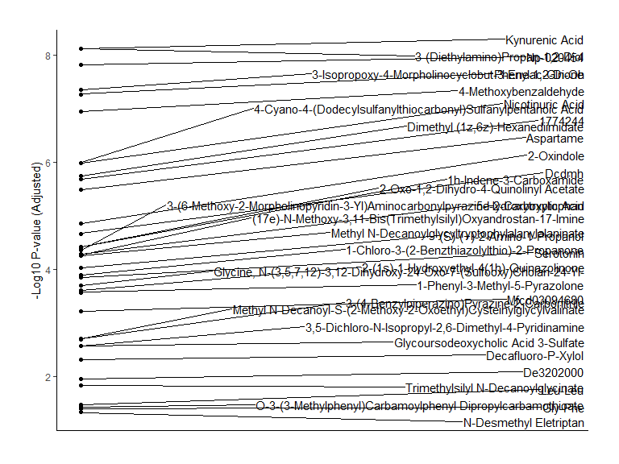<!-- -->

``` r
Sing.comp.ENT_IBE2 <- volcano %>%
  filter(negLog10P > 1.3, (log2FC < -0.5| log2FC > 0.5))
```

IBE2 VS IBE1

Vulcanoplot between grups:

``` r
df.IBE1<-df.2 %>% filter(group == 'IBE1')
df.IBE2 <- df.2 %>% filter(group == 'IBE2')
```

species means

``` r
df.IBE1_means <- as.data.frame(colMeans(df.IBE1[, -c(1:2)], na.rm = TRUE))
names(df.IBE1_means)[1] <- "mean"
```

``` r
df.IBE2_means <- as.data.frame(colMeans(df.IBE2[, -c(1:2)], na.rm = TRUE))
names(df.IBE2_means)[1] <- "mean"
```

``` r
summary(df.IBE1_means)
sum(df.IBE1_means$mean==0)
summary(df.IBE2_means)
sum(df.IBE1_means$mean==0)
```

log2 fold change

``` r
log2fc <- log2(df.IBE1_means$mean / df.IBE2_means$mean)
```

calc the p vals

``` r
p.val <- sapply(colnames(df.2)[-c(1:2)], function(compound) {
  t.test(df.IBE1[[compound]], df.a1[[compound]], alternative = "two.sided", var.equal = TRUE)$p.value
})
```

``` r
p.val.adj <- p.adjust(p.val, method = "BH")
```

``` r
volcano<- data.frame(
  Compound = colnames(df.2)[-c(1:2)],
  log2FC = log2fc,
  negLog10P = -log10(p.val.adj)
)
```

Create the volcano plot

``` r
ggplot(volcano, aes(x = log2FC, y = negLog10P)) +
  geom_point(aes(color = negLog10P)) +
  scale_y_continuous(limits= c(0,  max(volcano$negLog10P*1.2, na.rm = TRUE))) +
  scale_x_continuous(limits= c(-3,  3)) +
  labs(x = "Log2FC", y = "-Log10 P-value (Adjusted)",title = expression(atop("RPCL-Pos", "IBE2 vs IBE1")))  +
  scale_color_gradient(low = "steelblue4", high = "firebrick1") +
  geom_hline(yintercept = -log10(0.05), linetype = "dashed", color = "darkred") +
  geom_vline(xintercept = 0, linetype= "dashed", color="gray50")+
  theme_classic() +
  theme(
    text = element_text(family = "arial",size = 16, color = 'gray20'),
    legend.position = "none",
    legend.title = element_blank(),
    plot.title = element_text(hjust = 0.5, vjust = 2.5),
    plot.margin = margin(1, 1, 1, 1, "cm"),
    panel.grid.major.x = element_blank(),
    panel.grid.major.y = element_blank(),
    panel.grid.minor.x = element_blank(),
    panel.grid.minor.y = element_blank(),
    axis.line = element_line(color = "black"))
```

<!-- -->

``` r
library(ggrepel)
volcano %>%
  filter(negLog10P>1.3, (log2FC < -0.5 | log2FC > 0.5)) %>%
  ggplot(aes(x = 1, y = negLog10P, label = Compound)) +
  geom_point() +
  geom_text_repel(
    force        = 0.5,
    nudge_x      = 0.01,
    direction    = "y",
    hjust        = 0.5,
    segment.size = 0.2
  )  +
  theme_classic() +
  labs(x = "", y = "-Log10 P-value (Adjusted)") +
  theme(
    plot.margin = margin(1, 1, 1, 1, "cm"),
    axis.title.x = element_blank(),
    axis.text.x = element_blank(),
    axis.ticks.x = element_blank()
  )
```

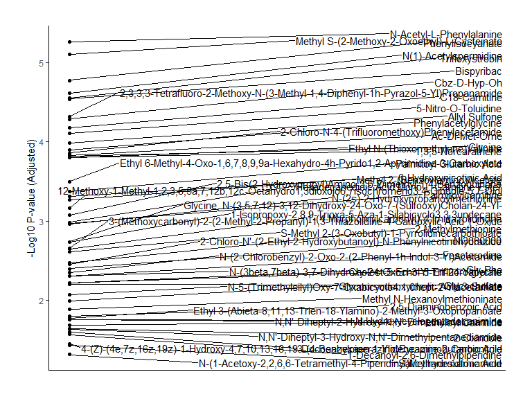<!-- -->

``` r
Sing.comp.IBE2_IBE1 <- volcano %>%
  filter(negLog10P > 1.3, (log2FC < -0.5| log2FC > 0.5))
```

A2 VS A1

Vulcanoplot between grups:

``` r
df.A2<-df.2 %>% filter(group == 'A2')
df.a1 <- df.2 %>% filter(group == 'A1')
```

species means

``` r
df.A2_means <- as.data.frame(colMeans(df.A2[, -c(1:2)], na.rm = TRUE))
names(df.A2_means)[1] <- "mean"
df.a1_means <- as.data.frame(colMeans(df.a1[, -c(1:2)], na.rm = TRUE))
names(df.a1_means)[1] <- "mean"
```

``` r
summary(df.A2_means)
sum(df.A2_means$mean==0)
summary(df.a1_means)
sum(df.A2_means$mean==0)
```

log2 fold change

``` r
log2fc <- log2(df.A2_means$mean / df.a1_means$mean)
```

calc the p vals

``` r
p.val <- sapply(colnames(df.2)[-c(1:2)], function(compound) {
  t.test(df.A2[[compound]], df.a1[[compound]], alternative = "two.sided", var.equal = TRUE)$p.value
})
```

``` r
p.val.adj <- p.adjust(p.val, method = "BH")
```

``` r
volcano<- data.frame(
  Compound = colnames(df.2)[-c(1:2)],
  log2FC = log2fc,
  negLog10P = -log10(p.val.adj)
)
```

Create the volcano plot

``` r
ggplot(volcano, aes(x = log2FC, y = negLog10P)) +
  geom_point(aes(color = negLog10P)) +
  scale_y_continuous(limits= c(0,  max(volcano$negLog10P*1.2, na.rm = TRUE))) +
  scale_x_continuous(limits= c(-4,  4)) +
  labs(x = "Log2FC", y = "-Log10 P-value (Adjusted)",title = expression(atop("RPLC-Pos Log2FC", "A1 vs A2")))  +
  scale_color_gradient(low = "steelblue4", high = "firebrick1") +
  geom_hline(yintercept = -log10(0.05), linetype = "dashed", color = "darkred") +
  geom_vline(xintercept = 0, linetype= "dashed", color="gray50")+
  theme_classic() +
  theme(
    text = element_text(family = "arial",size = 16, color = 'gray20'),
    legend.position = "none",
    legend.title = element_blank(),
    plot.title = element_text(hjust = 0.5, vjust = 2.5),
    plot.margin = margin(1, 1, 1, 1, "cm"),
    panel.grid.major.x = element_blank(),
    panel.grid.major.y = element_blank(),
    panel.grid.minor.x = element_blank(),
    panel.grid.minor.y = element_blank(),
    axis.line = element_line(color = "black"))
```

<!-- -->

``` r
volcano %>%
  filter(negLog10P > 1, (log2FC < -0.5 | log2FC > 0.5)) %>%
  ggplot(aes(x = 1, y = negLog10P, label = Compound)) +
  geom_point() +
  geom_text_repel(
    force        = 0.5,
    nudge_x      = 0.01,
    direction    = "y",
    hjust        = 0.5,
    segment.size = 0.2
  )  +
  theme_classic() +
  labs(x = "", y = "-Log10 P-value (Adjusted)") +
  theme(
    plot.margin = margin(1, 1, 1, 1, "cm"),
    axis.title.x = element_blank(),
    axis.text.x = element_blank(),
    axis.ticks.x = element_blank()
  )
```

<!-- -->

``` r
Sing.comp.A1_A2 <- volcano %>%
  filter(negLog10P > 1, (log2FC < -0.5| log2FC > 0.5))
```

``` r
vulcano.sign.all <- full_join(Sing.comp.A1_A2, Sing.comp.A1_Ent)
vulcano.sign.all <- full_join(vulcano.sign.all, Sing.comp.ENT_IBE1)
vulcano.sign.all <- full_join(vulcano.sign.all, Sing.comp.ENT_IBE2)
vulcano.sign.all <- full_join(vulcano.sign.all, Sing.comp.IBE1_A1)
vulcano.sign.all <- full_join(vulcano.sign.all, Sing.comp.IBE2_IBE1)
RPLC.volcano.sign.all <- vulcano.sign.all
```

clean environment:

``` r
rm(list=setdiff(ls(), c("RPLC.final", "RPLC.DB.match", "HILIC.final", "HILIC.DB.match", "RPLC.volcano.sign.all", "HILIC.vulcano.sign.all")))
```

# 4. HILIC Data Analysis

install if neccescary:

install.packages(c(‘ggalt’,‘tidyverse’, ‘reshape2’, ‘circlize’, ‘ca’,
‘gridExtra’ ))

install complex heatmap if required . follow instructions in console
(remove ““)

if (!require(“BiocManager”, quietly = TRUE))

install.packages(“BiocManager”)

BiocManager::install(“ComplexHeatmap”)

load libraries

``` r
library(dplyr)
library(gridExtra)
library(patchwork)
library(reshape2)
library(ca)
library(vegan)
library(circlize)
library(RColorBrewer)
library(ggalt)
library(ComplexHeatmap) 
library(PCAtools)
library(svglite)
```

Import data

``` r
df.t <- read.csv("./data/HILIC_neg_final_FM.csv",sep = ",", header = TRUE, check.names = F)
```

``` r
HILIC.final <- df.t[,-1]
```

``` r
ncol(df.t)
```

``` r
metabolites <- as.data.frame(colnames(df.t)[4:ncol(df.t)] , check.names = F)
```

Normalization process:

normalization against the QC samples using the raw values.

aims to correct for batch effects, instrumental drift, systematic
variations -\> systemic variations are minimized transformation to
QC-normalized data. transformation stabilizes the variance across the
range of data, making the data more suitable for subsequent analysis. It
also helps to make the data more normally distributed, which is an
assumption of many statistical techniques.

Here I choose sqrt() transform because it is the same transformation
done when creating vulcano plots. (Vulcano LogFC calculation needs the
data to be centered around 1 becasue negative values are impossible in
log calcs.

Thus, here, I am keeping the sqrt transfom the same as the vulcano plot
to keep the data consistent, but I chose to center the data around 0, as
it is a common practice in metabolomics to center the data around 0.

to start normalize against QC samples first makes sense beacuse it
directly addresses the technical variability introduced during the
sample processing and acquisition.

thus I have ensured that any subsequent transformations or scaling are
applied to data that have already been adjusted for technical artifacts,
which increases reliabillity and interpretabillity of the results.

Scale and center the data: Helps issues where some variables dominate
solely due to their scale.

Centering (subtracting the mean) can be particularly useful for
techniques like PCA, where the variation around the mean is of interest.

This nomalization step will be done to all future data.

``` r
qc <- df.t[df.t$group == "qc", 4:ncol(df.t)] #extracts qc grpup
norm <- apply(qc, 2, median, na.rm = TRUE) #calculates the median for each compound


#Apply QC normalization factor to each compound
met.sc <- df.t
met.sc[,4:ncol(met.sc)] <- sweep(df.t[, 4:ncol(met.sc)], 2, norm, FUN = "/") #sweep across all columns, 2 indicates columns


#Apply sqrt transformation centering and scaling
met.sc <- scale(sqrt(met.sc[,4:ncol(met.sc)]), center = T, scale = T)
```

Making 4 plots showing effects of normalization

``` r
m.sc.plot <- cbind(df.t[2], met.sc)%>%
  melt(., id= "sample")%>%
  mutate(value =as.numeric(unlist(value)))%>%
  ggplot(aes(value, variable))+
  geom_boxplot(fill='gray20', color= 'gray50') +
  labs(y='Compound',
       x='Normalized Peak Intensity') + 
  theme_classic()+
  theme(
    axis.text.y = element_blank(),   
    axis.ticks.y = element_blank(),
  )

m.sc.dens <- cbind(df.t[2], met.sc)%>%
  melt(., id= "sample")%>%
  mutate(value =as.numeric(unlist(value)))%>%
  ggplot(aes(value))+
  geom_density(linewidth=1, color ='grey20')+
  labs(title = 'After Normalization', 
       y='Density',
       x='Normalized Peak Intensity') + 
  theme_classic()+
  theme(
    axis.ticks.y = element_blank(),
    plot.title = element_text(hjust = 0.5),
plot.margin = margin(1, 1, 1, 1, "cm")


  )

df.t.unnorm.box <-
  cbind(df.t[2], df.t[4:ncol(df.t)])%>%
  melt(., id= "sample")%>%
  mutate(value =as.numeric(unlist(value)))%>%
  ggplot(aes(value, variable))+
  geom_boxplot(fill='gray20', color= 'gray50') +
  labs(y='Compound',
       x='Normalized Peak Intensity') + 
  theme_classic()+
  theme(
    axis.text.y = element_blank(),   
    axis.ticks.y = element_blank(),
plot.margin = margin(1, 1, 1, 1, "cm")
 )

df.t.unnorm.dens <-cbind(df.t[2], df.t[4:ncol(df.t)])%>%
  melt(., id= "sample")%>%
  mutate(value =as.numeric(unlist(value)))%>%
  ggplot(aes(value))+
  geom_density(linewidth=1, color ='grey20')+
  labs(title = 'Before Normalization', 
       y='Density',
       x='Normalized Peak Intensity') + 
  theme_classic()+
  theme(
    axis.ticks.y = element_blank(),
    plot.title = element_text(hjust = 0.5),
plot.margin = margin(1, 1, 1, 1, "cm")
  )


grid.arrange(df.t.unnorm.dens,m.sc.dens, df.t.unnorm.box, m.sc.plot, ncol=2)
```

<!-- --> Inspection of plot the
normalization seems OK.

What follows is and inital data exploration.

Cluster analysis andheat map:

``` r
rownames(met.sc) <- df.t[,2] #Making row names the samples
h.df<-as.matrix(met.sc)
rownames(h.df) <- df.t[,2] #Making row names the samples
```

Heatmap preamble

``` r
c <-rev(brewer.pal(6,"RdBu")) #take reverse order of six colors from Brewer palette RdBu
col_fun = colorRamp2(c(-2,-1,0,1,2,4),c) #make gradient and supply color scale range
```

define color for the groups with hexadecimal keys

``` r
an.col <- list(group = c("IBE1"= "#E41A1C", "IBE2"="#377EB8", "A1"="#4DAF4A", 
                         "A2"="#984EA3","ENT"= "#FF7F00",
                         "Test" ="#FFFF33","qc"="#FDBF6F", "blank"= "#A65628" ))
```

Define vector that is the groups (-blank)

``` r
ha <- HeatmapAnnotation(group = df.t[,3], col = an.col,
                        annotation_legend_param = list(
                          group = list(title = ""))
)
```

Make heatmap

``` r
heat <- Heatmap(t(h.df),
                show_row_names=FALSE,
                clustering_distance_rows ="euclidean",
                clustering_distance_columns ="euclidean",
                clustering_method_rows= "ward.D",
                clustering_method_columns= "ward.D",
                column_dend_height = unit(2, "cm"), 
                row_dend_width = unit(2, "cm"),
                col = col_fun,
                top_annotation = ha,
                heatmap_legend_param = list(
                  title = "Relative abundance",
                  legend_height = unit(3, "cm"),
                  title_position = "leftcenter-rot"
                ))
```

Draw heatmap

``` r
heat
```

<!-- -->

Initial heatmap look promisign. Here, we have done an unsuperwised
clustering method for rows and columns using ward.D method. The color
scale is centered at 0 and goes from -2 to 4. The samples are annotated
by group but group information is not used in the clustering.

Nice to see QCs clustering and showing an expected overall value around
0. This makes sense as the QCs are a mix of all samples and we have
normalized against the mean of row QC value.

Blank shows overall very low valuse. which is good. There are some lines
in there that tick up towards -1 and 0 which is not good. This could be
due to contamination or some other issue. This is to be kept in mind.
However, overall it looks good and we can proceed.

k-means clustering for initial exploration. A starting point for data
exploration because it is an unsupervised learning algorithm that helps
to group similar data points into clusters based on their feature
values. This allows us to quickly identify patterns or natural groupings
in the metabolomics dataset without prior knowledge of the data
structure. Additionally, k-means is computationally efficient and easy
to implement, making it useful for initial exploration of large,
high-dimensional datasets such as those generated in metabolomics.

Load required packages

``` r
library(FactoMineR)
library(factoextra)
library(cluster)
```

inspect head of matrix to cluster. We want to use the scaled data for
clustering.

``` r
(h.df[,1:4])
```

Don’t know how many clusters is best so we make and elbow plot.

``` r
fviz_nbclust(h.df[-35,], kmeans, method = "wss") #not include blank
```

<!-- -->

Not totally clear what is the best so we may look at total intra-cluster
variation for different values of k with their expected values for a
distribution with no clustering

``` r
fviz_gap_stat(clusGap(h.df,
                      FUN = kmeans,
                      nstart = 25,
                      K.max = 10,
                      B = 50)
)
```

<!-- -->

looks like 9 clusters is optimal Which is a bit much even when including
qc and test animal (7) Perform k-means clustering with 7 clusters

``` r
km.h.df <- kmeans(h.df[-35,], centers = 7)
```

so we plot it

``` r
fviz_cluster(km.h.df, data = h.df[-35,], max.overlaps=70,
             ellipse = FALSE,
             star.plot=TRUE,#Addsegmentsfromcentroidstoitems 
             repel=TRUE,#Avoidlabeloverplotting(slow) 
             ggtheme=theme_minimal() )
```

<!-- -->

Pooled QC samples looks good (perfect overlap).

P1 (test animal, non hibernator) driving second component of k-means
clustering.

Removing from analysis.

Heatmap preamble remove rows where rownames = P1 and QC1 to QC6

``` r
rm<- c("P1", "blank")

h.df.2 <- h.df[!rownames(h.df) %in% rm, ]

c <-rev(brewer.pal(6,"RdBu")) #take reverse order of six colors from Brewer palette RdBu
col_fun = colorRamp2(c(-2,-1,0,1,2,4),c) #make gradient and supply color scale range
```

define color for the groups with hexadecimal keys

``` r
an.col <- list(group = c("IBE1"= "#E41A1C", "IBE2"="#377EB8", "A1"="#4DAF4A", 
                         "A2"="#984EA3","ENT"= "#FF7F00", qc = "#FDBF6F"
))
```

Define vector that is the groups (-blank, -Test)

``` r
ha.2 <- HeatmapAnnotation(group = df.t[!df.t$group %in% c("Test", "blank"), "group"], col = an.col,
                          annotation_legend_param = list(
                            group = list(title = ""))
)
```

Make heatmap

``` r
heat.2 <- Heatmap(t(h.df.2),
                  show_row_names=FALSE,
                  clustering_distance_rows ="euclidean",
                  clustering_distance_columns ="euclidean",
                  clustering_method_rows= "ward.D",
                  clustering_method_columns= "ward.D",
                  column_dend_height = unit(2, "cm"), 
                  row_dend_width = unit(2, "cm"),
                  col = col_fun,
                  top_annotation = ha.2,
                  heatmap_legend_param = list(
                    title = "Relative abundance",
                    legend_height = unit(3, "cm"),
                    title_position = "leftcenter-rot"
                  ))
```

Draw heatmap

``` r
heat.2
```

<!-- --> This heatmap looks good. We
have clear clustering if groups and it is expacted that IBE1 and IBE2
are close to each other.

Principal Component Analysis (PCA) is a linear dimensionality reduction
method that projects data onto orthogonal axes (principal components) to
capture the maximum variance in the dataset. Since we have
sqrt-transformed, scaled, and centered the data—ensuring homogeneity in
measurement scales and normalizing distributions—PCA is appropriate as
it retains continuous data properties and maximizes interpretability by
prioritizing variance. Unlike k-means, which partitions data into
discrete clusters based on proximity, PCA provides a multivariate view
of the dataset’s structure without enforcing categorical boundaries,
allowing for a more nuanced exploration of variance and relationships
between variables. This makes PCA superior for identifying underlying
patterns and relationships in interval data.

``` r
rm<- c("P1", "blank")

h.df.2 <- h.df[!rownames(h.df) %in% rm, ]

metadata<-data.frame(row.names = rownames(h.df.2))

metadata$group <- df.t[!df.t$group %in% c("Test", "blank"), "group"] #!test & QC, blank

pca.h.df.2 <- PCAtools:: pca(t(h.df.2), metadata=metadata ,removeVar = 0.1)

screeplot(pca.h.df.2, axisLabSize = 18, titleLabSize = 22)
```

<!-- --> The scree plot shows the
percentage of variance explained by each principal component (PC) in a
PCA. The first few components, particularly PC1 and PC2, explain a
substantial portion of the total variance, with PC1 alone accounting for
over 30%. As additional components are included, the cumulative variance
rises and begins to plateau around the 5th or 6th component, where the
explained variance levels off. This “elbow” in the curve suggests
diminishing returns in variance explained by additional components
beyond PC5. Thus, the first 4-5 components should be sufficient for
capturing the majority of the dataset’s variability, while later
components contribute minimally and can likely be excluded for practical
analysis.

A scatterplot matirx can be useful to visually see the relationships
between the first few principal components. This plot displays pairwise
combinations of PCs, with each point representing an observation in the
dataset. By coloring points according to their group membership, we can
assess how well the PCA separates different groups and identify
potential patterns or clusters.

``` r
pairsplot(pca.h.df.2,
          components = getComponents(pca.h.df.2, c(1:5)),
          triangle = TRUE, trianglelabSize = 12,
          hline = 0, vline = 0,
          pointSize = 0.75,
          gridlines.major = FALSE, gridlines.minor = FALSE,
          title = 'Pairs plot', plotaxes = FALSE,
          margingaps = unit(c(-0.01, -0.01, -0.01, -0.01), 'cm')
)
```

<!-- -->

3 components explain 67% of the variation in the data. but mostly 1 and
2. No me than 2 in loading plot is probable sensible as the 3rd
component explains only 10% of the variation and does not add much to
the interpretation of the data.

Fancy PCAplot biplot:

``` r
biplot(pca.h.df.2,
       colby = "group",
       colkey = c('A1' = '#1f77b4',
                  'A2' = '#ff7f0e', 
                  'IBE1' = '#2ca02c', 
                  'IBE2' = '#d62728', 
                  'ENT' = '#9467bd',
                  'qc' = '#8c564b'),
       lab= NULL,
       pointSize = 5,
       showLoadings = TRUE,
       ntopLoadings = 5,
       lengthLoadingsArrowsFactor = 1.5,
       sizeLoadingsNames = 3,
       showLoadingsNames = T,
       hline = 0, vline = 0,
       legendPosition = 'right',
       encircle = TRUE
)
```

<!-- --> PC1 explaining 37.91% of the
variance and PC2 accounting for 12.52%. Each group forms distinct
clusters, with metabolites such as Acetyl Arginine and Ferulic Acid
4-Sulfate driving separation along PC1, while Ethyl Methyl Trisulfide
and 6-Thiouric Acid contribute to both PC1 and PC2. The plot highlights
metabolic differences between groups like A1 and A2, while groups like
IBE1 and IBE2 show some overlap, indicating closer metabolic similarity.
loadings plot

Proceed to explore the lodgings of the components.

the loadings of the first two principal components to understand which
variables contribute the most to the variance in the data. Focusing on
the top or bottom 20% of loadings, we can identify variables that are
having the greatest impact on separating the different groups. This
helps us narrow down the key factors driving the patterns we see in the
PCA.

Additionally, by highlighting the top 50% of variables contributing to
both PC1 and PC2, we select out the most important ones for further
analysis. This is done as later in PLS analysis we make sure we only
focus on metabolites that drive the separation between groups and filter
based on this. We do this to simplyfy the model and optimize feature
selection process.

``` r
#Comp 1
a <- as.data.frame(pca.h.df.2$loadings, check.names = F) %>% 
  dplyr::select(PC1) %>% 
  tibble::rownames_to_column()

plot_loading <- a%>%
  filter( PC1< (min(a$PC1) + ((max(a$PC1) - min(a$PC1)) * 0.20)) | PC1>(max(a$PC1) - ((max(a$PC1) - min(a$PC1)) * 0.20))) %>%
  ggplot(aes(reorder(rowname, PC1, mean),y=PC1))+geom_point()+coord_flip()

plot_loading
```

<!-- -->

``` r
#Comp 2
b <- as.data.frame(pca.h.df.2$loadings, check.names = F) %>% 
  dplyr::select(PC2) %>% 
  tibble::rownames_to_column()

plot_loading2 <- b%>%
  filter( PC2< (min(b$PC2) + ((max(b$PC2) - min(b$PC2)) * 0.20)) | PC2>(max(b$PC2) - ((max(b$PC2) - min(b$PC2)) * 0.20))) %>%
  ggplot(aes(reorder(rowname, PC2, mean),y=PC2))+geom_point()+scale_x_discrete(position = "top") +coord_flip()

plot_loading2
```

<!-- -->

``` r
pca_loadings <- full_join(a,b, by = "rowname")
#Finding the Loadings of component 1 and 2 where the top 50% of variables are highlighted
pca.h.df.2$loadings$magnitude <- sqrt(pca.h.df.2$loadings$PC1^2 + pca.h.df.2$loadings$PC2^2)
```

Determine the cutoff for the top 50%

``` r
top_50_cutoff <- quantile(pca.h.df.2$loadings$magnitude, 0.5)
```

Create a new column for highlighting

``` r
pca.h.df.2$loadings$highlight <- pca.h.df.2$loadings$magnitude >= top_50_cutoff
```

And finally we plot it:

``` r
loadings <- ggplot(pca.h.df.2$loadings, aes(x = PC1, y = PC2, color = highlight, size = highlight)) +
  geom_hline(yintercept = 0, linetype = "dashed", color = "gray50") +
  geom_vline(xintercept = 0, linetype = "dashed", color = "gray50") +
  geom_point() +
  scale_color_manual(values = c("steelblue4", "firebrick3")) +
  scale_size_manual(values = c(1, 2)) +
  xlab("PC1") +
  ylab("PC2") +
  ggtitle("Loadings plot PC1 & PC2 top 50% loadings highlighted") +
  theme_bw() +
  theme(plot.title = element_text(hjust = 0.5),
        legend.position = "none")

loadings
```

<!-- --> Nice plot:) How many metabolis
are in the top 50% of the loadings?

``` r
pca.h.df.2$loadings %>%
  filter(highlight == TRUE) %>%
  nrow()
```

There are 203 metabolites in the top 50% of the loadings. which is large
number of variables. We will use this information to filter the
metabolites in the PLS-DA analysis later on.

### sPLS-DA

Cite:Rohart F, Gautier B, Singh A, Lê Cao KA (2017) mixOmics: An R
package for ’omics feature selection and multiple data integration.

PLOS Computational Biology 13(11): e1005752.
<https://doi.org/10.1371/journal.pcbi.1005752>

Rationale for Utilizing PLS-DA: PLS-DA, a supervised machine learning
model, excels in classifying high-dimensional data by identifying latent
variables that best separate classes. Sparse PLS-DA enhances this by
selecting only the most relevant variables, thus improving
interpretability and classification performance.

Initially developed as an extension of PLS regression, PLS-DA models
relationships between two continuous data matrices. PLS is particularly
effective when predictors (X) are highly collinear or when there are
more variables than observations, as in metabolomics or genomics. It
reduces the predictor matrix’s dimensionality while retaining crucial
information for outcome prediction. PLS-DA adapts this for supervised
learning, aiming to classify samples into predefined groups (categorical
outcomes). PLS-DA projects the predictor matrix (X) and categorical
response matrix (Y) onto a lower-dimensional space, maximizing their
covariance while capturing X’s variation. This supervised method
contrasts with unsupervised PCA, which lacks class labels. In PLS-DA,
class labels guide the model during training to identify components that
best separate groups, enabling predictions for new samples.

The sparse variant of PLS-DA refines the model by incorporating
sparsity, selecting only the most relevant variables for classification.
It uses a regularization technique that sets many loadings
(coefficients) to zero, focusing on variables that significantly
contribute to class separation. This is particularly beneficial for
high-dimensional datasets with many irrelevant or redundant variables.
Sparse PLS-DA enhances interpretability, reduces noise, and emphasizes
informative features, resulting in a more efficient and biologically
significant model.

Biological relevant questions for sPLS-DA: 1. **Can we discriminate
samples based on their outcome category? 2. **Which variables
discriminate the different outcomes? 3. \*\*Can they constitute a
molecular signature that predicts the class of external samples?

``` r
library(mixOmics)
```

#### sPLS_DA All groups

Specifiy where the group variable:

``` r
groups <- df.t[!df.t$group %in% c("Test", "blank", "qc"), "group"] #!test & blank
groups
```

Performing sPLS-DA Set a seed for reproducibility

``` r
set.seed(123)
```

Removing foods identified in end of script (Foods present in fial VIP
lists) from h.df.2 - list “Foods”

``` r
Foods <- c("D-(+)-Xylose", "Galactitol", "Panaxatriol", "D-Gluconic Acid D-Lactone",
           "Gluconic Acid", "D-Gluconic Acid", "Cepharadione A", "Hippurate", "Tetradecanedioic Acid", 
           "Behenic Acid", "(E)-Ferulic Acid", "Tartrate", "Cdp-Ethanolamine", "Benzoic Acid",
           "Erythritol", "4-Acetamidobutyric Acid", "16-Hydroxyhexadecanoic Acid", 
           "Juniperic Acid", "Myrmicacin", "1-Arachidonoyl-Sn-Glycero-3-Phosphoethanolamine", 
           "1-Linoleoyl-Sn-Glycero-3-Phosphoethanolamine", "Methyl Salicylate", "Ethylparaben", "Diboa",
           "Acetophenone", "Toluene", "Phenylethyl Alcohol", "Sesartemin", "3-Methoxyphenylacetic Acid", 
           "2,5-Di-Tert-Butylhydroquinone", "Almecillin", "Benalfocin", "Convicine", "Diflufenican",
           "Djenkolic Acid", "Rubiadin", "Caffeic Acid 3-Glucoside", "Glabridin", "D-(+)-Xylose","Galactitol","Panaxatriol","D-GluconicAcidD-Lactone",
           "GluconicAcid","D-GluconicAcid","CepharadioneA","Hippurate","TetradecanedioicAcid",
           "BehenicAcid","(E)-FerulicAcid","Tartrate","Cdp-Ethanolamine","BenzoicAcid",
           "Erythritol","4-AcetamidobutyricAcid","16-HydroxyhexadecanoicAcid",
           "JunipericAcid","Myrmicacin","1-Arachidonoyl-Sn-Glycero-3-Phosphoethanolamine",
           "1-Linoleoyl-Sn-Glycero-3-Phosphoethanolamine","MethylSalicylate","Ethylparaben","Diboa",
           "Acetophenone","Toluene","PhenylethylAlcohol","Sesartemin","3-MethoxyphenylaceticAcid",
           "2,5-Di-Tert-Butylhydroquinone","Almecillin","Benalfocin","Convicine","Diflufenican",
           "DjenkolicAcid","Rubiadin","CaffeicAcid3-Glucoside","Glabridin","2-Amino-4-Methylpyrimidine","2-Amino-4-Methylpyrimidine",
           "4-Cyano-4-(Dodecylsulfanylthiocarbonyl)SulfanylpentanoicAcid",
           "(3ar,4r,11ar)-4-Hydroxy-10-(Hydroxymethyl)-3-Methylidene-2-Oxo-2h,3h,3ah,4h,5h,8h,9h,11ah-Cyclodecabfuran-6-Carbaldehyde",
           "4-Indolecarbaldehyde","6-Methylquinoline","4,4'-Bipyridine","Bispyribac","Aspartame","1h-Indene-3-Carboxamide",
           "2-(1s)-1-Hydroxyethyl-4(1h)-Quinazolinone","(S)-(+)-2-Amino-1-Propanol")

h.df.2 <- h.df.2[, !(colnames(h.df.2) %in% Foods)]
```

Remove QC samples from h.df.2 (We know these are good and does therfor
not to be included anymore)

``` r
df.t[!df.t$group %in% c("Test", "blank", "qc"), 2:3]
df.eu <- df.t[!df.t$group %in% c("Test", "blank", "qc"), 2]
h.df.2 <- h.df.2[rownames(h.df.2) %in% df.eu, ] 
```

Perform initial PLS-DA with a guessed number of components and variables
to keep

``` r
plsda_result <- plsda(h.df.2, groups, ncomp = 10)
```

Plot the individuals (samples) using the initial sPLS-DA result

``` r
plotIndiv(plsda_result, group = groups, comp = 1:2, 
          ind.names = FALSE,  # colour points by class
          ellipse = TRUE, # include 95% confidence ellipse for each class
          legend = TRUE, title = 'PLSDA with confidence ellipses')
```

<!-- -->

``` r
perf.splsda<- perf(plsda_result, validation = "Mfold", 
                   folds = 4, nrepeat = 100, # use repeated cross-validation, 3-5 folds appropriate for small sample sizes
                   progressBar = T, auc = TRUE) # include AUC values
```

``` r
plot(perf.splsda, sd = TRUE,
     legend.position = "horizontal")
```

<!-- -->

undergo performance evaluation of the initial PLA-DA in order to tune
the number of components to use for the spare model

(Tuning steps are ommited for R runns in HTML versions for faster html
complile time.)

``` r
perf.splsda$choice.ncomp # what is the optimal value of components according to perf()
```

grid of possible keepX values that will be tested for each component

``` r
list.keepX <- c(1:10,  seq(20, 300, 10))
```

undergo the tuning process to determine the optimal number of variables

tune.splsda \<- tune.splsda(X = h.df.2, Y = groups, ncomp = 7, \#
calculate for first 7 components validation = ‘Mfold’, folds = 4,
nrepeat = 100, \# use repeated cross-validation, 3 folds appropriate for
small sample sizes dist = ‘centroids.dist’, measure = “BER”, \# use
balanced error rate of dist measure test.keepX = list.keepX, cpus = 5)
\# allow for paralleliation to decrease runtime, NB! Adjust to
appropriate number of cores for local machine.

plot(tune.splsda, col = color.jet(7)) \# plot output of variable number
tuning

tune.splsda$choice.ncomp$ncomp \# what is the optimal value of
components according to tune.splsda() tune.splsda\$choice.keepX \# what
are the optimal values of variables according to tune.splsda()

optimal.ncomp \<- tune.splsda$choice.ncomp$ncomp optimal.keepX \<-
tune.splsda\$choice.keepX\[1:optimal.ncomp\]

``` r
final.splsda <- splsda(X = h.df.2, Y = groups,
                       ncomp = 4 , #derived from optimal.ncomp
                       keepX = c(20, 300, 6, 60 ) #derived form optimal.keepX
                        )
```

Perform final PLS-DA with the optimal number of components to keep

``` r
final.plsda <- plsda(X = h.df.2, Y = groups,
                       ncomp = 4)
```

use the centroids.dist measure to form decision boundaries between
classes based on PLS-DA data

``` r
background = background.predict(final.splsda, comp.predicted=2, dist = "centroids.dist")
```

plot the samples projected onto the first two components of the PLS-DA
subspace

``` r
plotIndiv(final.splsda, group = groups, comp = 1:2,
          ind.names = FALSE, # colour points by class
          background = background, # include prediction background for each class
          legend = TRUE, title = "sPLS-DA with prediction background")
```

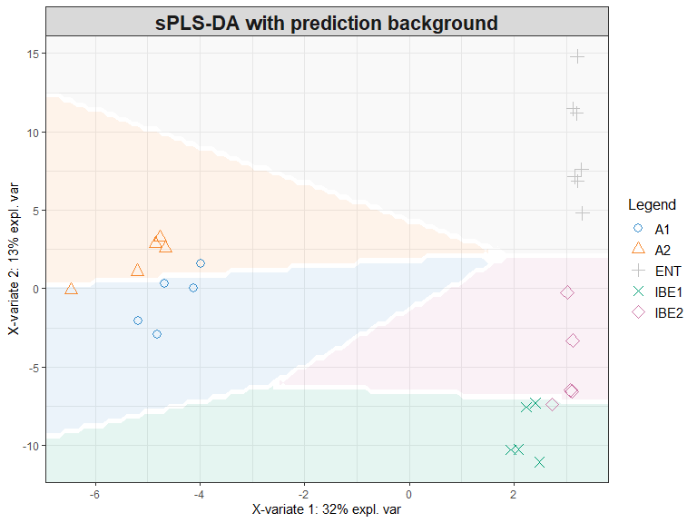<!-- -->

plot the PLS-DA result use the cenroids.dist measure to form decision
boundaries between classes based on PLS-DA data

``` r
background = background.predict(final.plsda, comp.predicted=2, dist = "centroids.dist")
```

plot the samples projected onto the first two components of the PLS-DA
subspace

``` r
plotIndiv(final.plsda, group = groups, comp = 1:2,
          ind.names = FALSE, # colour points by class
          background = background, # include prediction background for each class
          legend = TRUE, title = "PLS-DA with prediction background")
```

<!-- -->

form new perf() object which utilises the final model

``` r
perf.final.splsda <- perf(final.splsda, 
                          folds = 4, nrepeat = 100, # use repeated cross-validation
                          validation = "Mfold", dist = "centroids.dist",  
                          progressBar = T, auc = TRUE) # include AUC values
```

plot the final performance evaluation

``` r
plot(perf.final.splsda, sd = TRUE,
     legend.position = "horizontal")
```

<!-- -->

``` r
perf.final.splsda$auc
```

form new perf() object which utilises the final model

``` r
perf.final.plsda <- perf(final.plsda, 
                          folds = 4, nrepeat = 100, # use repeated cross-validation
                          validation = "Mfold", dist = "centroids.dist",  
                          progressBar = T, auc = TRUE) # include AUC values
```

plot the final performance evaluation

``` r
plot(perf.final.plsda, sd = TRUE,
     legend.position = "horizontal")
```

<!-- -->

``` r
perf.final.plsda$auc
```

##### Initial interpretation of the results

the PLS-DA outperforms Sparse PLS-DA in this case and the AUC is higher
for the PLS-DA model.

The PLS-DA model is therefore the best model for this dataset. However,
we want the sparse model because more useful for feature selection and
interpretation of biological relevance.

We can therefore use the sparse model to identify the most important
features for that model. To increase model performance, we may consider
splitting the data in a way that will make sense for our purposes.

In this case we know that A1 and A2 is only separated by 20-30 minutes
of time and 3 degrees of iBAT temperature. Thereore, we may consider
grouping A1 and A2 into one group. This will simplyfy the tasl of the
sPLS-DA model and may increase the accuracy ang give a easier
interpretation of the results.

If we are interested in the differences in between A1 and A2 we can run
a separate analysis including only these groups.

Final remarks: analysis of the sPLS-DA model shows that the model is
able to distinguish between the Torpid and euthermic groups with a high
accuracy. component 1 VIPs will be informative for what Features are
driving the separation. in perticular, the negative sPLS-DA loading
scores should be of interest. Component 2 tries to separate Euthermic
groups but with moderate success.. however, the error rates and
diagostics are not perfect, and the model is not able to separate all
groups with high accuracy.

Consider rerun model grouping A1 and A2 to into EAR (early arousal) and
IBE1 and IBE2 into IBE. Then separate model on euthermics and arousals

This is appropriate if we wish to identify the divers of the overall
patterns we see in the PLS-DA analysis so far which is that IBE1 and
IBE2 are more similar to each other than to the other groups, and that
A1 and A2 are more similar to each other than to the other groups.

Biologically, this makes sense, as IBE1 and IBE2 are both from the same
broad definition of Inter bout euthermic, and A1 and A2 are both Early
arousals.

Entry into torpor sits in between these two groups, yet is more similar
to the IBE groups than to the Arousal group Which also makes sense
biologically.

#### Grouping A1 & A2 -\> EAR

the original group variable

``` r
groups <- df.t[!df.t$group %in% c("Test", "blank", "qc"), "group"] #!test & blank
groups
```

New groups with A1 and A2 merged into new grew called EAR

``` r
groups2 <- groups

groups2[groups == "A1" | groups == "A2"] <- "EAR"

groups2
```

Performing sPLS-DA

Set a seed for reproducibility

``` r
set.seed(123)
```

Perform initial PLS-DA with a guessed number of components and variables
to keep

``` r
plsda_result <- plsda(h.df.2, groups2, ncomp = 5)
```

Plot the individuals (samples) using the initial sPLS-DA result

``` r
plotIndiv(plsda_result, group = groups2, comp = 1:2, 
          ind.names = FALSE,  # colour points by class
          ellipse = TRUE, # include 95% confidence ellipse for each class
          legend = TRUE, title =  "PLS-DA with confidence ellipses")
```

<!-- -->

``` r
perf.plsda<- perf(plsda_result, validation = "Mfold", 
                  folds = 4, nrepeat = 100, # use repeated cross-validation, 3-5 folds appropriate for small sample sizes
                  progressBar = T, auc = TRUE) # include AUC values
```

plot the outcome of performance evaluation across all ten components

``` r
plot(perf.plsda, col = color.mixo(5:7), sd = TRUE,
     legend.position = "horizontal")
```

<!-- -->

From the plot above we see that cetroids.dist measure is the best for
this data set, as it gives the lowest amount of error with the fewest
components.

``` r
perf.plsda$choice.ncomp # what is the optimal value of components according to perf()
```

grid of possible keepX values that will be tested for each component

``` r
list.keepX <- c(1:10,  seq(20, 300, 10))
```

undergo the tuning process to determine the optimal number of variables

tune.splsda \<- tune.splsda(X = h.df.2, Y = groups2, ncomp = 3, \#
calculate for first 3 components validation = ‘Mfold’, folds = 3,
nrepeat = 100, \# use repeated cross-validation, 3 folds appropriate for
small sample sizes dist = ‘centroids.dist’, measure = “BER”, \# use
balanced error rate of dist measure test.keepX = list.keepX, cpus = 5)
\# allow for paralleliation to decrease runtime

plot(tune.splsda, col = color.jet(3)) \# plot output of variable number
tuning

tune.splsda$choice.ncomp$ncomp \# what is the optimal value of
components according to tune.splsda() tune.splsda\$choice.keepX \# what
are the optimal values of variables according to tune.splsda()

\[1\] 2

tune.splsda\$choice.keepX what are the optimal values of variables
according to tune.splsda()

comp1 comp2 comp3

20 1 1

optimal.ncomp \<- tune.splsda$choice.ncomp$ncomp optimal.keepX \<-
tune.splsda\$choice.keepX\[1:optimal.ncomp\]

``` r
final.splsda <- splsda(X = h.df.2, Y = groups2,
                       ncomp = 2, #Derived from optimal ncomp
                       keepX = c(20, 10)) #Derived from optimal keepX but set comp 2 ncomps to 10

plotIndiv(final.splsda, comp = c(1,2), # plot samples from final model
          group = groups2, ind.names = FALSE, # colour by class label
          ellipse = TRUE, legend = TRUE, # include 95% confidence ellipse
          title = 'sPLS-DA EAR ENT IBE1 IBE2')
```

<!-- -->

Manual fancy plot

``` r
scores <- final.splsda$variates$X
explained_variance <- final.splsda$prop_expl_var$X * 100  # Convert to percentage
plot_data <- data.frame(scores, Group = groups2)

group_colors <- c(
  "EAR" = "#6A5ACD",  # Slate Blue
  "IBE2" = "#FF7F50", # Coral
  "IBE1" = "#2E8B57", # Sea Green
  "ENT" = "#DAA520"   # Goldenrod
)

Plot_sPLS_DA_ALL_HILIC <- ggplot(plot_data, aes(x = comp1, y = comp2, color = Group)) +
  geom_point(size = 3, alpha = 0.8, shape = 4) + 
  stat_ellipse(level = 0.95, linetype = "solid", linewidth = 0.75) +  # Solid ellipses
  scale_color_manual(values = group_colors) + 
  scale_y_continuous(limits = c(-6, 6)) +
  scale_x_continuous(limits = c(-12, 12)) +
  labs(title = "sPLS-DA HILIC , comp 1 & 2",
       x = paste0("Component 1 (", round(explained_variance[1], 2), "% variance)"),
       y = paste0("Component 2 (", round(explained_variance[2], 2), "% variance)")) +
  theme_bw(base_size = 14) +  # Base font size for readability
  theme(
    legend.title = element_blank(), 
    legend.text = element_text(size = 12), 
    plot.title = element_text(hjust = 0.5, size = 16),  
    axis.title = element_text(size = 14,), 
    axis.text = element_text(size = 12),  
    panel.grid.major = element_line(size = 0.5, color = "gray90"), 
    panel.grid.minor = element_blank()  
  )

Plot_sPLS_DA_ALL_HILIC
```

<!-- -->

use the centroids measure to form decision boundaries between classes
based on PLS-DA data

``` r
background = background.predict(final.splsda, comp.predicted=2, dist = "centroids.dist")
```

form new perf() object which utilises the final model

``` r
perf.final.splsda <- perf(final.splsda, 
                          folds = 4, nrepeat = 100, # use repeated cross-validation
                          validation = "Mfold", dist = "centroids.dist",  
                          progressBar = T, auc = TRUE) # include AUC values
```

plot the final performance evaluation

``` r
plot(perf.final.splsda, sd = TRUE,
     legend.position = "horizontal")
```

<!-- -->

``` r
perf.final.plsda$auc


#sPLS-DA on Ear model
perf.final.splsda$auc
```

##### Interpreataion of sPLS EAR model

This yeailde much better peformance. On a less colmplex model which is
desiarable.

sPLS-DA selects variables (e.g., genes, metabolites) that are most
relevant for discriminating between groups or classes.Repeated
Cross-Validation (tuning) involves dividing the data into training and
testing sets multiple times (folds) and running the model on each. It
helps assess the model’s performance and generalizability. During
repeated cross-validation in perf(), MixOmics records how often the same
variables are selected across different folds.This gives insight into
the stability or reproducibility of the variable selection.

The frequency with which a variable is selected across cross-validation
folds indicates its stability. A higher frequency suggests that the
variable is consistently chosen as important, implying higher stability.
Different components in sPLS-DA might exhibit different patterns in
terms of variable stability. For example, the first component might show
a wider variety of variable combinations leading to similar
discriminating ability, while subsequent components might show increased
stability as the model refines its classification.

The stability analysis helps to understand which variables are
consistently important across different splits of the data.It is an
essential aspect of model interpretation, especially in high-dimensional
settings like genomics or metabolomics,where feature selection is a
critical part of the analysis.

Featur stability therefore refers to how consistntly a feature is picked
as significant across different iterations or folds in cross-validation.
It acts as a gauge of feature selection reproducibility. Features with
high stability are selected consistently across various training sets,
hinting their importance is not just due to a specific data split.

VIP (Variable Importance in Projection) VIP score mesasure the
importance of eech variable in the model. specificaly, in PLS and
sPLS-DA, a VIP score shows how much a variable contributes to the
model’s capacity to distinguish between clasess or groups.

VIP scorees are derived from a variable’s contribution to the PLS
model’s component, taking into account both the explained varience of
the components and the variables impact on the response variable. Highr
VIP scores indicate variables that are more important for the model
performance. VIP is usually used for variable selection. Variables with
lower VIP scores (under a certain thresold, usually 1) might be seen as
less important and perhaps removed from the model.

VIP scores reflect how crucial features are in terms of their
contribution to the model’s efectiveness, particularly in separating
groups. Stability, on the other hand, indicates the consistncy or
reliability of the feature selection proces across different training
subsets.VIP scores are based on the model trained on the entire dataset,
while stability deals with variations in feature selection acros
diferent data subsets. VIP is tied to the model’s structure (e.g., the
number and nature of components in PLS/sPLS-DA). Stability is a more
expansive concept applicable to any feature selection proces involving
resampling or cross-validation, independent of the underlying model.

Because of thes two different aspects, it is important to consider both
VIP scores and stability when interpreting the results of a PLS/sPLS-DA
model. VIP scores help identify the most important variables for the
model, while stability provides insight into the reliability of the
variable selection process. In our final feature selection then, we are
going to use stability weighted VIP scores.

VIP scores are calculated using the vip() function. The function takes a
perf object as input.

``` r
vip_df <- as.data.frame(vip(final.splsda), check.names = FALSE)

vip_df$Feature <- rownames(vip_df)
```

Overall VIP scores column gathering all components in one column

``` r
vip_df$Components_mean <- rowMeans(vip_df[,1:2])
```

the group information is here:

``` r
groups2
```

integrating metadata group info with normalized abundace data

``` r
met.df <- data.frame(groups2, h.df.2, check.names = FALSE)
```

rearrange so groups2 is the first column using relocate

``` r
met.df <- met.df %>%
  dplyr::relocate(groups2)
```

looks good calculate the mean of each metabolite for each group

``` r
met.mean.df <- met.df %>%
  group_by(groups2) %>%
  summarise_all(mean, na.rm = TRUE)
```

Cast long

``` r
long.met.df <- met.mean.df %>%
  tidyr::pivot_longer(-groups2, names_to = "Feature", values_to = "mean_ab")

head(long.met.df)
```

Filter ‘long.met.df’ for only the metabolites present in VIP_df\$Feature

``` r
long.met.df.filtered <- long.met.df %>%
  filter(Feature %in%vip_df$Feature)
```

merge the two dataframes

``` r
vip_df <- full_join(vip_df, long.met.df.filtered, by = "Feature")
```

``` r
summary(vip_df)
```

Filter to only keep VIP scores \> 1 and apply conservative filtering
strategy from the vulcano and PCA analysis.

``` r
vip_df_filtered <- vip_df %>%
  filter(comp1 >1 | comp2 >1)%>% #filter out VIP scores <1
  dplyr:: filter(Feature %in% HILIC.vulcano.sign.all$Compound) %>%#filter out vulcano non-significant metabolites (any vs any)
  dplyr::filter(Feature %in% pca_loadings$rowname) #filter out metabolites not in the PCA loadings
```

now to create plots with feature abundances and VIP scores separatly:

Component 1 filter to keep comp1 for plotting

``` r
vip_df_filtered_c1 <- vip_df_filtered %>%
  filter(comp1 > 1)
```

Extract the stability data

``` r
stab_C1 <- data.frame( Stability = perf.final.splsda$features$stable[[1]], check.names = FALSE) 
names(stab_C1) <- c("Feature", "Stability.freq")
stab_C1$group <- paste('Stabillity')
```

Create the stability plot

``` r
pl_stab_c1 <- stab_C1%>% 
  merge(vip_df_filtered_c1, by = "Feature")%>%
  dplyr::filter(Feature %in% stab_C1$Feature)%>%
  dplyr::filter(Feature %in% vip_df_filtered_c1$Feature)%>%
  arrange(desc(Stability.freq))%>%
  ggplot(aes(x = group, y = reorder(Feature,comp1 * Stability.freq), fill = Stability.freq)) +
  geom_tile(color = "white",
            lwd = 0,
            linetype = 1) +
  scale_fill_distiller(palette = "Spectral", direction = -1, limits = c(0, 1)) + 
  scale_x_discrete(limits = c('Stabillity'), position = 'top')+
  theme_minimal() +
  theme(
    axis.text.x = element_text(vjust = 0.5),
    axis.text.y= element_blank(),
    axis.title.x = element_blank(),
    axis.title.y = element_blank(),
    plot.margin = unit(c(0.5, 0.5, 0.5, 0.5), "lines"),
    legend.position = c(15, 0.15)
  ) +
  labs(fill = "Stabillity")+
  guides(fill = guide_colourbar(barwidth = 1,
                                barheight = 10))
```

create mean abundance plot

``` r
pl_tile <- vip_df_filtered_c1%>%
  merge(stab_C1, by = "Feature")%>%
  dplyr::filter(Feature %in% stab_C1$Feature)%>%
  ggplot(aes(x = groups2, y = reorder(Feature, comp1 * Stability.freq ), fill = mean_ab)) +
  geom_tile(color = "white",
            lwd = 0,
            linetype = 1) +
  scale_fill_distiller(palette = "Spectral", direction = -1) +  # Use Spectral colors
  scale_x_discrete(limits = c("IBE1", 'IBE2', 'ENT', "EAR"), position = 'top')+
  theme_minimal() +
  theme(
    axis.text.x = element_text(vjust = 0.5),
    axis.text.y= element_blank(),
    axis.title.x = element_blank(),
    axis.title.y = element_blank(),
    plot.margin = unit(c(1, 6, 0.5, 0.5), "lines"),
    legend.position = 'right', #c(1.4, 0.9)
  ) +
  labs(fill = "Mean Relative\nAbundance")+
  guides(fill = guide_colourbar(barwidth = 1,
                                barheight = 10))
```

Create stabillity weights VIP scores plot. What are the top metabolites
that are most consistently being used in model performance evals, that
the sPLS-DA model is using to separate the groups

``` r
VIP <-  vip_df_filtered_c1%>%
  merge(stab_C1, by = "Feature")%>%
  dplyr::filter(Feature %in% stab_C1$Feature)%>% 
  ggplot(aes(x = reorder(Feature, comp1 * Stability.freq ), y = comp1 * Stability.freq)) +
  geom_point(size=5, color= 'firebrick4') +
  geom_vline(aes(xintercept = reorder(Feature,comp1 * Stability.freq)), color = "gray30") +
  labs(y = "Stabillity weighted sPLS-DA VIP Score", x = "", title = "Component 1 VIP scores sPLS-DA final MSI 1-3") +
  coord_flip()+
  theme_bw() +
  theme(panel.grid.major.x = element_blank(),    
        panel.grid.minor.x = element_blank())
```

Create the loading plot to show which direction on each component the
metabolites are pulling

``` r
loadings_comp1 <- as.data.frame(final.splsda$loadings$X[, 1])
loadings_comp1$Feature <- rownames(loadings_comp1)
```

rename the columns Loading_scores and Feature

``` r
names(loadings_comp1) <- c("Loading_scores", "Feature")
loadings_comp1$group <- paste('Loadings')
```

``` r
VIP_stab_merged <- vip_df_filtered_c1%>%
  merge(stab_C1, by = "Feature")
```

Represent loading as tiles using ggplot

``` r
pl_tile_loadings <-  loadings_comp1%>%
  merge(VIP_stab_merged, by = "Feature")%>%
  dplyr::filter(Feature %in% stab_C1$Feature)%>%
  ggplot(aes(x=group.x, y = reorder(Feature, comp1 * Stability.freq), fill = Loading_scores)) +
  geom_tile(color = "white",
            lwd = 0,
            linetype = 1) +
  scale_fill_distiller(palette = "Spectral", direction = -1, limits = c(min(loadings_comp1$Loading_scores), max(loadings_comp1$Loading_scores))) +  # Use Spectral colors
  scale_x_discrete( position = 'top')+
  theme_minimal() +
  theme(
    axis.text.x = element_text(vjust = 0.5),
    axis.text.y= element_blank(),
    axis.title.x = element_blank(),
    axis.title.y = element_blank(),
    plot.margin = unit(c(0.5, 0.5, 0.5, 0.5), "lines"),
    legend.position = c(14, 0.85)
  ) +
  labs(fill = "Loading Score")+
  guides(fill = guide_colourbar(barwidth = 1,
                                barheight = 10))
```

Combine the 4 plots side by side

``` r
comb_VIP <- VIP + pl_stab_c1+ pl_tile_loadings+  pl_tile  + plot_layout(ncol = 4, widths = c(1, 0.1, 0.1, 0.2))
```

Print the combined plot

``` r
comb_VIP
```

<!-- -->

Repeat for Component 2 filter to keep comp1 for plotting

``` r
vip_df_filtered_c2 <- vip_df_filtered %>%
  filter(comp2 > 1)

stab_c2 <- data.frame( Stability = perf.final.splsda$features$stable[[2]], check.names = FALSE) 
names(stab_c2) <- c("Feature", "Stability.freq")
stab_c2$group <- paste('Stabillity')


pl_stab_c2 <- stab_c2%>% 
  merge(vip_df_filtered_c2, by = "Feature")%>%
  dplyr::filter(Feature %in% stab_c2$Feature)%>%
  dplyr::filter(Feature %in% vip_df_filtered_c2$Feature)%>%
  arrange(desc(Stability.freq))%>%
  ggplot(aes(x = group, y = reorder(Feature, comp2 * Stability.freq), fill = Stability.freq)) +
  geom_tile(color = "white",
            lwd = 0,
            linetype = 1) +
  scale_fill_distiller(palette = "Spectral", direction = -1, limits = c(0, 1)) +  # Use Spectral colors 
  scale_x_discrete(limits = c('Stabillity'), position = 'top')+
  theme_minimal() +
  theme(
    axis.text.x = element_text(vjust = 0.5),
    axis.text.y= element_blank(),
    axis.title.x = element_blank(),
    axis.title.y = element_blank(),
    plot.margin = unit(c(0.5, 0.5, 0.5, 0.5), "lines"),
    legend.position = c(15, 0.15)
  ) +
  labs(fill = "Stabillity")+
  guides(fill = guide_colourbar(barwidth = 1,
                                barheight = 10))

pl_tile <- vip_df_filtered_c2%>%
  merge(stab_c2, by = "Feature")%>%
  dplyr::filter(Feature %in% stab_c2$Feature)%>%
  ggplot(aes(x = groups2, y = reorder(Feature, comp2 * Stability.freq ), fill = mean_ab)) +
  geom_tile(color = "white",
            lwd = 0,
            linetype = 1) +
  scale_fill_distiller(palette = "Spectral", direction = -1) +  # Use Spectral colors
  scale_x_discrete(limits = c("IBE1", 'IBE2', 'ENT', "EAR"), position = 'top')+
  theme_minimal() +
  theme(
    axis.text.x = element_text(vjust = 0.5),
    axis.text.y= element_blank(),
    axis.title.x = element_blank(),
    axis.title.y = element_blank(),
    plot.margin = unit(c(1, 6, 0.5, 0.5), "lines"),
    legend.position = 'right', #c(1.4, 0.9)
  ) +
  labs(fill = "Mean Relative\nAbundance")+
  guides(fill = guide_colourbar(barwidth = 1,
                                barheight = 10))

VIP <-  vip_df_filtered_c2%>%
  merge(stab_c2, by = "Feature")%>%
  dplyr::filter(Feature %in% stab_c2$Feature)%>% 
  ggplot(aes(x = reorder(Feature,comp2 * Stability.freq ), y = comp2 * Stability.freq)) +
  geom_point(size=5, color= 'firebrick4') +
  geom_vline(aes(xintercept = reorder(Feature,comp2 * Stability.freq)), color = "gray30") +
  labs(y = "Stabillity wighted sPLS-DA VIP Score", x = "", title = "Component 2 VIP scores sPLS-DA final MSI 1-3") +
  coord_flip()+
  theme_bw() +
  theme(panel.grid.major.x = element_blank(),    
        panel.grid.minor.x = element_blank())


loadings_comp2 <- as.data.frame(final.splsda$loadings$X[, 2])
loadings_comp2$Feature <- rownames(loadings_comp2)

names(loadings_comp2) <- c("Loading_scores", "Feature")
loadings_comp2$group <- paste('Loadings')

VIP_stab_merged <- vip_df_filtered_c2%>%
  merge(stab_c2, by = "Feature")

pl_tile_loadings <-  loadings_comp2%>%
  merge(VIP_stab_merged, by = "Feature")%>%
  dplyr::filter(Feature %in% stab_c2$Feature)%>%
  ggplot(aes(x=group.x, y = reorder(Feature, comp2 * Stability.freq), fill = Loading_scores)) +
  geom_tile(color = "white",
            lwd = 0,
            linetype = 1) +
  scale_fill_distiller(palette = "Spectral", direction = -1,
  limits = c(min(loadings_comp2$Loading_scores), max(loadings_comp2$Loading_scores))) +  # Use Spectral colors
  scale_x_discrete( position = 'top')+
  theme_minimal() +
  theme(
    axis.text.x = element_text(vjust = 0.5),
    axis.text.y= element_blank(),
    axis.title.x = element_blank(),
    axis.title.y = element_blank(),
    plot.margin = unit(c(0.5, 0.5, 0.5, 0.5), "lines"),
    legend.position = c(14, 0.85)
  ) +
  labs(fill = "Loading Score")+
  guides(fill = guide_colourbar(barwidth = 1,
                                barheight = 10))

comb_VIP <- VIP + pl_stab_c2+ pl_tile_loadings+  pl_tile  + plot_layout(ncol = 4, widths = c(1, 0.1, 0.1, 0.2))

comb_VIP
```

<!-- -->

##### Predictive performance

auroc for the first component and all three components auroc is a
measure of how well a parametr can distinguish between the groups and
the higher the value the beter the parameter is at distinguishing
between the groups. the standard is 0.5, so anything above 0.5 is better
than random. the roc curve shows the trade-of between sensitivity (or
tpr) and specificity (1 – fpr). classifiers that give curves closer to
the top-left corner indicate a beter performance. as a baseline, a
random classifier is expected to give points lying along the diagonal
(fpr = tpr).the closer the curve comes to the 45-degree diagonal of the
roc space, the less acurate the test. sensitivity, also known as the
true positive rate (tpr), is defined as the proportion of true positives
(tp) that are correctly identified by the test. it is calculated as tp /
(tp + fn), where fn is false negatives. specificity, on the other hand,
is the true negative rate and represents the proportion of true
negatives (tn) that are correctly identified. it is calculated as tn /
(tn + fp), where fp is false positives.How good the model has to be
befor it is considered acceptable is constxt spesific. at least the
model should be performing better than random guessing (auc = 0.5). a
model with auc = 1 is considered perfect.in most cases, a model with auc
\> 0.8 is considered good.

``` r
auc.splsda = auroc(final.splsda, roc.comp = 1, print = FALSE) # AUROC for the first component
```

<!-- -->

``` r
auc.splsda = auroc(final.splsda, roc.comp = 2, print = FALSE) # AUROC using both components
```

<!-- -->

final remarks:

The displayed compunds gives us a good understanding of which metabolits
are the most important for the model and has given us a good start. this
gave a result much easier to interpret with lower error rates and higher
predictive performance.

Looking at the component 1, negative loadings are highly stable and it
is clear that feature selection has done a good job. component 2 is also
very stable and well defined between the groups.

Store these compunds in a new dataframe for later use. Filter Features
from vip_df_filtered that are not present in the Feature of the
stabillity dfs stab_C1 or stab_C2 and are above1 vip score

``` r
vip_df_filtered_stab_1 <- vip_df_filtered %>%
  dplyr::filter(comp1 > 1 | comp2 >1) %>%
  dplyr::filter(Feature %in% stab_C1$Feature | Feature %in% stab_c2$Feature)
```

#### sPLS-DA Euthermic groups

The reason we want a seprate analysis done on the euthermic groups is
because arousal groups are extreamely different from the euthermic
groups. If we want to gain more insight into what happens in interbout
euthermia, we may want to remove arousal that may cas masking effects on
imoprotan metabolite dynamics in euthermia.

For this, we omit most intermittant comments in the code for faster
processing.

find which samples are the A1, A2, Test, blank and qc in df.t\[,3\]

``` r
df.t[!df.t$group %in% c("Test", "blank", "A1", "A2", "qc"), 2:3]
df.eu <- df.t[!df.t$group %in% c("Test", "blank", "A1", "A2", "qc"), 2]

h.df.3 <- h.df.2
h.df.3 <- h.df.3[rownames(h.df.3) %in% df.eu, ] 
rownames(h.df.3)


groups2 <- df.t[!df.t$group %in% c("Test", "blank", "A1", "A2", "qc"), 3]

set.seed(123)

plsda_result <- plsda(h.df.3, groups2, ncomp = 5)


plotIndiv(plsda_result, group = groups2, comp = 1:2, 
          ind.names = FALSE,  # colour points by class
          ellipse = TRUE, # include 95% confidence ellipse for each class
          legend = TRUE, title =  "PLSDA with confidence ellipses")
```

<!-- -->

use the max.dist measure to form decision boundaries between classes
based on PLS-DA data

``` r
background = background.predict(plsda_result, comp.predicted=2, dist = "max.dist")


plotIndiv(plsda_result, group = groups2, comp = 1:2,
          ind.names = FALSE, # colour points by class
          background = background, # include prediction background for each class
          legend = TRUE, title = "  PLSDA with prediction background")
```

<!-- -->

``` r
perf.plsda<- perf(plsda_result, validation = "Mfold", 
                  folds = 3, nrepeat = 100, # use repeated cross-validation, 3-5 folds appropriate for small sample sizes
                  progressBar = T, auc = TRUE) # include AUC values

plot(perf.plsda, col = color.mixo(5:7), sd = TRUE,
     legend.position = "horizontal")
```

<!-- -->

From the plot above we see that cetroids.dist measure is the best for
this data set, as it gives the lowest amount of error with the fewest
components.

``` r
perf.plsda$choice.ncomp # what is the optimal value of components according to perf()

list.keepX <- c(1:10,  seq(20, 300, 10))
```

undergo the tuning process to determine the optimal number of variables

tune.splsda \<- tune.splsda(X = h.df.3, Y = groups2, ncomp = 4, \#
calculate for first 3 components validation = ‘Mfold’, folds = 3,
nrepeat = 50, \# use repeated cross-validation, 3 folds appropriate for
small sample sizes dist = ‘centroids.dist’, measure = “BER”, \# use
balanced error rate of dist measure test.keepX = list.keepX, cpus = 5)
\# allow for paralleliation to decrease runtime

plot(tune.splsda, col = color.jet(4)) \# plot output of variable number
tuning

tune.splsda$choice.ncomp$ncomp \# what is the optimal value of
components according to tune.splsda() tune.splsda\$choice.keepX \# what
are the optimal values of variables according to tune.splsda()

optimal.ncomp \<- tune.splsda$choice.ncomp$ncomp optimal.keepX \<-
tune.splsda\$choice.keepX\[1:optimal.ncomp\]

``` r
final.splsda <- splsda(X = h.df.3, Y = groups2,
                       ncomp = 2, #set manual 
                       keepX = c(10,10)) # set manual keepX values overfitting seems to start >20 features

plotIndiv(final.splsda, comp = c(1,2), # plot samples from final model
          group = groups2, ind.names = FALSE, # colour by class label
          ellipse = TRUE, legend = TRUE, # include 95% confidence ellipse
          title = 'sPLS-DA on Euthermics HILIC')
```

<!-- -->

``` r
scores <- final.splsda$variates$X
explained_variance <- final.splsda$prop_expl_var$X * 100  # Convert to percentage
plot_data <- data.frame(scores, Group = groups2)

group_colors <- c(
  "EAR" = "#6A5ACD",  # Slate Blue
  "IBE2" = "#FF7F50", # Coral
  "IBE1" = "#2E8B57", # Sea Green
  "ENT" = "#DAA520"   # Goldenrod
)

Plot_sPLS_DA_EUTH_RPLC <- ggplot(plot_data, aes(x = comp1, y = comp2, color = Group)) +
  geom_point(size = 3, alpha = 0.8, shape=4) +  # Slight transparency to reduce overlap
  stat_ellipse(level = 0.95, linetype = "solid", linewidth = 0.75) +  # Solid ellipses
  scale_color_manual(values = group_colors) + 
  scale_y_continuous(limits = c(-10, 10)) +  # Set limits for better visualisation
  scale_x_continuous(limits = c(-10, 10)) +  # Set limits for better visualisation
  labs(title = "sPLS-DA Euthermic HILIC , comp 1 & 2",
       x = paste0("Component 1 (", round(explained_variance[1], 2), "% variance)"),
       y = paste0("Component 2 (", round(explained_variance[2], 2), "% variance)")) +
  theme_bw(base_size = 14) +  # Base font size for readability
  theme(
    legend.title = element_blank(), 
    legend.text = element_text(size = 12), 
    plot.title = element_text(hjust = 0.5, size = 16),  
    axis.title = element_text(size = 14,), 
    axis.text = element_text(size = 12),  
    panel.grid.major = element_line(size = 0.5, color = "gray90"), 
    panel.grid.minor = element_blank()  
  )

Plot_sPLS_DA_EUTH_RPLC
```

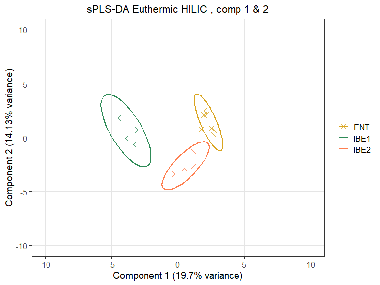<!-- -->

``` r
perf.final.splsda <- perf(final.splsda, 
                          folds = 4, nrepeat = 100, # use repeated cross-validation
                          validation = "Mfold", dist = "centroids.dist",  
                          progressBar = T, auc = TRUE) # include AUC values

plot(perf.final.splsda, sd = TRUE,
     legend.position = "horizontal")
```

<!-- -->

``` r
vip_df <- as.data.frame(vip(final.splsda), check.names = FALSE)

vip_df$Feature <- rownames(vip_df)

vip_df$Components_mean <- rowMeans(vip_df[,1:2])


met.df <- data.frame(groups2, h.df.3, check.names = FALSE)

met.df <- met.df %>%
  dplyr::relocate(groups2)

met.mean.df <- met.df %>%
  group_by(groups2) %>%
  summarise_all(mean, na.rm = TRUE)

long.met.df <- met.mean.df %>%
  tidyr::pivot_longer(-groups2, names_to = "Feature", values_to = "mean_ab")

head(long.met.df)

long.met.df.filtered <- long.met.df %>%
  filter(Feature %in%vip_df$Feature)

vip_df <- full_join(vip_df, long.met.df.filtered, by = "Feature")
```

``` r
summary(vip_df)

vip_df_filtered <- vip_df %>%
  filter(comp1 >1| comp2 >1)%>% 
  dplyr:: filter(Feature %in% HILIC.vulcano.sign.all$Compound) %>%#filter out vulcano non-significant metabolites (any vs any)
  dplyr::filter(Feature %in% pca_loadings$rowname) #filter out metabolites not in the 20% top loadings
```

now to create plots with feature abundances and VIP scores separatly:
Component 1 filter to keep comp1 for plotting

``` r
vip_df_filtered_c1 <- vip_df_filtered %>%
  filter(comp1 > 1)

stab_C1 <- data.frame( Stability = perf.final.splsda$features$stable[[1]], check.names = FALSE) 
names(stab_C1) <- c("Feature", "Stability.freq")
stab_C1$group <- paste('Stabillity')

pl_stab_c1 <- stab_C1%>% 
  merge(vip_df_filtered_c1, by = "Feature")%>%
  dplyr::filter(Feature %in% stab_C1$Feature)%>%
  dplyr::filter(Feature %in% vip_df_filtered_c1$Feature)%>%
  arrange(desc(Stability.freq))%>%
  ggplot(aes(x = group, y = reorder(Feature,comp1 * Stability.freq), fill = Stability.freq)) +
  geom_tile(color = "white",
            lwd = 0,
            linetype = 1) +
  scale_fill_distiller(palette = "Spectral", direction = -1, limits = c(0, 1)) +  # Use Spectral colors 
  scale_x_discrete(limits = c('Stabillity'), position = 'top')+
  theme_minimal() +
  theme(
    axis.text.x = element_text(vjust = 0.5),
    axis.text.y= element_blank(),
    axis.title.x = element_blank(),
    axis.title.y = element_blank(),
    plot.margin = unit(c(0.5, 0.5, 0.5, 0.5), "lines"),
    legend.position = c(15, 0.15)
  ) +
  labs(fill = "Stabillity")+
  guides(fill = guide_colourbar(barwidth = 1,
                                barheight = 10))

pl_tile <- vip_df_filtered_c1%>%
  merge(stab_C1, by = "Feature")%>%
  dplyr::filter(Feature %in% stab_C1$Feature)%>%
  ggplot(aes(x = groups2, y = reorder(Feature, comp1 * Stability.freq ), fill = mean_ab)) +
  geom_tile(color = "white",
            lwd = 0,
            linetype = 1) +
  scale_fill_distiller(palette = "Spectral", direction = -1) +  # Use Spectral colors
  scale_x_discrete(limits = c('IBE1', 'IBE2', "ENT"), position = 'top')+
  theme_minimal() +
  theme(
    axis.text.x = element_text(vjust = 0.5),
    axis.text.y= element_blank(),
    axis.title.x = element_blank(),
    axis.title.y = element_blank(),
    plot.margin = unit(c(1, 6, 0.5, 0.5), "lines"),
    legend.position = 'right', #c(1.4, 0.9)
  ) +
  labs(fill = "Mean Relative\nAbundance")+
  guides(fill = guide_colourbar(barwidth = 1,
                                barheight = 10))

VIP <-  vip_df_filtered_c1%>%
  merge(stab_C1, by = "Feature")%>%
  dplyr::filter(Feature %in% stab_C1$Feature)%>% 
  ggplot(aes(x = reorder(Feature, comp1 * Stability.freq ), y = comp1 * Stability.freq)) +
  geom_point(size=5, color= 'firebrick4') +
  geom_vline(aes(xintercept = reorder(Feature,comp1 * Stability.freq)), color = "gray30") +
  labs(y = "Stabillity weighted sPLS-DA VIP Score", x = "", title = "Component 1 VIP scores sPLS-DA final MSI 1-3") +
  coord_flip()+
  theme_bw() +
  theme(panel.grid.major.x = element_blank(),    
        panel.grid.minor.x = element_blank())

loadings_comp1 <- as.data.frame(final.splsda$loadings$X[, 1])
loadings_comp1$Feature <- rownames(loadings_comp1)

names(loadings_comp1) <- c("Loading_scores", "Feature")
loadings_comp1$group <- paste('Loadings')

VIP_stab_merged <- vip_df_filtered_c1%>%
  merge(stab_C1, by = "Feature")

pl_tile_loadings <-  loadings_comp1%>%
  merge(VIP_stab_merged, by = "Feature")%>%
  dplyr::filter(Feature %in% stab_C1$Feature)%>%
  ggplot(aes(x=group.x, y = reorder(Feature, comp1 * Stability.freq), fill = Loading_scores)) +
  geom_tile(color = "white",
            lwd = 0,
            linetype = 1) +
  scale_fill_distiller(palette = "Spectral", direction = -1, limits = c(min(loadings_comp1$Loading_scores), max(loadings_comp1$Loading_scores))) +  # Use Spectral colors
  scale_x_discrete( position = 'top')+
  theme_minimal() +
  theme(
    axis.text.x = element_text(vjust = 0.5),
    axis.text.y= element_blank(),
    axis.title.x = element_blank(),
    axis.title.y = element_blank(),
    plot.margin = unit(c(0.5, 0.5, 0.5, 0.5), "lines"),
    legend.position = c(14, 0.85)
  ) +
  labs(fill = "Loading Score")+
  guides(fill = guide_colourbar(barwidth = 1,
                                barheight = 10))

comb_VIP <- VIP + pl_stab_c1+ pl_tile_loadings+  pl_tile  + plot_layout(ncol = 4, widths = c(1, 0.1, 0.1, 0.2))

comb_VIP
```

<!-- -->

Component 2 filter to keep comp1 for plotting

``` r
vip_df_filtered_c2 <- vip_df_filtered %>%
  filter(comp2 > 1)

stab_c2 <- data.frame( Stability = perf.final.splsda$features$stable[[2]], check.names = FALSE) 
names(stab_c2) <- c("Feature", "Stability.freq")
stab_c2$group <- paste('Stabillity')

pl_stab_c2 <- stab_c2%>% 
  merge(vip_df_filtered_c2, by = "Feature")%>%
  dplyr::filter(Feature %in% stab_c2$Feature)%>%
  dplyr::filter(Feature %in% vip_df_filtered_c2$Feature)%>%
  arrange(desc(Stability.freq))%>%
  ggplot(aes(x = group, y = reorder(Feature, comp2 * Stability.freq), fill = Stability.freq)) +
  geom_tile(color = "white",
            lwd = 0,
            linetype = 1) +
  scale_fill_distiller(palette = "Spectral", direction = -1, limits = c(0, 1)) +  # Use Spectral colors 
  scale_x_discrete(limits = c('Stabillity'), position = 'top')+
  theme_minimal() +
  theme(
    axis.text.x = element_text(vjust = 0.5),
    axis.text.y= element_blank(),
    axis.title.x = element_blank(),
    axis.title.y = element_blank(),
    plot.margin = unit(c(0.5, 0.5, 0.5, 0.5), "lines"),
    legend.position = c(15, 0.15)
  ) +
  labs(fill = "Stabillity")+
  guides(fill = guide_colourbar(barwidth = 1,
                                barheight = 10))

pl_tile <- vip_df_filtered_c2%>%
  merge(stab_c2, by = "Feature")%>%
  dplyr::filter(Feature %in% stab_c2$Feature)%>%
  ggplot(aes(x = groups2, y = reorder(Feature, comp2 * Stability.freq ), fill = mean_ab)) +
  geom_tile(color = "white",
            lwd = 0,
            linetype = 1) +
  scale_fill_distiller(palette = "Spectral", direction = -1) +  # Use Spectral colors
  scale_x_discrete(limits = c('IBE1', 'IBE2', "ENT"), position = 'top')+
  theme_minimal() +
  theme(
    axis.text.x = element_text(vjust = 0.5),
    axis.text.y= element_blank(),
    axis.title.x = element_blank(),
    axis.title.y = element_blank(),
    plot.margin = unit(c(1, 6, 0.5, 0.5), "lines"),
    legend.position = 'right', #c(1.4, 0.9)
  ) +
  labs(fill = "Mean Relative\nAbundance")+
  guides(fill = guide_colourbar(barwidth = 1,
                                barheight = 10))

VIP <-  vip_df_filtered_c2%>%
  merge(stab_c2, by = "Feature")%>%
  dplyr::filter(Feature %in% stab_c2$Feature)%>% 
  ggplot(aes(x = reorder(Feature,comp2 * Stability.freq ), y = comp2 * Stability.freq)) +
  geom_point(size=5, color= 'firebrick4') +
  geom_vline(aes(xintercept = reorder(Feature,comp2 * Stability.freq)), color = "gray30") +
  labs(y = "Stabillity wighted sPLS-DA VIP Score", x = "", title = "Component 2 VIP scores sPLS-DA final MSI 1-3") +
  coord_flip()+
  theme_bw() +
  theme(panel.grid.major.x = element_blank(),    
        panel.grid.minor.x = element_blank())

loadings_comp2 <- as.data.frame(final.splsda$loadings$X[, 2])
loadings_comp2$Feature <- rownames(loadings_comp2)

names(loadings_comp2) <- c("Loading_scores", "Feature")
loadings_comp2$group <- paste('Loadings')

VIP_stab_merged <- vip_df_filtered_c2%>%
  merge(stab_c2, by = "Feature")

pl_tile_loadings <-  loadings_comp2%>%
  merge(VIP_stab_merged, by = "Feature")%>%
  dplyr::filter(Feature %in% stab_c2$Feature)%>%
  ggplot(aes(x=group.x, y = reorder(Feature, comp2 * Stability.freq), fill = Loading_scores)) +
  geom_tile(color = "white",
            lwd = 0,
            linetype = 1) +
  scale_fill_distiller(palette = "Spectral", direction = -1, limits = c(min(loadings_comp2$Loading_scores), max(loadings_comp2$Loading_scores))) +  # Use Spectral colors
  scale_x_discrete( position = 'top')+
  theme_minimal() +
  theme(
    axis.text.x = element_text(vjust = 0.5),
    axis.text.y= element_blank(),
    axis.title.x = element_blank(),
    axis.title.y = element_blank(),
    plot.margin = unit(c(0.5, 0.5, 0.5, 0.5), "lines"),
    legend.position = c(14, 0.85)
  ) +
  labs(fill = "Loading Score")+
  guides(fill = guide_colourbar(barwidth = 1,
                                barheight = 10))

comb_VIP <- VIP + pl_stab_c2+ pl_tile_loadings+  pl_tile  + plot_layout(ncol = 4, widths = c(1, 0.1, 0.1, 0.2))

comb_VIP
```

<!-- -->

``` r
vip_df_filtered_stab_2 <- vip_df_filtered %>%
  dplyr::filter(comp1 > 1 | comp2 >1) %>%
  dplyr::filter(Feature %in% stab_C1$Feature | Feature %in% stab_c2$Feature)


auc.splsda = auroc(final.splsda, roc.comp = 1, print = FALSE) # AUROC for the first component
```

<!-- -->

``` r
auc.splsda = auroc(final.splsda, roc.comp = 2, print = FALSE) # AUROC using both components
```

<!-- -->

Using 2 Componetns seem to yeald a good predictive performance. However
I am sligly conserned about overfitting due to low sample size for this
perticular subset. A sentiment that is based on tuning diagnistics of
the model. However, the model is still able to predict the test samples
with a high accuracy. And we keep these features for further enrichment
analysis.

We now store the features that we have selected though sPLS-DA for
enrichment analysis, which will be done togther with the RPLC data.

``` r
HILIC.shorthib.all.list.enriched <- vip_df_filtered_stab_1 %>%
  dplyr::select(!comp2)%>%
  left_join(HILIC.DB.match, by = c("Feature" = "Query")) %>%
  dplyr::select(Feature, Match, HMDB, tag)

HILIC.shorthib.all.list.enriched <- HILIC.shorthib.all.list.enriched$Match%>%na.omit()%>%unique()%>%as.vector()

HILIC.shorthib.euuthermics.list.enriched <- vip_df_filtered_stab_2 %>%
  left_join(HILIC.DB.match, by = c("Feature" = "Query")) %>%
  dplyr::select(Feature, Match, HMDB, tag)

HILIC.shorthib.euuthermics.list.enriched<-HILIC.shorthib.euuthermics.list.enriched$Match%>%na.omit()%>%unique()%>%as.vector()
```

And write it to disk if nessecary:
write.csv(HILIC.shorthib.all.list.enriched,
“./data/HILIC.shorthib.all.list.enriched.csv”, row.names = FALSE)
write.csv(HILIC.shorthib.euuthermics.list.enriched,
“./data/HILIC.shorthib.euuthermics.list.enriched.csv”, row.names =
FALSE)

Manual work to select features. Fist iteration of the pipline Identified
many features of interest. Many of which was found to be assosiated with
food intake. Food intake is a variable we could not control for in the
study. We therefore decided to remove these features from the list of
features of interest, i hope to mitigate the impact of this confouding
variable on model performance and feature selection.

``` r
Foods <- c("D-(+)-Xylose", "Galactitol", "Panaxatriol", "D-Gluconic Acid D-Lactone",
           "Gluconic Acid", "D-Gluconic Acid", "Cepharadione A", "Hippurate", "Tetradecanedioic Acid", 
           "Behenic Acid", "(E)-Ferulic Acid", "Tartrate", "Cdp-Ethanolamine", "Benzoic Acid",
           "Erythritol", "4-Acetamidobutyric Acid", "16-Hydroxyhexadecanoic Acid", 
           "Juniperic Acid", "Myrmicacin", "1-Arachidonoyl-Sn-Glycero-3-Phosphoethanolamine", 
           "1-Linoleoyl-Sn-Glycero-3-Phosphoethanolamine", "Methyl Salicylate", "Ethylparaben", "Diboa",
           "Acetophenone", "Toluene", "Phenylethyl Alcohol", "Sesartemin", "3-Methoxyphenylacetic Acid", 
           "2,5-Di-Tert-Butylhydroquinone", "Almecillin", "Benalfocin", "Convicine", "Diflufenican",
           "Djenkolic Acid", "Rubiadin", "Caffeic Acid 3-Glucoside", "Glabridin")
```

Cycle back to top of sPLS-DA analysis and re-run with only the features
of interest (Foods removed from h.df.2) Food metabolites from the RPLC
analysis is also added there.

clean environment before running the next part of the analysis.

``` r
rm(list=setdiff(ls(), c("RPLC.final", "RPLC.DB.match", "HILIC.final", "HILIC.DB.match", "RPLC.volcano.sign.all", "HILIC.vulcano.sign.all")))
```

# 5. RPLC Data Analysis

Initial data exploration The same logic as for the HILIC data is applied
here. Since most is resused code. Moset comments are ommited. Commenting
and interpretation is given where nedded.

Normalize senter and scale:

``` r
df.t <- read.csv("./data/RPLC_pos_final_FM.csv", header = TRUE, check.names = FALSE)
names(df.t)  
ncol(df.t)

metabolites <- as.data.frame(colnames(df.t)[4:ncol(df.t)] , check.names = F)

qc <- df.t[df.t$group == "qc", 4:ncol(df.t)] #extracts qc grpup

norm <- apply(qc, 2, median, na.rm = TRUE) #calculates the median for each compound

met.sc <- df.t
met.sc[,4:ncol(met.sc)] <- sweep(df.t[, 4:ncol(met.sc)], 2, norm, FUN = "/") #sweep across all columns, 2 indicates columns

met.sc <- scale(sqrt(met.sc[,4:ncol(met.sc)]), center = T, scale = T)
```

Making 4 plots showing effects of normalization

``` r
m.sc.plot <- cbind(df.t[2], met.sc)%>%
  melt(., id= "sample")%>%
  mutate(value =as.numeric(unlist(value)))%>%
  ggplot(aes(value, variable))+
  geom_boxplot(fill='gray20', color= 'gray50') +
  labs(y='Compound',
       x='Normalized Peak Intensity') + 
  theme_classic()+
  theme(
    axis.text.y = element_blank(),   
    axis.ticks.y = element_blank(),
plot.margin = margin(1, 1, 1, 1, "cm")
  )

m.sc.dens <- cbind(df.t[2], met.sc)%>%
  melt(., id= "sample")%>%
  mutate(value =as.numeric(unlist(value)))%>%
  ggplot(aes(value))+
  geom_density(linewidth=1, color ='grey20')+
  labs(title = 'After Normalization', 
       y='Density',
       x='Normalized Peak Intensity') + 
  theme_classic()+
  theme(
    axis.ticks.y = element_blank(),
    plot.title = element_text(hjust = 0.5),
    plot.margin = margin(1, 1, 1, 1, "cm"))


df.t.unnorm.box <-
  cbind(df.t[2], df.t[4:ncol(df.t)])%>%
  melt(., id= "sample")%>%
  mutate(value =as.numeric(unlist(value)))%>%
  ggplot(aes(value, variable))+
  geom_boxplot(fill='gray20', color= 'gray50') +
  labs(y='Compound',
       x='Peak Intensity') + 
  theme_classic()+
  theme(
    axis.text.y = element_blank(),   
    axis.ticks.y = element_blank(),
    plot.margin = margin(1, 1, 1, 1, "cm"))

df.t.unnorm.dens <-cbind(df.t[2], df.t[4:ncol(df.t)])%>%
  melt(., id= "sample")%>%
  mutate(value =as.numeric(unlist(value)))%>%
  ggplot(aes(value))+
  geom_density(linewidth=1, color ='grey20')+
  labs(title = 'Before Normalization', 
       y='Density',
       x=' Peak Intensity') + 
  theme_classic()+
  theme(
    axis.ticks.y = element_blank(),
    plot.title = element_text(hjust = 0.5),
    plot.margin = margin(1, 1, 1, 1, "cm")
  )

grid.arrange(df.t.unnorm.dens,m.sc.dens, df.t.unnorm.box, m.sc.plot, ncol=2)
```

<!-- -->

Inspection of plot the normalization seems OK.

Cluster analysis with heat map

``` r
rownames(met.sc) <- df.t[,2] #Making row names the samples
h.df<-as.matrix(met.sc)
rownames(h.df) <- df.t[,2] #Making row names the samples

c <-rev(brewer.pal(6,"RdBu")) #take reverse order of six colors from Brewer palette RdBu
col_fun = colorRamp2(c(-2,-1,0,1,2,4),c) #make gradient and supply color scale range

an.col <- list(group = c("IBE1"= "#E41A1C", "IBE2"="#377EB8", "A1"="#4DAF4A", 
                         "A2"="#984EA3","ENT"= "#FF7F00",
                         "Test" ="#FFFF33","qc"="#FDBF6F", "blank"= "#A65628" ))

ha <- HeatmapAnnotation(group = df.t[,3], col = an.col,
                        annotation_legend_param = list(
                          group = list(title = ""))
)

heat <- Heatmap(t(h.df),
                show_row_names=FALSE,
                clustering_distance_rows ="euclidean",
                clustering_distance_columns ="euclidean",
                clustering_method_rows= "ward.D",
                clustering_method_columns= "ward.D",
                column_dend_height = unit(2, "cm"), 
                row_dend_width = unit(2, "cm"),
                col = col_fun,
                top_annotation = ha,
                heatmap_legend_param = list(
                  title = "Relative abundance",
                  legend_height = unit(3, "cm"),
                  title_position = "leftcenter-rot"
                ))

heat
```

<!-- -->

Heat map looks good. QCs ok and Blank ok.P1 clearly stand out. Removing
these two from analysis futher. Skipping k-means as i was good for
initial expolration but PCA was deemed better suited for this kinds of
data.

Heatmap 2 preamble

``` r
rm<- c("P1", "blank")

h.df.2 <- h.df[!rownames(h.df) %in% rm, ]

c <-rev(brewer.pal(6,"RdBu")) #take reverse order of six colors from Brewer palette RdBu
col_fun = colorRamp2(c(-2,-1,0,1,2,4),c) #make gradient and supply color scale range

an.col <- list(group = c("IBE1"= "#E41A1C", "IBE2"="#377EB8", "A1"="#4DAF4A", 
                         "A2"="#984EA3","ENT"= "#FF7F00","qc"="#FDBF6F"
))

df.t$group
df.t[!df.t$group %in% c("Test", "blank"), "group"]
rownames(h.df.2)

ha.2 <- HeatmapAnnotation(group = df.t[!df.t$group %in% c("Test", "blank"), "group"], col = an.col,
                          annotation_legend_param = list(
                            group = list(title = ""))
)


heat.2 <- Heatmap(t(h.df.2),
                  show_row_names=FALSE,
                  clustering_distance_rows ="euclidean",
                  clustering_distance_columns ="euclidean",
                  clustering_method_rows= "ward.D",
                  clustering_method_columns= "ward.D",
                  column_dend_height = unit(2, "cm"), 
                  row_dend_width = unit(2, "cm"),
                  col = col_fun,
                  top_annotation = ha.2,
                  heatmap_legend_param = list(
                    title = "Relative abundance",
                    legend_height = unit(3, "cm"),
                    title_position = "leftcenter-rot"
                  ))

ht <- draw(heat.2)
```

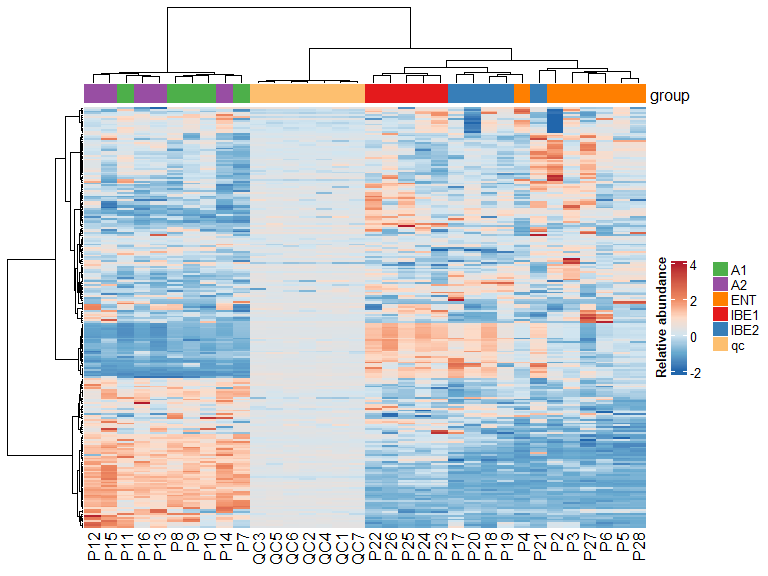<!-- -->

PCA, since we have sqrt transformed, scaled and centered our data (thus
interval data) PCA analysis is appropriate. include QCs for initial PCA
analysis

``` r
rm<- c("P1", "blank")
h.df.2 <- h.df[!rownames(h.df) %in% rm, ]

metadata<-data.frame(row.names = rownames(h.df.2))

metadata$group <- df.t[!df.t$group %in% c("Test", "blank"), "group"]  #!test &  blank

pca.h.df.2 <- PCAtools::pca(t(h.df.2), metadata=metadata ,removeVar = 0.1)

screeplot(pca.h.df.2, axisLabSize = 18, titleLabSize = 22)
```

<!-- -->

``` r
pairsplot(pca.h.df.2,
          components = getComponents(pca.h.df.2, c(1:5)),
          triangle = TRUE, trianglelabSize = 12,
          hline = 0, vline = 0,
          pointSize = 0.75,
          gridlines.major = FALSE, gridlines.minor = FALSE,
          title = 'Pairs plot', plotaxes = FALSE,
          margingaps = unit(c(-0.01, -0.01, -0.01, -0.01), 'cm')
)
```

<!-- -->

3 components explain 63% of the variation in the data. but mostly 1 and
2. No me than 2 in loading plot is probable sensible

``` r
biplot(pca.h.df.2,
       colby = "group",
       colkey = c('A1' = '#1f77b4',
                  'A2' = '#ff7f0e', 
                  'IBE1' = '#2ca02c', 
                  'IBE2' = '#d62728', 
                  'ENT' = '#9467bd',
                  'qc' = '#8c564b'),
       pointSize = 5,
       showLoadings = TRUE,
       ntopLoadings = 5,
       lengthLoadingsArrowsFactor = 1.5,
       sizeLoadingsNames = 3,
       showLoadingsNames = T,
       hline = 0, vline = 0,
       legendPosition = 'right',
       encircle = TRUE
)
```

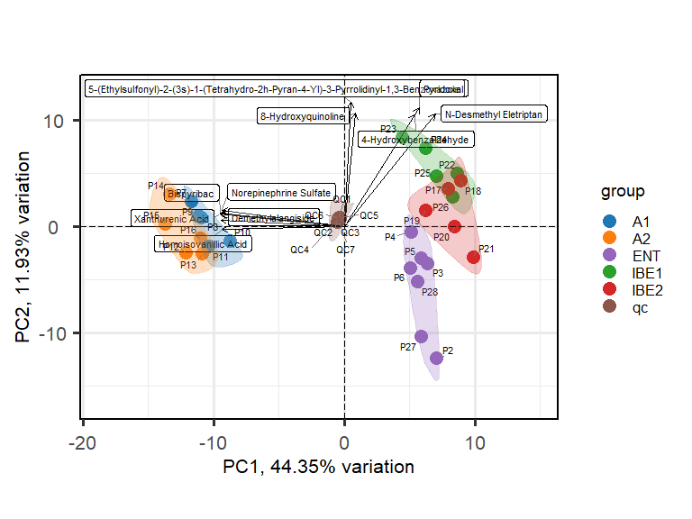<!-- -->

Extract loadings for PC1 and PC2

``` r
a <- as.data.frame(pca.h.df.2$loadings) %>% 
  dplyr::select(PC1) %>% 
  tibble::rownames_to_column()

plot_loading <- a%>%
  filter( PC1< (min(a$PC1) + ((max(a$PC1) - min(a$PC1)) * 0.2)) | PC1>(max(a$PC1) - ((max(a$PC1) - min(a$PC1)) * 0.2))) %>%
  ggplot(aes(reorder(rowname, PC1, mean),y=PC1))+geom_point()+coord_flip()

plot_loading
```

<!-- -->

``` r
b <- as.data.frame(pca.h.df.2$loadings) %>% 
  dplyr::select(PC2) %>% 
  tibble::rownames_to_column()

plot_loading2 <- b%>%
  filter( PC2< (min(b$PC2) + ((max(b$PC2) - min(b$PC2)) * 0.2)) | PC2>(max(b$PC2) - ((max(b$PC2) - min(b$PC2)) * 0.2))) %>%
  ggplot(aes(reorder(rowname, PC2, mean),y=PC2))+geom_point()+scale_x_discrete(position = "top") +coord_flip()

plot_loading2
```

<!-- -->

``` r
pca_loadings <- full_join(a,b, by = "rowname")

pca.h.df.2$loadings$magnitude <- sqrt(pca.h.df.2$loadings$PC1^2 + pca.h.df.2$loadings$PC2^2)

top_50_cutoff <- quantile(pca.h.df.2$loadings$magnitude, 0.5)

pca.h.df.2$loadings$highlight <- pca.h.df.2$loadings$magnitude >= top_50_cutoff

loadings <- ggplot(pca.h.df.2$loadings, aes(x = PC1, y = PC2, color = highlight, size = highlight)) +
  geom_hline(yintercept = 0, linetype = "dashed", color = "gray50") +
  geom_vline(xintercept = 0, linetype = "dashed", color = "gray50") +
  geom_point() +
  scale_color_manual(values = c("steelblue4", "firebrick3")) +
  scale_size_manual(values = c(1, 2)) +
  xlab("PC1") +
  ylab("PC2") +
  ggtitle("Loadings plot PC1 & PC2 top 50% loadings highlighted") +
  theme_bw() +
  theme(plot.title = element_text(hjust = 0.5),
          legend.position = "none")

loadings
```

<!-- -->

\##sPLS-DA

``` r
library(mixOmics)
```

``` r
Food <- c("D-(+)-Xylose","Galactitol","Panaxatriol","D-GluconicAcidD-Lactone",
          "GluconicAcid","D-GluconicAcid","CepharadioneA","Hippurate","TetradecanedioicAcid",
          "BehenicAcid","(E)-FerulicAcid","Tartrate","Cdp-Ethanolamine","BenzoicAcid",
          "Erythritol","4-AcetamidobutyricAcid","16-HydroxyhexadecanoicAcid",
          "JunipericAcid","Myrmicacin","1-Arachidonoyl-Sn-Glycero-3-Phosphoethanolamine",
          "1-Linoleoyl-Sn-Glycero-3-Phosphoethanolamine","MethylSalicylate","Ethylparaben","Diboa",
          "Acetophenone","Toluene","PhenylethylAlcohol","Sesartemin","3-MethoxyphenylaceticAcid",
          "2,5-Di-Tert-Butylhydroquinone","Almecillin","Benalfocin","Convicine","Diflufenican",
          "DjenkolicAcid","Rubiadin","CaffeicAcid3-Glucoside","Glabridin","2-Amino-4-Methylpyrimidine","2-Amino-4-Methylpyrimidine",
          "4-Cyano-4-(Dodecylsulfanylthiocarbonyl)SulfanylpentanoicAcid",
          "(3ar,4r,11ar)-4-Hydroxy-10-(Hydroxymethyl)-3-Methylidene-2-Oxo-2h,3h,3ah,4h,5h,8h,9h,11ah-Cyclodecabfuran-6-Carbaldehyde",
          "4-Indolecarbaldehyde","6-Methylquinoline","4,4'-Bipyridine","Bispyribac","Aspartame","1h-Indene-3-Carboxamide",
          "2-(1s)-1-Hydroxyethyl-4(1h)-Quinazolinone","(S)-(+)-2-Amino-1-Propanol")

h.df.3 <- h.df.2[,!colnames(h.df.2) %in% Food]
```

\###sPLS-DA all samples

the original group variable:

``` r
groups <- df.t[!df.t$group %in% c("Test", "blank", "qc"), "group"] #!test & blank
groups
```

remove QC1 - 7 in h.df.3 rows

``` r
h.df.3 <- h.df.3[!rownames(h.df.3) %in% c("QC1", "QC2", "QC3", "QC4", "QC5", "QC6", "QC7"),]

groups2 <- groups

length(groups2)
length(rownames(h.df.3))

head(h.df.3[,1:4])
```

Performing sPLS-DA Set a seed for reproducibility

``` r
set.seed(123)
```

Perform initial PLS-DA with a guessed number of components and variables
to keep

``` r
plsda_result <- plsda(h.df.3, groups2, ncomp = 10)

plotIndiv(plsda_result, group = groups2, comp = 1:2, 
          ind.names = FALSE,  # colour points by class
          ellipse = TRUE, # include 95% confidence ellipse for each class
          legend = TRUE, title = 'PLSDA with confidence ellipses')
```

<!-- -->

undergo performance evaluation in order to tune the number of components
to use

``` r
perf.splsda<- perf(plsda_result, validation = "Mfold", 
                          folds = 4, nrepeat = 100, # use repeated cross-validation, 3-5 folds appropriate for small sample sizes
                          progressBar = T, auc = TRUE) # include AUC values
```

plot the outcome of performance evaluation across all ten components

``` r
plot(perf.splsda, col = color.mixo(5:7), sd = TRUE,
     legend.position = "horizontal")
```

<!-- -->

``` r
perf.splsda$choice.ncomp # what is the optimal value of components according to perf()

list.keepX <- c(1:10,  seq(20, 300, 10))
```

undergo the tuning process to determine the optimal number of variables

tune.splsda \<- tune.splsda(X = h.df.3, Y = groups2, ncomp = 7, \#
calculate for first 7 components validation = ‘Mfold’, folds = 4,
nrepeat = 50, \# use repeated cross-validation, 3 folds appropriate for
small sample sizes dist = ‘centroids.dist’, \# measure = “BER”, \# use
balanced error rate of dist measure test.keepX = list.keepX, cpus = 5)
\# allow for paralleliation to decrease runtime } plot(tune.splsda, col
= color.jet(7)) \# plot output of variable number tuning

tune.splsda$choice.ncomp$ncomp \# what is the optimal value of
components according to tune.splsda() tune.splsda\$choice.keepX \# what
are the optimal values of variables according to tune.splsda()

optimal.ncomp \<- tune.splsda$choice.ncomp$ncomp optimal.keepX \<-
tune.splsda\$choice.keepX\[1:optimal.ncomp\]

``` r
final.splsda <- splsda(X = h.df.3, Y = groups2,
                       ncomp = 2 , #manual set of ncomp values based on eval on the final perf results. No additional error improvement after 2 components 
                       keepX = c( 50 ,   20) ) #manual from optimal.keepX

final.plsda <- plsda(X = h.df.3, Y = groups2,
                     ncomp = 4)

background = background.predict(final.splsda, comp.predicted=2, dist = "centroids.dist")

plotIndiv(final.splsda, group = groups2, comp = 1:2,
          ind.names = FALSE, # colour points by class
          background = background, # include prediction background for each class
          legend = TRUE, title = "sPLS-DA with prediction background")
```

<!-- -->

``` r
background = background.predict(final.plsda, comp.predicted=2, dist = "centroids.dist")

plotIndiv(final.plsda, group = groups2, comp = 1:2,
          ind.names = FALSE, # colour points by class
          background = background, # include prediction background for each class
          legend = TRUE, title = "PLS-DA with prediction background")
```

<!-- -->

form new perf() object which utilises the final model

``` r
perf.final.splsda <- perf(final.splsda, 
                          folds = 4, nrepeat = 100, # use repeated cross-validation
                          validation = "Mfold", dist = "mahalanobis.dist",  
                          progressBar = T, auc = TRUE) # include AUC values

plot(perf.final.splsda, sd = TRUE,
     legend.position = "horizontal")
```

<!-- -->

``` r
perf.final.splsda$auc

perf.final.plsda <- perf(final.plsda, 
                         folds = 4, nrepeat = 100, # use repeated cross-validation
                         validation = "Mfold", dist = "centroids.dist",  
                         progressBar = T, auc = TRUE) # include AUC values

plot(perf.final.plsda, sd = TRUE,
     legend.position = "horizontal")
```

<!-- -->

``` r
perf.final.plsda$auc
```

the sPLS-DA outperforms PLS-DA in this case and the AUC is higher for
the sPLS-DA model. The sPLS-DA model is therefore the best model for
this dataset.

A sparse model is more useful for feature selection and interpretation
of biological relevance. We can therefore use the sparse model to
identify the most important features for that model.

Not the best compared performance model (AUC numbers). Appears hard to
separate A1 and A2 from the each other. But model seems to do fine
separating arousal from Other, and separates ENT, IBE1 & IBE2 well. So
mediocre diagnostics may be due to the two arousal groups blending. For
the same reason as with the HILIC analysis we merge A1 A2 into one group
and check performance.

## Grouping A1 and A2 -\> EAR

the original group variable:

``` r
groups <- df.t[!df.t$group %in% c("Test", "blank", "qc"), "group"] #!test & blank
groups
```

New groups with A1 and A2 merged into new grew called EAR

``` r
groups2 <- groups
groups2[groups == "A1" | groups == "A2"] <- "EAR"
groups2
```

Performing sPLS-DA

``` r
set.seed(123)
plsda_result <- plsda(h.df.3, groups2, ncomp = 10)

plotIndiv(plsda_result, group = groups2, comp = 1:2, 
          ind.names = FALSE,  # colour points by class
          ellipse = TRUE, # include 95% confidence ellipse for each class
          legend = TRUE, title =  "PLSDA with confidence ellipses")
```

<!-- -->

``` r
perf.plsda<- perf(plsda_result, validation = "Mfold", 
                   folds = 4, nrepeat = 100, # use repeated cross-validation, 3-5 folds appropriate for small sample sizes
                   progressBar = T, auc = TRUE) # include AUC values

plot(perf.plsda, col = color.mixo(5:7), sd = TRUE,
     legend.position = "horizontal")
```

<!-- -->

From the plot above we see that cetroids.dist measure is the best for
this data set, as it gives the lowest amount of error with the fewest
components.

``` r
perf.plsda$choice.ncomp # what is the optimal value of components according to perf()

list.keepX <- c(1:10,  seq(20, 300, 10))
```

undergo the tuning process to determine the optimal number of variables

tune.splsda \<- tune.splsda(X = h.df.3, Y = groups2, ncomp = 4, \#
calculate for first 6 components validation = ‘Mfold’, folds = 4,
nrepeat = 100, \# use repeated cross-validation, 3 folds appropriate for
small sample sizes dist = ‘centroids.dist’, measure = “BER”, \# use
balanced error rate of dist measure test.keepX = list.keepX, cpus = 5)
\# allow for paralleliation to decrease runtime

plot(tune.splsda, col = color.jet(4)) \# plot output of variable number
tuning

tune.splsda$choice.ncomp$ncomp \# what is the optimal value of
components according to tune.splsda() returns 2 as optimal number of
components.

tune.splsda\$choice.keepX \# what are the optimal values of variables
according to tune.splsda()

optimal.ncomp \<- tune.splsda$choice.ncomp$ncomp optimal.keepX \<-
tune.splsda\$choice.keepX\[1:optimal.ncomp\]

``` r
final.splsda <- splsda(X = h.df.3, Y = groups2,
                       ncomp = 2, #derived from optimal.ncomp
                       keepX = c(50,    30 )) #derived from optimal.keepX

plotIndiv(final.splsda, comp = c(1,2), # plot samples from final model
          group = groups2, ind.names = FALSE, # colour by class label
          ellipse = TRUE, legend = TRUE, # include 95% confidence ellipse
          title = 'sPLS-DA shorthib , comp 1 & 2')
```

<!-- -->

``` r
scores <- final.splsda$variates$X
explained_variance <- final.splsda$prop_expl_var$X * 100  # Convert to percentage
plot_data <- data.frame(scores, Group = groups2)


group_colors <- c(
  "EAR" = "#6A5ACD",  # Slate Blue
  "IBE2" = "#FF7F50", # Coral
  "IBE1" = "#2E8B57", # Sea Green
  "ENT" = "#DAA520"   # Goldenrod
)


Plot_sPLS_DA_SH_RPLC <- ggplot(plot_data, aes(x = comp1, y = comp2, color = Group)) +
  geom_point(size = 3, alpha = 0.8) +  # Slight transparency to reduce overlap
  stat_ellipse(level = 0.95, linetype = "solid", linewidth = 0.75) +  # Solid ellipses
  scale_color_manual(values = group_colors) + 
  scale_y_continuous(limits = c(-6, 6)) +
  scale_x_continuous(limits = c(-12, 12)) +
  labs(title = "sPLS-DA shorthib , comp 1 & 2",
       x = paste0("Component 1 (", round(explained_variance[1], 2), "% variance)"),
       y = paste0("Component 2 (", round(explained_variance[2], 2), "% variance)")) +
  theme_bw(base_size = 14) +  # Base font size for readability
  theme(
    legend.title = element_blank(), 
    legend.text = element_text(size = 12), 
    plot.title = element_text(hjust = 0.5, size = 16),  
    axis.title = element_text(size = 14,), 
    axis.text = element_text(size = 12),  
    panel.grid.major = element_line(size = 0.5, color = "gray90"), 
    panel.grid.minor = element_blank()  
  )

Plot_sPLS_DA_SH_RPLC
```

<!-- -->

``` r
background = background.predict(final.splsda, comp.predicted=2, dist = "centroids.dist")

plotIndiv(final.splsda, group = groups2, comp = 1:2,
          ind.names = FALSE, # colour points by class
          background = background, # include prediction background for each class
          legend = TRUE, title = "sPLSDA with prediction background")
```

<!-- -->

``` r
perf.final.splsda <- perf(final.splsda, 
                          folds = 4, nrepeat = 100, # use repeated cross-validation
                          validation = "Mfold", dist = "centroids.dist",  
                          progressBar = T, auc = TRUE) # include AUC values

plot(perf.final.splsda, sd = TRUE,
     legend.position = "horizontal")
```

<!-- --> So we display a plot th AUCs:

``` r
auc.splsda = auroc(final.splsda, roc.comp = 1, print = FALSE) # AUROC for the first component
```

<!-- -->

``` r
auc.splsda = auroc(final.splsda, roc.comp = 2, print = FALSE) # AUROC for both components
```

<!-- -->

``` r
auc.splsda
```

<!-- -->

This yealded a very good model with clear predicition outcome. So we
plot the stabillity weighted VIP scores for the model as for the HILIC
than save the compund list for enrichment analysis.

``` r
vip_df <- as.data.frame(vip(final.splsda), check.names = FALSE)

vip_df$Feature <- rownames(vip_df)

vip_df$Components_mean <- rowMeans(vip_df[,1:2])

met.df <- data.frame(groups2, h.df.3, check.names = FALSE)

met.df <- met.df %>%
  dplyr::relocate(groups2)
```

calculate the mean of each metabolite for each group

``` r
met.mean.df <- met.df %>%
  group_by(groups2) %>%
  summarise_all(mean, na.rm = TRUE)

long.met.df <- met.mean.df %>%
  tidyr::pivot_longer(-groups2, names_to = "Feature", values_to = "mean_ab")

head(long.met.df)
```

Filter ‘long.met.df’ for only the metabolites present in VIP_df\$Feature

``` r
long.met.df.filtered <- long.met.df %>%
  filter(Feature %in%vip_df$Feature)

vip_df <- full_join(vip_df, long.met.df.filtered, by = "Feature")

summary(vip_df)
```

Filter to only keep VIP scores \> 1 and apply conservative filtering
strategy keeping only 20% PCA loadingsand significant metabolitesFrom
the vulcano plots

``` r
vip_df_filtered <- vip_df %>%
  filter(comp1 >1 | comp2 >1)%>% #filter out VIP scores <1
  dplyr:: filter(Feature %in% RPLC.volcano.sign.all$Compound) %>%#filter out vulcano non-significant metabolites (any vs any)
  dplyr::filter(Feature %in% pca_loadings$rowname) #filter out metabolites not in the PCA loadings
```

now to create plots with feature abundances and VIP scores separatly:

Component 1:

``` r
vip_df_filtered_c1 <- vip_df_filtered %>%
  filter(comp1 > 1)

stab_C1 <- data.frame( Stability = perf.final.splsda$features$stable[[1]], check.names = FALSE) 
names(stab_C1) <- c("Feature", "Stability.freq")
stab_C1$group <- paste('Stabillity')

pl_stab_c1 <- stab_C1%>% 
  merge(vip_df_filtered_c1, by = "Feature")%>%
  dplyr::filter(Feature %in% stab_C1$Feature)%>%
  dplyr::filter(Feature %in% vip_df_filtered_c1$Feature)%>%
  arrange(desc(Stability.freq))%>%
  ggplot(aes(x = group, y = reorder(Feature,comp1 * Stability.freq), fill = Stability.freq)) +
  geom_tile(color = "white",
            lwd = 0,
            linetype = 1) +
  scale_fill_distiller(palette = "Spectral", direction = -1, limits = c(0, 1)) +  # Use Spectral colors 
  scale_x_discrete(limits = c('Stabillity'), position = 'top')+
  theme_minimal() +
  theme(
    axis.text.x = element_text(vjust = 0.5),
    axis.text.y= element_blank(),
    axis.title.x = element_blank(),
    axis.title.y = element_blank(),
    plot.margin = unit(c(0.5, 0.5, 0.5, 0.5), "lines"),
    legend.position = c(15, 0.15)
  ) +
  labs(fill = "Stabillity")+
  guides(fill = guide_colourbar(barwidth = 1,
                                barheight = 10))

pl_tile <- vip_df_filtered_c1%>%
  merge(stab_C1, by = "Feature")%>%
  dplyr::filter(Feature %in% stab_C1$Feature)%>%
  ggplot(aes(x = groups2, y = reorder(Feature, comp1 * Stability.freq ), fill = mean_ab)) +
  geom_tile(color = "white",
            lwd = 0,
            linetype = 1) +
  scale_fill_distiller(palette = "Spectral", direction = -1) +  # Use Spectral colors
  scale_x_discrete(limits = c("IBE1", 'IBE2', 'ENT', "EAR"), position = 'top')+
  theme_minimal() +
  theme(
    axis.text.x = element_text(vjust = 0.5),
    axis.text.y= element_blank(),
    axis.title.x = element_blank(),
    axis.title.y = element_blank(),
    plot.margin = unit(c(1, 6, 0.5, 0.5), "lines"),
    legend.position = 'right', #c(1.4, 0.9)
  ) +
  labs(fill = "Mean Relative\nAbundance")+
  guides(fill = guide_colourbar(barwidth = 1,
                                barheight = 10))

VIP <-  vip_df_filtered_c1%>%
  merge(stab_C1, by = "Feature")%>%
  dplyr::filter(Feature %in% stab_C1$Feature)%>% 
  ggplot(aes(x = reorder(Feature, comp1 * Stability.freq ), y = comp1 * Stability.freq)) +
  geom_point(size=5, color= 'firebrick4') +
  geom_vline(aes(xintercept = reorder(Feature,comp1 * Stability.freq)), color = "gray30") +
  labs(y = "Stabillity weighted sPLS-DA VIP Score", x = "", title = "Component 1 VIP scores sPLS-DA final MSI 1-3") +
  coord_flip()+
  theme_bw() +
  theme(panel.grid.major.x = element_blank(),    
        panel.grid.minor.x = element_blank())

loadings_comp1 <- as.data.frame(final.splsda$loadings$X[, 1])
loadings_comp1$Feature <- rownames(loadings_comp1)

names(loadings_comp1) <- c("Loading_scores", "Feature")
loadings_comp1$group <- paste('Loadings')

VIP_stab_merged <- vip_df_filtered_c1%>%
  merge(stab_C1, by = "Feature")

pl_tile_loadings <-  loadings_comp1%>%
  merge(VIP_stab_merged, by = "Feature")%>%
  dplyr::filter(Feature %in% stab_C1$Feature)%>%
  ggplot(aes(x=group.x, y = reorder(Feature, comp1 * Stability.freq), fill = Loading_scores)) +
  geom_tile(color = "white",
            lwd = 0,
            linetype = 1) +
  scale_fill_distiller(palette = "Spectral", direction = -1, limits = c(min(loadings_comp1$Loading_scores), max(loadings_comp1$Loading_scores))) +  # Use Spectral colors
  scale_x_discrete( position = 'top')+
  theme_minimal() +
  theme(
    axis.text.x = element_text(vjust = 0.5),
    axis.text.y= element_blank(),
    axis.title.x = element_blank(),
    axis.title.y = element_blank(),
    plot.margin = unit(c(0.5, 0.5, 0.5, 0.5), "lines"),
    legend.position = c(14, 0.85)
  ) +
  labs(fill = "Loading Score")+
  guides(fill = guide_colourbar(barwidth = 1,
                                barheight = 10))


comb_VIP <- VIP + pl_stab_c1+ pl_tile_loadings+  pl_tile  + plot_layout(ncol = 4, widths = c(1, 0.1, 0.1, 0.2))

comb_VIP
```

<!-- -->

Component 2

``` r
vip_df_filtered_c2 <- vip_df_filtered %>%
  filter(comp2 > 1)

stab_c2 <- data.frame( Stability = perf.final.splsda$features$stable[[2]], check.names = FALSE) 
names(stab_c2) <- c("Feature", "Stability.freq")
stab_c2$group <- paste('Stabillity')

pl_stab_c2 <- stab_c2%>% 
  merge(vip_df_filtered_c2, by = "Feature")%>%
  dplyr::filter(Feature %in% stab_c2$Feature)%>%
  dplyr::filter(Feature %in% vip_df_filtered_c2$Feature)%>%
  arrange(desc(Stability.freq))%>%
  ggplot(aes(x = group, y = reorder(Feature, comp2 * Stability.freq), fill = Stability.freq)) +
  geom_tile(color = "white",
            lwd = 0,
            linetype = 1) +
  scale_fill_distiller(palette = "Spectral", direction = -1, limits = c(0, 1)) +  # Use Spectral colors 
  scale_x_discrete(limits = c('Stabillity'), position = 'top')+
  theme_minimal() +
  theme(
    axis.text.x = element_text(vjust = 0.5),
    axis.text.y= element_blank(),
    axis.title.x = element_blank(),
    axis.title.y = element_blank(),
    plot.margin = unit(c(0.5, 0.5, 0.5, 0.5), "lines"),
    legend.position = c(15, 0.15)
  ) +
  labs(fill = "Stabillity")+
  guides(fill = guide_colourbar(barwidth = 1,
                                barheight = 10))

pl_tile <- vip_df_filtered_c2%>%
  merge(stab_c2, by = "Feature")%>%
  dplyr::filter(Feature %in% stab_c2$Feature)%>%
  ggplot(aes(x = groups2, y = reorder(Feature, comp2 * Stability.freq ), fill = mean_ab)) +
  geom_tile(color = "white",
            lwd = 0,
            linetype = 1) +
  scale_fill_distiller(palette = "Spectral", direction = -1) +  # Use Spectral colors
  scale_x_discrete(limits = c("IBE1", 'IBE2', 'ENT', "EAR"), position = 'top')+
  theme_minimal() +
  theme(
    axis.text.x = element_text(vjust = 0.5),
    axis.text.y= element_blank(),
    axis.title.x = element_blank(),
    axis.title.y = element_blank(),
    plot.margin = unit(c(1, 6, 0.5, 0.5), "lines"),
    legend.position = 'right', #c(1.4, 0.9)
  ) +
  labs(fill = "Mean Relative\nAbundance")+
  guides(fill = guide_colourbar(barwidth = 1,
                                barheight = 10))

VIP <-  vip_df_filtered_c2%>%
  merge(stab_c2, by = "Feature")%>%
  dplyr::filter(Feature %in% stab_c2$Feature)%>% 
  ggplot(aes(x = reorder(Feature,comp2 * Stability.freq ), y = comp2 * Stability.freq)) +
  geom_point(size=5, color= 'firebrick4') +
  geom_vline(aes(xintercept = reorder(Feature,comp2 * Stability.freq)), color = "gray30") +
  labs(y = "Stabillity wighted sPLS-DA VIP Score", x = "", title = "Component 2 VIP scores sPLS-DA final MSI 1-3") +
  coord_flip()+
  theme_bw() +
  theme(panel.grid.major.x = element_blank(),    
        panel.grid.minor.x = element_blank())

loadings_comp2 <- as.data.frame(final.splsda$loadings$X[, 2])
loadings_comp2$Feature <- rownames(loadings_comp2)

names(loadings_comp2) <- c("Loading_scores", "Feature")
loadings_comp2$group <- paste('Loadings')

VIP_stab_merged <- vip_df_filtered_c2%>%
  merge(stab_c2, by = "Feature")

pl_tile_loadings <-  loadings_comp2%>%
  merge(VIP_stab_merged, by = "Feature")%>%
  dplyr::filter(Feature %in% stab_c2$Feature)%>%
  ggplot(aes(x=group.x, y = reorder(Feature, comp2 * Stability.freq), fill = Loading_scores)) +
  geom_tile(color = "white",
            lwd = 0,
            linetype = 1) +
  scale_fill_distiller(palette = "Spectral", direction = -1, limits = c(min(loadings_comp2$Loading_scores), max(loadings_comp2$Loading_scores))) +  # Use Spectral colors
  scale_x_discrete( position = 'top')+
  theme_minimal() +
  theme(
    axis.text.x = element_text(vjust = 0.5),
    axis.text.y= element_blank(),
    axis.title.x = element_blank(),
    axis.title.y = element_blank(),
    plot.margin = unit(c(0.5, 0.5, 0.5, 0.5), "lines"),
    legend.position = c(14, 0.85)
  ) +
  labs(fill = "Loading Score")+
  guides(fill = guide_colourbar(barwidth = 1,
                                barheight = 10))

comb_VIP <- VIP + pl_stab_c2+ pl_tile_loadings+  pl_tile  + plot_layout(ncol = 4, widths = c(1, 0.1, 0.1, 0.2))

comb_VIP
```

<!-- -->

filter Features from vip_df_filtered that are not present in the Feature
of the stabillity dfs stab_C1 or stab_C2 and are above 0.8 vip score

``` r
vip_df_filtered_stab_1 <- vip_df_filtered %>%
  dplyr::filter(comp1 > 1 | comp2 > 1) %>%
  dplyr::filter(Feature %in% stab_C1$Feature | Feature %in% stab_c2$Feature)
```

final remarks: analysis of the sPLS-DA model shows that the model is
very capable of separating all groups if A1 and A2 are merged.

Component 1 Separates early arousal very effectivly and neggative
loading values are informative for what features are driving the
separation.

Component 2 tries to separate Euthermic groups and does so well.
However, the model is using some of the same features as component 1 and
stabillity shows that using these features are not as effective for
separating arousal groups from euthermic group in component 2. Component
2 VIPs will be informative for what Features are driving metabolic arc
fro, IBE1 to Entry. in perticular, the negative sPLS-DA loading scores
should be of interest identifying Entry specific metabolites.

Extract features for enrichment analysis

``` r
list_Euhermics_1 <- vip_df_filtered_stab_1%>%
  dplyr::select(Feature)%>%
  unique()
```

## sPLS-DA euthermic groups

IBE2 vs ENTRY VS IBE1 the original group variable:

``` r
df.t[,2:3]

df.t[!df.t$group %in% c("Test", "blank", "A1", "A2", "qc"), 2:3]
df.eu <- df.t[!df.t$group %in% c("Test", "blank", "A1", "A2",  "qc"), 2]

h.df.3 <- h.df.2
h.df.3 <- h.df.3[rownames(h.df.3) %in% df.eu, ] 
rownames(h.df.3)

groups2 <- df.t[!df.t$group %in% c("Test", "blank",  "A1", "A2", "qc"), 3]
groups2

head(h.df.3[,1:4])
```

Performing sPLS-DA Set a seed for reproducibility

``` r
set.seed(123)

plsda_result <- plsda(h.df.3, groups2, ncomp = 3)

plotIndiv(plsda_result, group = groups2, comp = 1:2, 
          ind.names = FALSE,  # colour points by class
          ellipse = TRUE, # include 95% confidence ellipse for each class
          legend = TRUE, title =  "PLSDA with confidence ellipses")
```

<!-- -->

``` r
perf.plsda<- perf(plsda_result, validation = "Mfold", 
                  folds = 3, nrepeat = 100, # use repeated cross-validation, 3-5 folds appropriate for small sample sizes
                  progressBar = T, auc = TRUE) # include AUC values

plot(perf.plsda, col = color.mixo(5:7), sd = TRUE,
     legend.position = "horizontal")
```

<!-- -->

From the plot above we see that cetroids.dist measure is the best for
this data set, as it gives the lowest amount of error with the fewest
components.

perf.plsda\$choice.ncomp \# what is the optimal value of components
according to perf() list.keepX \<- c(1:10, seq(20, 300, 10))

undergo the tuning process to determine the optimal number of variables
tune.splsda \<- tune.splsda(X = h.df.3, Y = groups2, ncomp = 3, \#
calculate for first 6 components validation = ‘Mfold’, folds = 3,
nrepeat = 50, \# use repeated cross-validation, 3 folds appropriate for
small sample sizes dist = ‘max.dist’, measure = “BER”, \# use balanced
error rate of dist measure test.keepX = list.keepX, cpus = 5) \# allow
for paralleliation to decrease runtime

plot(tune.splsda, col = color.jet(3)) \# plot output of variable number
tuning

tune.splsda$choice.ncomp$ncomp \# what is the optimal value of
components according to tune.splsda() tune.splsda\$choice.keepX \# what
are the optimal values of variables according to tune.splsda()

optimal.ncomp \<- tune.splsda$choice.ncomp$ncomp optimal.keepX \<-
tune.splsda\$choice.keepX\[1:optimal.ncomp\]

optimal.keepX comp1 comp2 comp3 40 20 180

``` r
final.splsda <- splsda(X = h.df.3, Y = groups2,
                       ncomp = 2, #derived form optimal.ncomp
                       keepX =c(40,    20 )) #derived from optimal.keepX

plotIndiv(final.splsda, comp = c(1,2), # plot samples from final model
          group = groups2, ind.names = FALSE, # colour by class label
          ellipse = TRUE, legend = TRUE, # include 95% confidence ellipse
          title = 'sPLS-DA Euthermic RPLC')
```

<!-- -->

``` r
scores <- final.splsda$variates$X
explained_variance <- final.splsda$prop_expl_var$X * 100  # Convert to percentage
plot_data <- data.frame(scores, Group = groups2)

group_colors <- c(
  "EAR" = "#6A5ACD",  # Slate Blue
  "IBE2" = "#FF7F50", # Coral
  "IBE1" = "#2E8B57", # Sea Green
  "ENT" = "#DAA520"   # Goldenrod
)

Plot_sPLS_DA_EUTH_RPLC <- ggplot(plot_data, aes(x = comp1, y = comp2, color = Group)) +
  geom_point(size = 3, alpha = 0.8) +  # Slight transparency to reduce overlap
  stat_ellipse(level = 0.95, linetype = "solid", linewidth = 0.75) +  # Solid ellipses
  scale_color_manual(values = group_colors) + 
  scale_y_continuous(limits = c(10, -10), trans = "reverse", position = 'right') +
  scale_x_continuous(limits = c(-10, 10)) +
  labs(title = "sPLS-DA Euthermic RPLC , comp 1 & 2",
       x = paste0("Component 1 (", round(explained_variance[1], 2), "% variance)"),
       y = paste0("Component 2 (", round(explained_variance[2], 2), "% variance)")) +
  theme_bw(base_size = 14) +  # Base font size for readability
  theme(
    legend.title = element_blank(), 
    legend.text = element_text(size = 12), 
    plot.title = element_text(hjust = 0.5, size = 16),  
    axis.title = element_text(size = 14,), 
    axis.text = element_text(size = 12),  
    panel.grid.major = element_line(size = 0.5, color = "gray90"), 
    panel.grid.minor = element_blank()  
  )

Plot_sPLS_DA_EUTH_RPLC
```

<!-- -->

``` r
background = background.predict(final.splsda, comp.predicted=2, dist = "max.dist")

plotIndiv(final.splsda, group = groups2, comp = 1:2,
          ind.names = FALSE, # colour points by class
          background = background, # include prediction background for each class
          legend = TRUE, title = "sPLS-DA IBE2 vs ENT")
```

<!-- -->

``` r
perf.final.splsda <- perf(final.splsda, 
                          folds = 4, nrepeat = 100, # use repeated cross-validation
                          validation = "Mfold", dist = "centroids.dist",  
                          progressBar = T, auc = TRUE) # include AUC values

plot(perf.final.splsda, sd = TRUE,
     legend.position = "horizontal")
```

<!-- -->

``` r
perf.final.splsda$auc
```

Model performance is good, with a balanced error rate of 0.1 and an AUC
approaching 1. The model is able to distinguish between the 3 classes
with high accuracy.

We proccent with the stabillity wieghted VIPS

``` r
vip_df <- as.data.frame(vip(final.splsda), check.names = FALSE)

vip_df$Feature <- rownames(vip_df)

vip_df$Components_mean <- rowMeans(vip_df[,1:2])

groups2

met.df <- data.frame(groups2, h.df.3, check.names = FALSE)

met.df <- met.df %>%
  dplyr::relocate(groups2)

met.mean.df <- met.df %>%
  group_by(groups2) %>%
  summarise_all(mean, na.rm = TRUE)

long.met.df <- met.mean.df %>%
  tidyr::pivot_longer(-groups2, names_to = "Feature", values_to = "mean_ab")

head(long.met.df)

long.met.df.filtered <- long.met.df %>%
  filter(Feature %in%vip_df$Feature)

vip_df <- full_join(vip_df, long.met.df.filtered, by = "Feature")

summary(vip_df)
```

filter to only keep VIP scores \> 1 and apply conservative filtering
strategy

``` r
vip_df_filtered <- vip_df %>%
  filter(comp1 >1| comp2 >1)%>% 
  dplyr:: filter(Feature %in% RPLC.volcano.sign.all$Compound) %>%#filter out vulcano non-significant metabolites (any vs any)
  dplyr::filter(Feature %in% pca_loadings$rowname) #filter out metabolites not in the 20% top loadings
```

now to create plots with feature abundances and VIP scores separatly:

Component 1:

``` r
vip_df_filtered_c1 <- vip_df_filtered %>%
  filter(comp1 > 1)

stab_C1 <- data.frame( Stability = perf.final.splsda$features$stable[[1]], check.names = FALSE) 
names(stab_C1) <- c("Feature", "Stability.freq")
stab_C1$group <- paste('Stabillity')

pl_stab_c1 <- stab_C1%>% 
  merge(vip_df_filtered_c1, by = "Feature")%>%
  dplyr::filter(Feature %in% stab_C1$Feature)%>%
  dplyr::filter(Feature %in% vip_df_filtered_c1$Feature)%>%
  arrange(desc(Stability.freq))%>%
  ggplot(aes(x = group, y = reorder(Feature,comp1 * Stability.freq), fill = Stability.freq)) +
  geom_tile(color = "white",
            lwd = 0,
            linetype = 1) +
  scale_fill_distiller(palette = "Spectral", direction = -1, limits = c(0, 1)) +  # Use Spectral colors 
  scale_x_discrete(limits = c('Stabillity'), position = 'top')+
  theme_minimal() +
  theme(
    axis.text.x = element_text(vjust = 0.5),
    axis.text.y= element_blank(),
    axis.title.x = element_blank(),
    axis.title.y = element_blank(),
    plot.margin = unit(c(0.5, 0.5, 0.5, 0.5), "lines"),
    legend.position = c(15, 0.15)
  ) +
  labs(fill = "Stabillity")+
  guides(fill = guide_colourbar(barwidth = 1,
                                barheight = 10))

pl_tile <- vip_df_filtered_c1%>%
  merge(stab_C1, by = "Feature")%>%
  dplyr::filter(Feature %in% stab_C1$Feature)%>%
  ggplot(aes(x = groups2, y = reorder(Feature, comp1 * Stability.freq ), fill = mean_ab)) +
  geom_tile(color = "white",
            lwd = 0,
            linetype = 1) +
  scale_fill_distiller(palette = "Spectral", direction = -1) +  # Use Spectral colors
  scale_x_discrete(limits = c('IBE1', 'IBE2', "ENT"), position = 'top')+
  theme_minimal() +
  theme(
    axis.text.x = element_text(vjust = 0.5),
    axis.text.y= element_blank(),
    axis.title.x = element_blank(),
    axis.title.y = element_blank(),
    plot.margin = unit(c(1, 6, 0.5, 0.5), "lines"),
    legend.position = 'right', #c(1.4, 0.9)
  ) +
  labs(fill = "Mean Relative\nAbundance")+
  guides(fill = guide_colourbar(barwidth = 1,
                                barheight = 10))

VIP <-  vip_df_filtered_c1%>%
  merge(stab_C1, by = "Feature")%>%
  dplyr::filter(Feature %in% stab_C1$Feature)%>% 
  ggplot(aes(x = reorder(Feature, comp1 * Stability.freq ), y = comp1 * Stability.freq)) +
  geom_point(size=5, color= 'firebrick4') +
  geom_vline(aes(xintercept = reorder(Feature,comp1 * Stability.freq)), color = "gray30") +
  labs(y = "Stabillity weighted sPLS-DA VIP Score", x = "", title = "Component 1 VIP scores sPLS-DA final MSI 1-3") +
  coord_flip()+
  theme_bw() +
  theme(panel.grid.major.x = element_blank(),    
        panel.grid.minor.x = element_blank())

loadings_comp1 <- as.data.frame(final.splsda$loadings$X[, 1])
loadings_comp1$Feature <- rownames(loadings_comp1)

names(loadings_comp1) <- c("Loading_scores", "Feature")
loadings_comp1$group <- paste('Loadings')

VIP_stab_merged <- vip_df_filtered_c1%>%
  merge(stab_C1, by = "Feature")

pl_tile_loadings <-  loadings_comp1%>%
  merge(VIP_stab_merged, by = "Feature")%>%
  dplyr::filter(Feature %in% stab_C1$Feature)%>%
  ggplot(aes(x=group.x, y = reorder(Feature, comp1 * Stability.freq), fill = Loading_scores)) +
  geom_tile(color = "white",
            lwd = 0,
            linetype = 1) +
  scale_fill_distiller(palette = "Spectral", direction = -1, limits = c(min(loadings_comp1$Loading_scores), max(loadings_comp1$Loading_scores))) +  # Use Spectral colors
  scale_x_discrete( position = 'top')+
  theme_minimal() +
  theme(
    axis.text.x = element_text(vjust = 0.5),
    axis.text.y= element_blank(),
    axis.title.x = element_blank(),
    axis.title.y = element_blank(),
    plot.margin = unit(c(0.5, 0.5, 0.5, 0.5), "lines"),
    legend.position = c(14, 0.85)
  ) +
  labs(fill = "Loading Score")+
  guides(fill = guide_colourbar(barwidth = 1,
                                barheight = 10))

comb_VIP <- VIP + pl_stab_c1+ pl_tile_loadings+  pl_tile  + plot_layout(ncol = 4, widths = c(1, 0.1, 0.1, 0.2))

comb_VIP
```

<!-- -->

Component 2:

``` r
vip_df_filtered_c2 <- vip_df_filtered %>%
  filter(comp2 > 1)

stab_c2 <- data.frame( Stability = perf.final.splsda$features$stable[[2]], check.names = FALSE) 
names(stab_c2) <- c("Feature", "Stability.freq")
stab_c2$group <- paste('Stabillity')

pl_stab_c2 <- stab_c2%>% 
  merge(vip_df_filtered_c2, by = "Feature")%>%
  dplyr::filter(Feature %in% stab_c2$Feature)%>%
  dplyr::filter(Feature %in% vip_df_filtered_c2$Feature)%>%
  arrange(desc(Stability.freq))%>%
  ggplot(aes(x = group, y = reorder(Feature, comp2 * Stability.freq), fill = Stability.freq)) +
  geom_tile(color = "white",
            lwd = 0,
            linetype = 1) +
  scale_fill_distiller(palette = "Spectral", direction = -1, limits = c(0, 1)) +  # Use Spectral colors 
  scale_x_discrete(limits = c('Stabillity'), position = 'top')+
  theme_minimal() +
  theme(
    axis.text.x = element_text(vjust = 0.5),
    axis.text.y= element_blank(),
    axis.title.x = element_blank(),
    axis.title.y = element_blank(),
    plot.margin = unit(c(0.5, 0.5, 0.5, 0.5), "lines"),
    legend.position = c(15, 0.15)
  ) +
  labs(fill = "Stabillity")+
  guides(fill = guide_colourbar(barwidth = 1,
                                barheight = 10))

pl_tile <- vip_df_filtered_c2%>%
  merge(stab_c2, by = "Feature")%>%
  dplyr::filter(Feature %in% stab_c2$Feature)%>%
  ggplot(aes(x = groups2, y = reorder(Feature, comp2 * Stability.freq ), fill = mean_ab)) +
  geom_tile(color = "white",
            lwd = 0,
            linetype = 1) +
  scale_fill_distiller(palette = "Spectral", direction = -1) +  # Use Spectral colors
  scale_x_discrete(limits = c('IBE1', 'IBE2', "ENT"), position = 'top')+
  theme_minimal() +
  theme(
    axis.text.x = element_text(vjust = 0.5),
    axis.text.y= element_blank(),
    axis.title.x = element_blank(),
    axis.title.y = element_blank(),
    plot.margin = unit(c(1, 6, 0.5, 0.5), "lines"),
    legend.position = 'right', #c(1.4, 0.9)
  ) +
  labs(fill = "Mean Relative\nAbundance")+
  guides(fill = guide_colourbar(barwidth = 1,
                                barheight = 10))

VIP <-  vip_df_filtered_c2%>%
  merge(stab_c2, by = "Feature")%>%
  dplyr::filter(Feature %in% stab_c2$Feature)%>% 
  ggplot(aes(x = reorder(Feature,comp2 * Stability.freq ), y = comp2 * Stability.freq)) +
  geom_point(size=5, color= 'firebrick4') +
  geom_vline(aes(xintercept = reorder(Feature,comp2 * Stability.freq)), color = "gray30") +
  labs(y = "Stabillity wighted sPLS-DA VIP Score", x = "", title = "Component 2 VIP scores sPLS-DA final MSI 1-3") +
  coord_flip()+
  theme_bw() +
  theme(panel.grid.major.x = element_blank(),    
        panel.grid.minor.x = element_blank())

loadings_comp2 <- as.data.frame(final.splsda$loadings$X[, 2])
loadings_comp2$Feature <- rownames(loadings_comp2)

names(loadings_comp2) <- c("Loading_scores", "Feature")
loadings_comp2$group <- paste('Loadings')

VIP_stab_merged <- vip_df_filtered_c2%>%
  merge(stab_c2, by = "Feature")

pl_tile_loadings <-  loadings_comp2%>%
  merge(VIP_stab_merged, by = "Feature")%>%
  dplyr::filter(Feature %in% stab_c2$Feature)%>%
  ggplot(aes(x=group.x, y = reorder(Feature, comp2 * Stability.freq), fill = Loading_scores)) +
  geom_tile(color = "white",
            lwd = 0,
            linetype = 1) +
  scale_fill_distiller(palette = "Spectral", direction = -1, limits = c(min(loadings_comp2$Loading_scores), max(loadings_comp2$Loading_scores))) +  # Use Spectral colors
  scale_x_discrete( position = 'top')+
  theme_minimal() +
  theme(
    axis.text.x = element_text(vjust = 0.5),
    axis.text.y= element_blank(),
    axis.title.x = element_blank(),
    axis.title.y = element_blank(),
    plot.margin = unit(c(0.5, 0.5, 0.5, 0.5), "lines"),
    legend.position = c(14, 0.85)
  ) +
  labs(fill = "Loading Score")+
  guides(fill = guide_colourbar(barwidth = 1,
                                barheight = 10))

comb_VIP <- VIP + pl_stab_c2+ pl_tile_loadings+  pl_tile  + plot_layout(ncol = 4, widths = c(1, 0.1, 0.1, 0.2))

comb_VIP
```

<!-- -->

So we save the VIP features for the components 1 and 2

``` r
vip_df_filtered_stab_3 <- vip_df_filtered %>%
  dplyr::filter(comp1 > 1 | comp2 > 1) %>%
  dplyr::filter(Feature %in% stab_C1$Feature | Feature %in% stab_c2$Feature)

list_Euhermics_2 <- vip_df_filtered_stab_3%>%
  dplyr::select(Feature)%>%
  unique()
```

To make sure we get as much info as possible from both the PLS-DA with
all animals and euthermic animals, we merge the two lists for enrichemnt
analysis. We do this because while we want to reduce the number of
features we look at en the enrichment analysis. We mus also make sure
that the Enrichment analysis has enough compounds to work with. In
theory, the features selected here are the very top features that are th
most important for the sPLS-da models classification prediciton in both
data sets (HILIC and RPLC)

We also make a list containing only euthremic animals to see if we can
discover any features that are specific to interbout euthermia and
entry.

And so we compile the lists and write them to disk

``` r
RPLC.shorthib.all.list <- list_Euhermics_1%>%
  full_join(list_Euhermics_2)%>%
  unique()%>%
  left_join(RPLC.DB.match, by = c("Feature" = "Query"))%>%
  dplyr::select(Feature, Match, HMDB, tag)

RPLC.shorthib.all.list.enriched <- RPLC.shorthib.all.list$Match%>%na.omit()%>%unique()%>%as.vector()

RPLC.shorhib.euthermics.list <- list_Euhermics_2%>%
  unique()%>%
  left_join(RPLC.DB.match, by = c("Feature" = "Query"))%>%
  dplyr::select(Feature, Match, HMDB, tag)

RPLC.shorthib.euthermics.list.enriched <-RPLC.shorhib.euthermics.list$Match%>%na.omit()%>%unique()%>%as.vector()

RPLC.shorthib.all.list.enriched
RPLC.shorthib.euthermics.list.enriched
```

write.csv(RPLC.shorthib.all.list.enriched,
“./data/RPLC.shorthib.all.list.enriched.csv”)
write.csv(RPLC.shorthib.euthermics.list.enriched,
“./data/RPLC.shorthib.euthermics.list.enriched.csv”)

clean all in environment

``` r
rm(list=setdiff(ls(), c("RPLC.final", "RPLC.DB.match", "HILIC.final", "HILIC.DB.match")))
```

# 6. Enrichment plots

``` r
#Install dependencies if nessecary (uncomment)
#install.packages("rtools")

#metanr_packages <- function(){
#  
#  metr_pkgs <- c("impute", "pcaMethods", "globaltest", "GlobalAncova", #"Rgraphviz", "preprocessCore", "genefilter", "sva", "limma", "KEGGgraph", #"siggenes","BiocParallel", "MSnbase", #"multtest","RBGL","edgeR","fgsea","devtools","crmn","httr","qs")
#  
#  list_installed <- installed.packages()
#  
#  new_pkgs <- subset(metr_pkgs, !(metr_pkgs %in% list_installed[, #"Package"]))
#  
#  if(length(new_pkgs)!=0){
#    
#    if (!requireNamespace("BiocManager", quietly = TRUE))
#      install.packages("BiocManager")
#    BiocManager::install(new_pkgs)
#    print(c(new_pkgs, " packages added..."))
# }
#  
#  if((length(new_pkgs)<1)){
#    print("No new packages added...")
#  }
#}
#
#metanr_packages()

#Install MetaboAnalystR without documentation
#devtools::install_github("xia-lab/MetaboAnalystR", build = TRUE, build_vignettes = FALSE)

library(dplyr)
library(tidyverse)
library("MetaboAnalystR")

#install.packages("extrafont")
library(extrafont)
#font_import()  # This step may take some time to run
#loadfonts(device = "win")
```

Import the data generated from the sPLS-DA analysis and make plots for
the enriched features. Using Metaboanalystr for enrichment analysis.

``` r
RPLC.shorthib.all.list.enriched <- read.csv("./data/RPLC.shorthib.all.list.enriched.csv")
RPLC.shorthib.all.list.enriched <- RPLC.shorthib.all.list.enriched[,2]
HILIC.shorthib.all.list.enriched <- read.csv("./data/HILIC.shorthib.all.list.enriched.csv")
HILIC.shorthib.all.list.enriched <- HILIC.shorthib.all.list.enriched[,1]

RPLC.shorthib.all.list.enriched
HILIC.shorthib.all.list.enriched

cmpd.vec <- c(RPLC.shorthib.all.list.enriched, HILIC.shorthib.all.list.enriched)

cmpd.vec


as.data.frame(cmpd.vec)

mSet<-InitDataObjects("conc", "msetora", FALSE)


#initiate dataframe and manual namechecks:
mSet<-Setup.MapData(mSet, cmpd.vec);
    mSet<-CrossReferencing(mSet, "name");
    mSet<-CreateMappingResultTable(mSet)

    mSet<-PerformDetailMatch(mSet, "1,5-Naphthalenediamine");
    mSet<-GetCandidateList(mSet);
    mSet<-PerformDetailMatch(mSet, "N-benzylformamide");
    mSet<-GetCandidateList(mSet);
    mSet<-PerformDetailMatch(mSet, "myriocin");
    mSet<-GetCandidateList(mSet);
    mSet<-PerformDetailMatch(mSet, "4-Methylpyridine");
    mSet<-GetCandidateList(mSet);
    mSet<-SetCandidate(mSet, "4-Methylpyridine", "2-Acetyl-4-methylpyridine");
    mSet<-PerformDetailMatch(mSet, "Salicylhydroxamic acid");
    mSet<-GetCandidateList(mSet);
    mSet<-SetCandidate(mSet, "Salicylhydroxamic acid", "Acetohydroxamic Acid");
    mSet<-PerformDetailMatch(mSet, "Azelnidipine");
    mSet<-GetCandidateList(mSet);
    mSet<-PerformDetailMatch(mSet, "2-C-methyl-D-erythritol-4-phosphate");
    mSet<-GetCandidateList(mSet);
    mSet<-SetCandidate(mSet, "2-C-methyl-D-erythritol-4-phosphate", "2-C-Methyl-D-erythritol 4-phosphate");
    mSet<-PerformDetailMatch(mSet, "Demethylalangiside");
    mSet<-GetCandidateList(mSet);
    mSet<-SetCandidate(mSet, "Demethylalangiside", "Demethylisoalangiside");
    mSet<-PerformDetailMatch(mSet, "2-Aminoadipic acid");
    mSet<-GetCandidateList(mSet);
    mSet<-SetCandidate(mSet, "2-Aminoadipic acid", "Aminoadipic acid");
    mSet<-PerformDetailMatch(mSet, "2-Aminobicyclo[3.1.0]hexane-2,6-dicarboxylic acid");
    mSet<-GetCandidateList(mSet);
    mSet<-PerformDetailMatch(mSet, "Deferiprone");
    mSet<-GetCandidateList(mSet);
    mSet<-PerformDetailMatch(mSet, "Phenols");
    mSet<-GetCandidateList(mSet);
    mSet<-PerformDetailMatch(mSet, "Glucoiberverin");
    mSet<-GetCandidateList(mSet);
    mSet<-SetCandidate(mSet, "Glucoiberverin", "Glucoiberin");


#assosiate with smpdb pathways (error with kegg here but same results as smpdb in the metaobanalyst webbrowser service)
mSet<-SetMetabolomeFilter(mSet, F);
mSet<-SetCurrentMsetLib(mSet, "smpdb_pathway", 2);
mSet<-CalculateHyperScore(mSet)


#extract and plot the enriched pathways
a_enrich.data<- as.data.frame(mSet[["analSet"]][["ora.mat"]])
a_enrich.data$Pathway<-rownames(a_enrich.data)


p3 <-  a_enrich.data %>%
  dplyr::filter(-log10(`Raw p`) > 0.43) %>%
  dplyr::filter(!Pathway %in% c("Carnitine Synthesis")) %>% 
  ggplot(aes(x = reorder(Pathway, log10(`Raw p`)), y = -log10(`Raw p`))) +  # Reorder in the opposite direction
  geom_vline(aes(xintercept = reorder(Pathway, log10(`Raw p`))), color = "gray30") +
  geom_hline(yintercept = 1.3, color = "gray30", linetype = "dashed") +
  geom_point(aes(size = (hits/expected), fill = (`Raw p`)), pch = 21, color = 'black') +
  scale_fill_gradientn(colors = c("#eb4d4d", "#FFD700", "#FFA07A", "#4ECDC4", "#1A535C"),
                       values = scales::rescale(c(0.0001, 0.08, 0.15, 0.2, 0.4)),
                       breaks = c(0, 0.05, 0.1, 0.2, 0.4),
                       labels = c("0", "0.05", "0.1", "0.2", "0.4"),
                       guide = "colourbar") +
  scale_size_continuous(range = c(1, 12)) +
  theme(
    text = element_text(family = "arial", size = 12, color = 'gray20')
  ) +
  labs(y = "-Log10(p-value)", 
       x = "", 
       title = "TA-cycle Enriched Pathways",
       fill = "p-value",
       size = "Enrichment \nRatio"
  ) +
  theme_bw() +
  theme(panel.grid.major.x = element_blank(),    
        panel.grid.minor.x = element_blank(),
        text = element_text(family = "arial", size = 16, color = 'gray20'),
        legend.position = "left",
        axis.text.x = element_text(angle = 40, hjust = 1) # Rotate x-axis labels here
  )


p3 #plot the enriched pathways ()
```

<!-- -->

``` r
#
#clean:
rm(list=setdiff(ls(), c("RPLC.final", "RPLC.DB.match", "HILIC.final", "HILIC.DB.match", "p3")))
```

``` r
#Euthermic groups only: 
RPLC.shorthib.euthermics.list.enriched <- read.csv("./data/RPLC.shorthib.euthermics.list.enriched.csv")
RPLC.shorthib.euthermics.list.enriched <- RPLC.shorthib.euthermics.list.enriched[,2]
HILIC.shorthib.euuthermics.list.enriched <- read.csv("./data/HILIC.shorthib.euuthermics.list.enriched.csv")
HILIC.shorthib.euuthermics.list.enriched <- HILIC.shorthib.euuthermics.list.enriched[,1]


RPLC.shorthib.euthermics.list.enriched
HILIC.shorthib.euuthermics.list.enriched

cmpd.vec <- c(RPLC.shorthib.euthermics.list.enriched, HILIC.shorthib.euuthermics.list.enriched)

as.data.frame(cmpd.vec)

mSet<-InitDataObjects("conc", "msetora", FALSE)


mSet<-Setup.MapData(mSet, cmpd.vec);
mSet<-CrossReferencing(mSet, "name");
mSet<-CreateMappingResultTable(mSet)


mSet<-Setup.MapData(mSet, cmpd.vec);
    mSet<-CrossReferencing(mSet, "name");
    mSet<-CreateMappingResultTable(mSet)
    mSet<-PerformDetailMatch(mSet, "1,5-Naphthalenediamine");
    mSet<-GetCandidateList(mSet);
    mSet<-PerformDetailMatch(mSet, "Salicylhydroxamic acid");
    mSet<-GetCandidateList(mSet);
    mSet<-SetCandidate(mSet, "Salicylhydroxamic acid", "Acetohydroxamic Acid");
    mSet<-PerformDetailMatch(mSet, "Azelnidipine");
    mSet<-GetCandidateList(mSet);
    mSet<-PerformDetailMatch(mSet, "FAHFA(16:1(9Z)/5-O-18:0)");
    mSet<-GetCandidateList(mSet);
    mSet<-PerformDetailMatch(mSet, "XIPAMIDE");
    mSet<-GetCandidateList(mSet);


    mSet<-SetMetabolomeFilter(mSet, F);
    mSet<-SetCurrentMsetLib(mSet, "smpdb_pathway", 2);
    mSet<-CalculateHyperScore(mSet)
    


b_enrich.data<- as.data.frame(mSet[["analSet"]][["ora.mat"]])
b_enrich.data$Pathway<-rownames(b_enrich.data)

b_enrich.data


p4 <-  b_enrich.data %>%
  ggplot(aes(x = reorder(Pathway, log10(`Raw p`)), y = -log10(`Raw p`))) +
  geom_vline(aes(xintercept = reorder(Pathway, log10(`Raw p`))), color = "gray30") +
  geom_hline(yintercept = 1.3, color = "gray30", linetype = "dashed") +
  geom_point(aes(size = (hits/expected), fill = (`Raw p`)), pch = 21, color = 'black') +
  scale_fill_gradientn(colors = c("#eb4d4d", "#FFD700", "#FFA07A", "#4ECDC4", "#1A535C"),
                       values = scales::rescale(c(0.0001, 0.08, 0.15, 0.2, 0.4)),
                       breaks = c(0, 0.05, 0.1, 0.2, 0.4),
                       labels = c("0", "0.05", "0.1", "0.2", "0.4"),
                       guide = "colourbar") +
  scale_size_continuous(range = c(1, 12)) +
  theme(
    text = element_text(family = "arial", size = 12, color = 'gray20')
  ) +
  labs(y = "-Log10(p-value)", 
       x = "", 
       title = "Euthermic Enriched Pathways",
       fill = "p-value",
       size = "Enrichment \nRatio"
  ) +
  theme_bw() +
  theme(panel.grid.major.x = element_blank(),    
        panel.grid.minor.x = element_blank(),
        text = element_text(family = "arial", size = 16, color = 'gray20'),
        legend.position = "left",
        axis.text.x = element_text(angle = 40, hjust = 1) # Rotate x-axis labels here
  )

p4    
```

<!-- -->

``` r
#combine p3 and p4 using patchwork
library(patchwork)
p_sh <- p3 + p4 + plot_layout(ncol = 2)

p_sh
```

<!-- -->

``` r
# Save the plots
library(svglite)

#svglite::svglite("./figures/HILIC ShortHib/Enriched_Pathways.svg", width = 10, height = 15)
#print(p_sh)
#dev.off()


#rm(list=setdiff(ls(), c("b_enrich.data", "p4", "p3")))
```
